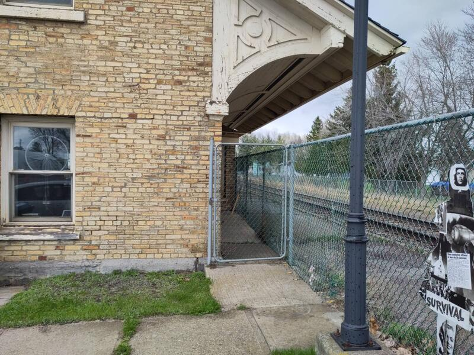
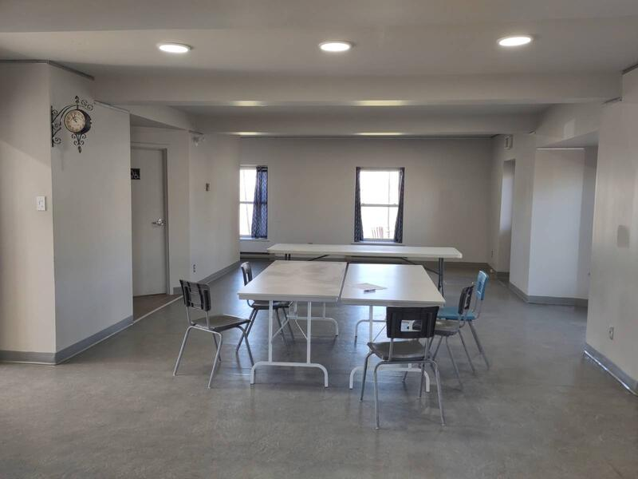
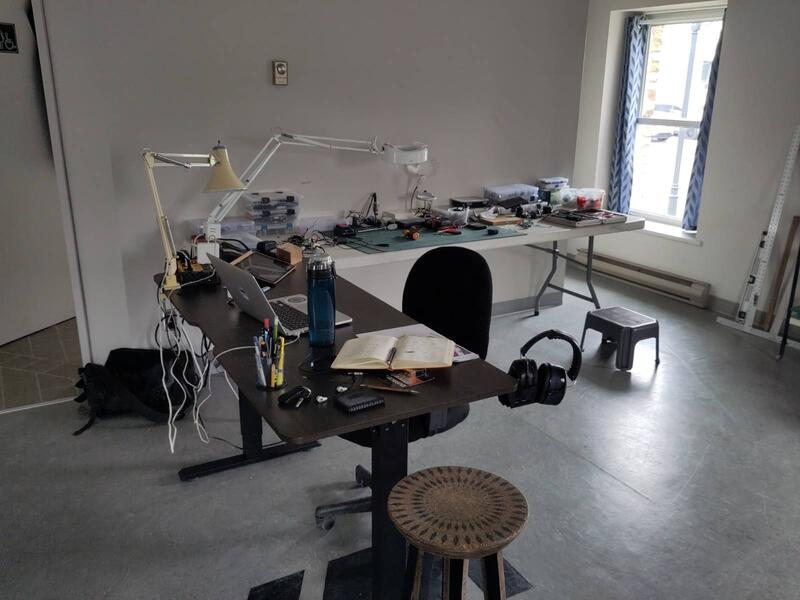
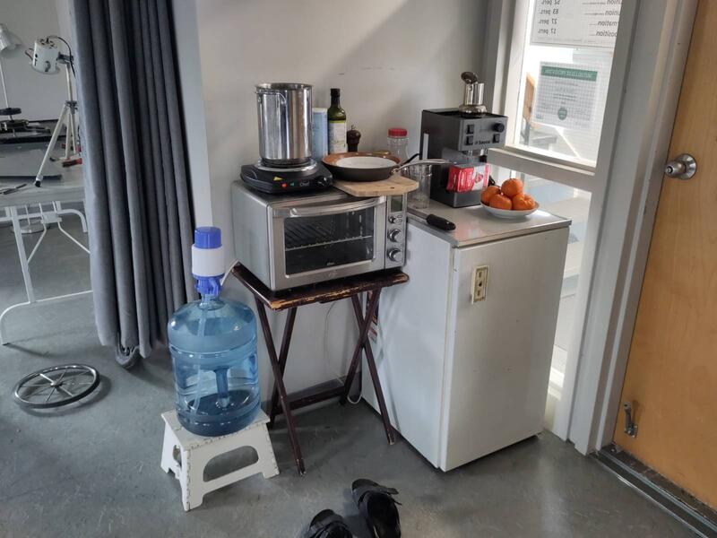

For this project, the city of St-Pascal has given me access to the ground floor of the old train station to set up my studio. The exterior of the building preserves its original architecture, though a little worn — which gives it a particular charm that is perfect for an art project. As if this slightly neglected building, living in the neighbourhood like the ghost of a fallen past, is coming back to life.

The station is accessible through the main entrance, which opens onto a small lobby leading to the studio and to the second floor, rented by a music school that doesn't seem very active at the moment. The back of the building opens directly onto the railway tracks. A chain-link fence was installed when the train company discontinued passenger service, to restrict access to the tracks. There are 2 other entrances through a narrow corridor between the back of the building and the fence at each end of the station. I actually prefer to use those instead of the main entrance. It makes it more intimate and feels more natural.  

The interior was recently renovated, with the best intentions — but in doing so, the original character was replaced by the standards of our time: the drive to standardize everything.

That said, the space is neutral, functional, and easy to make one's own. The area at my disposal is large enough to set up the various workspaces I'll need.

The freight train passes a few times a day. It's a North American-scale freight train — gigantic. As it approaches the station, you hear a whistle, and moments later the train barrels through at 80km/h just a few metres from the building, which shakes in rhythm with the chain of single and double-deck wagons — an exceptional sensory experience lasting about 2 minutes and 30 seconds. It currently passes heading east around 3:45pm and west around 5:45pm. We'll see how that holds over time. For now, it makes the stay rather interesting.

I have set up various workstations to address the different areas of my project.

Now I can start working and i decided that my first kinetic exploration project will focus on the manifestation of the energy of this magnificent train. It is expressed through sound and ground vibration as it passes, and I propose to visualize it through the wind it generates and the movement of matter. (see next post: The energy of the train)

