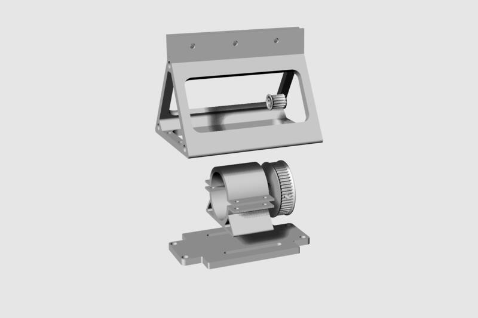
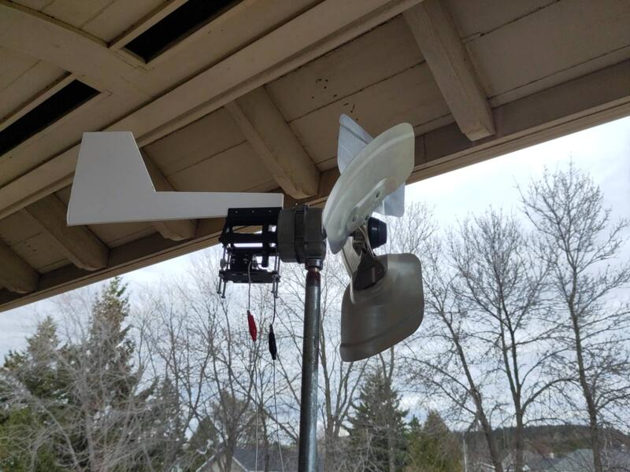
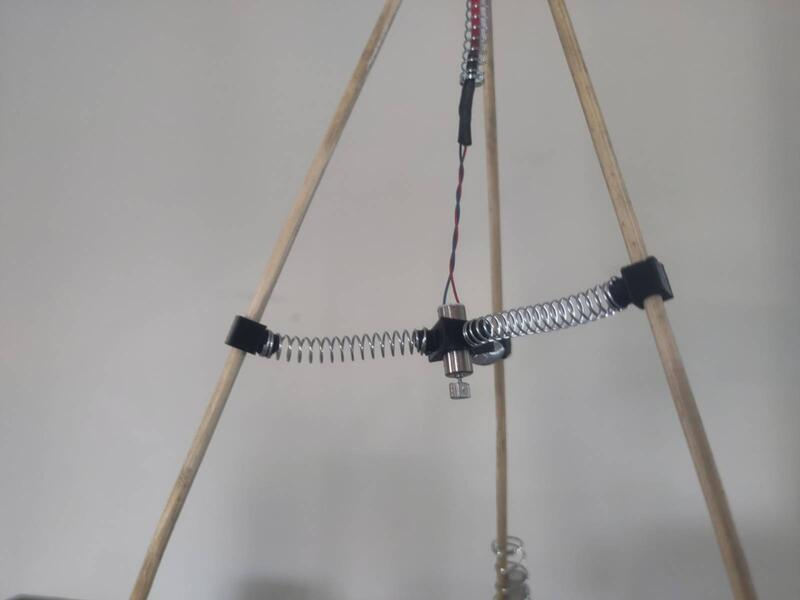
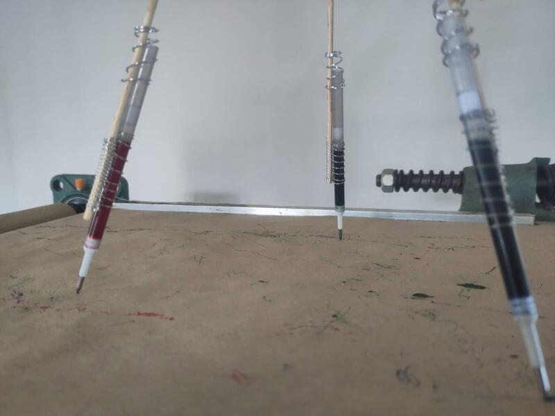
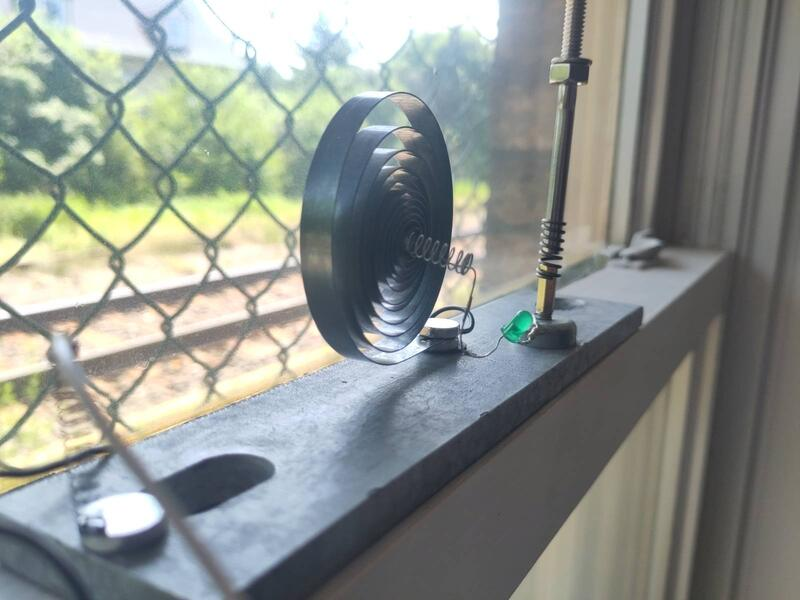

### ... and the wind it stirs up.

The first idea that came to me when I confirmed I would be developing this project in the old St-Pascal train station was to work with the energy of the train. From the moment I arrived, I began working on an artifact whose function is to visualize the energy of this train, which roars past a few times a day, making the station building shake as it passes — and whose absence, by contrast, plunges the studio into a place of calm and seemingly absolute silence.
The development of this project unfolds over the entire duration of the residency and runs in parallel with the research and exploration work on the sculpture, or the process of creating the model. It is indirectly connected to that work and serves, first and foremost, to experiment with a scale of technology applicable at the miniature scale. This project also functions as a "benchmark" for experimenting with the principles of energy autonomy.

#### Capturing the energy of the train.

At first, I created a mini wind turbine fitted with two small motors that are activated by the movement of the propeller to produce two parallel current sources. I hung the turbine on a fence post separating the rail line from the studio, and connected a wire that carries the electricity produced into the studio.

.

Working, on one hand, with wind that blows whenever it pleases, and on the other, with a train that passes irregularly for a few minutes only a handful of times a day, quickly became a handicap for the development of my learning process. I therefore understood that I needed to be able to simulate the wind. I built a base that lets me activate my turbine using a fan fitted with a speed-control pedal.
(photos and videos)

#### Material support and linear recording

I used an old paper cutter as a support structure for the paper, and integrated into it a support system for the paper roll at each end, as well as a motor to drive the paper and electronic components for speed control and automatic start-up when the train passes.
To power these components, a second, higher-voltage wind generator was built from a recycled motor taken from an old treadmill.
I then built a support structure for three pens, to which I attached a mini vibration motor powered by the turbine. When the wind blows, the propeller activates, driving the motor, which generates an electrical current; this produces a vibration transmitted to the pens, which begin to draw the wind.

#### Vibration sensor

Sometimes the wind that activates the turbine comes from the surrounding air rather than directly from the train's passage. To distinguish wind coming from the train, I built a device capable of detecting the vibration of the building caused by the train passing. It consists of a coiled alarm-clock spring set loosely upright, and an electrical circuit fitted with an LED that lights up when it comes into contact with the spring as it vibrates.

#### Ink and paper

When the pen tips are in contact with the paper, ink flows continuously, needlessly using it up. To fix this problem, I devised a lever system attached to the support mast of the pen-holder structure. I first tested it with a solenoid, but the amount of current required was too high. So I opted instead for a mini servo motor controlled by a 555 timer IC.
I worked out the theory for such a system because I would have liked to avoid relying on a microcontroller, but unfortunately without success.

My conclusions lead me to believe that, given the function of this element within the overall context of my project, it will be more effective to integrate a microcontroller (Arduino, ESP32, or Raspberry Pi Pico) as the control interface for the interactions between the various components.

This exercise gives me the opportunity to build a generic input/output workflow that will eventually be used when realizing the functional dimension of the model.
