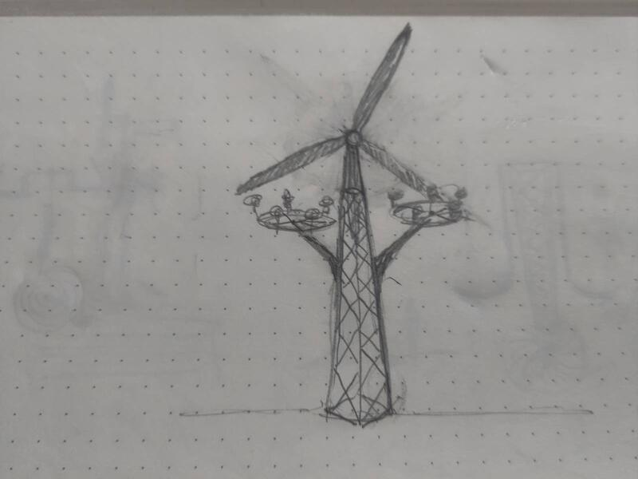
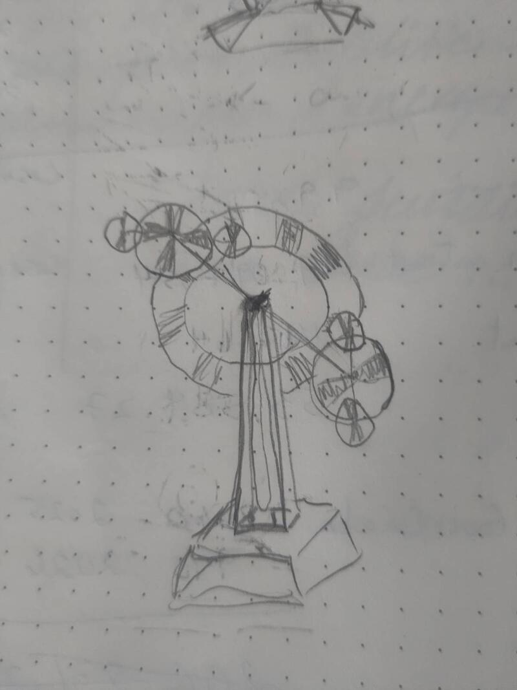
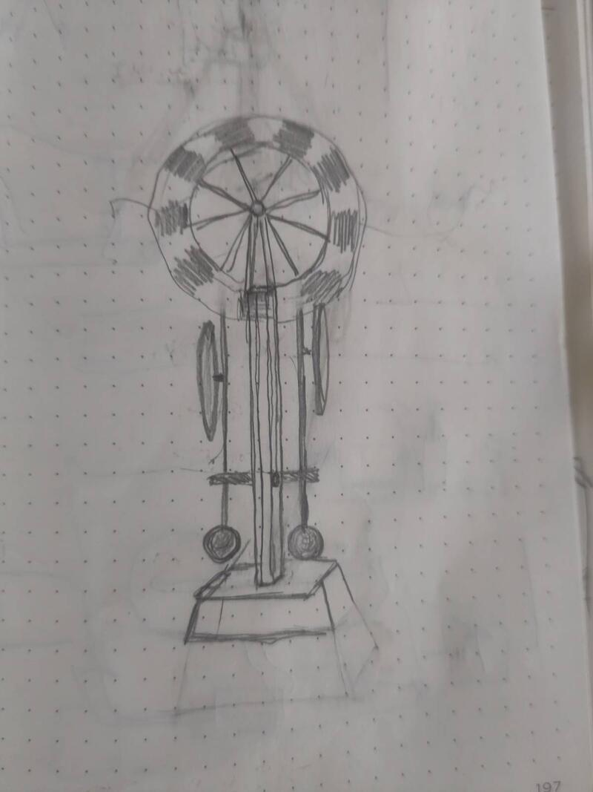

### Sketches and proportion  

  

The process of creating the artifacts has allowed me to identify the fundamental principles of the sculpture: balance and autonomy. And all my experimentation leads me to the essential question of resilience. What would be the ideal form of an energetically autonomous kinetic sculpture that requires the minimum possible maintenance?

#### Sketches
With this question in mind I began drawing, drawing inspiration from visual references and materials whose existence and availability I know.

  

#### Three-dimensional sketches  
The idea of creating the model of the sculpture involves projecting the miniature into the proportion of the real. I carried out a speculative exercise to relate miniature elements in the symbolic form evoked by elements present in the real dimension. I assembled a series of small DC motors and miniature wind turbine blades of different shapes with generic structural elements in proportion in order to give a proportionate representation of the model. This is not a formal proposal but rather a "three-dimensional sketch" of the physical dimension and kinetic principles I propose to explore with the sculpture. The deliberate choice of each element serves first and foremost to establish a system of coherence between the materials, their aesthetic and their symbolic value. This first sketch of the model serves primarily as a development support for the sculpture and functions as a proof of concept.

  

