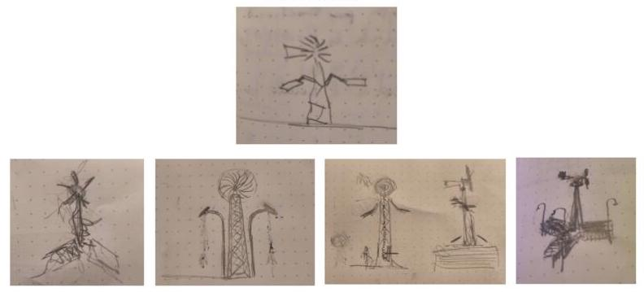

Autour du Moulin is a project of formal and technical research and experimentation aimed at creating an autonomous kinetic public art sculpture exploring the theme of the mill.

_"In Saint-Pascal de Kamouraska, along a provincial road in the Lower St. Lawrence, the silhouette of a mechanical colossus rises. Exposed to the elements, the forces of wind and sun animate its limbs composed of industrial remnants, transforming them into sensory mirages by day, and illuminating this guardian of the plains like a lighthouse in the night."_

Born from an invitation by the city of Saint-Pascal de Kamouraska, the project aims to develop a proposal for a permanent public art sculpture as part of its urban revitalization program and in celebration of the municipality's 200th anniversary in 2027.

Building on this premise, the project focuses on the preparatory stages leading to the sculpture's realization — establishing its symbolic dimension and defining its materiality, aesthetics, and kinetic functions. Spanning ten months — from March to December 2026 — the project will result in a functional reduced-scale prototype of the sculpture, as well as a series of technological artifacts, object-machines designed to explore and test the capacity of solar and wind energy to illuminate the sculpture and ensure its energy autonomy.

The results of the research and the processes explored will be presented as an installation offering a simulation of the future sculpture on its intended site and its potential interaction with the environment.

### The Theme:

The mill, a symbol of human ingenuity, has evolved through the ages and technological discoveries to better meet our needs. It inhabits the tales of Don Quixote as much as the Quebec landscape, serving to grind grain, saw wood, make paper, and now to produce a share of the planet's electricity.
Its principle is simple: it transforms natural energy into rotary motion. Yet it also operates as a visual emblem that bears witness to the magic of this transfer of natural energy into the transformation of matter.

The Kamouraska region is crossed by several rivers and enjoys windy currents that have long favoured the establishment of all kinds of mills on its territory. Saint-Pascal, which once housed sawmills and mills for flour and wool carding, was long known as the _land of mills_. Because of its rich industrial past tied to the hydraulic exploitation of the Kamouraska and Goudron rivers, the mill represents the icon of a vanished local heritage that this project proposes to reintroduce into the physical, cultural, and social landscape of the region.

### Community Roots

Produced in partnership with the City of Saint-Pascal and the FabLabs of the CEGEPs of Rivière-du-Loup and La Pocatière, Autour du moulin is built on an open methodology that encourages citizen involvement in the creative process, placing social interaction at the centre of the work and creating an intergenerational meeting place.

Through the FabLabs, paid internships will be offered to 2 college graduates from the departments of arts and design and civil engineering, showcasing their skills in an artistic creation context. This collaboration will bring to the project the physical and intellectual resources needed to realize the sculpture prototype and ensure its technical compliance for certification. Their mastery of current techniques and technological applications will complement my self-taught approach based on material experimentation and direct manipulation, creating a synergy between creative vision, traditional know-how, and innovation. This initiative also aims to integrate an intergenerational perspective likely to broaden the social and cultural impact of the project.

As a preamble to the project, a website will be created to document the evolution of the project and ensure its public dissemination. At the same time, a studio will be set up on the ground floor of the old Saint-Pascal train station. This historically significant place, through which the processed products of the mills once arrived and departed, will serve a hybrid function as a place of fabrication and open mediation with the public. A series of mediation meetings, fostering interaction and knowledge sharing, will be organized to mark the various stages of the project.

Autour du Moulin aspires to become a catalyst for collective pride by reinscribing heritage into everyday life and creating a space for encounters between generations. By placing the creative process at the centre of the work, I seek to bring art and society closer together, strengthening the community's sense of belonging while helping to position Saint-Pascal and Kamouraska as a territory of artistic innovation, capable of combining collective memory with contemporary vision.

### Project Development:

#### 1- Material Research, Site Surveys, Concept and First Sketches

This stage involves conceptualizing the sculpture and defining a composition that brings together symbolism, function, and materiality. It begins with the search for materials (urban furniture, industrial structures, machine parts, domestic appliances, etc.) from the municipal inventory, eco-centres, dumps, scrap dealers, or antique dealers in the region as well as from the local population.
It continues with a site study and the compilation of atmospheric data. It is completed with the production of the first compositional sketches of the sculpture and the simulation artifacts for the installation.

#### 2- Experimentation through Iterative Process and Prototyping

The second stage consists of an exercise in formal experimentation and prototyping focused on exploring technical solutions aimed at energy autonomy and the transformation of solar and wind energy into sensory experiences. This gives rise to the creation of a series of artifacts (object-machines) that make it possible to establish and test the engineering principles of the sculpture, its kinetic functionalities, the resilience of the mechanisms, and various technological solutions for generating and storing electrical energy. At the same time, simulation exercises will be carried out in the studio to explore the creation of visual effects through the movement of the various components. In collaboration with the interns, a miniature version of the sculpture will be developed; the chosen materials will be digitized in a parametric CAD format to produce a functional model of the sculpture at a 1:8 scale.

#### 3- In-situ Installation and Public Presentation.

The third stage consists of producing an installation that will serve to present the results of this research. The various "artifacts" will be tested on the actual implementation site and will ultimately be installed there alongside the miniature prototype. A scenography playing on viewpoints and forced perspective, juxtaposing miniature elements with the full-scale landscape of the site, will create the illusion of seeing the sculpture at its real scale on the intended site. The installation will be inaugurated on October 3, 2026 at a public event and will remain accessible to the public for 4 weeks in order to observe its potential interaction with the specific environment of the place.
The conclusions of these learnings will serve for the final design of the sculpture ahead of its planned realization in autumn 2027.

### Artistic Approach and Relevance of the Project

My practice explores the capacity of materials to transcend time through the integration of recycled materials drawn from historical heritage. Whether urban furniture fallen into disuse, industrial structures, a recycled fragment, or abandoned machinery, the materiality exposes technological obsolescence and situates the work within a quest for circularity. I thus seek to contribute to an awareness of the limited nature of resources and to the emergence of a culture of ecological and collective technological craftsmanship.

My sculptures are kinetic "artifacts" made from reclaimed materials that come back to life as interfaces between natural energy sources and the physical and social environment. Unpredictable like nature, they activate under its influence. They draw their formal references from Picabia, Machine Art, Tinguely, Takis, and Len Lye, and carry a reflection on progress, on the things it generates and destroys, situating material heritage as a witness to our collective memory.

In 2025, I initiated the Perpétuelle series — three ephemeral kinetic installations made from recycled materials, each exploring a natural energy: wind, water, and plant. With this new project I propose to explore the use of industrial materials and to integrate more than one natural energy source into a single sculpture. A large part of my work resides in the search for resilient and autonomous solutions.

I place great importance on the fact that my work reflects the cultural and social reality of the people for whom it is intended. With this in mind, the project proposes an open development process, giving the local public the opportunity to participate in the various stages of the creative process. The prototyping, the presentation of the research results, and the model will also serve to help the City of Saint-Pascal confirm the social acceptability of the project and begin fundraising for the realization of the final work.