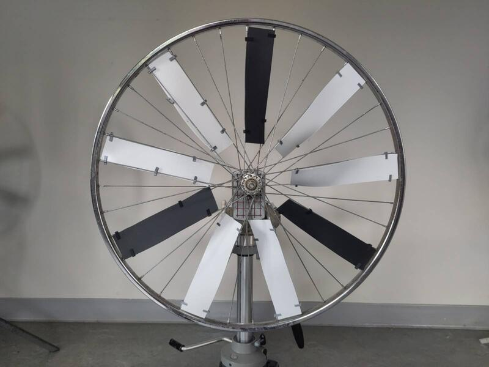
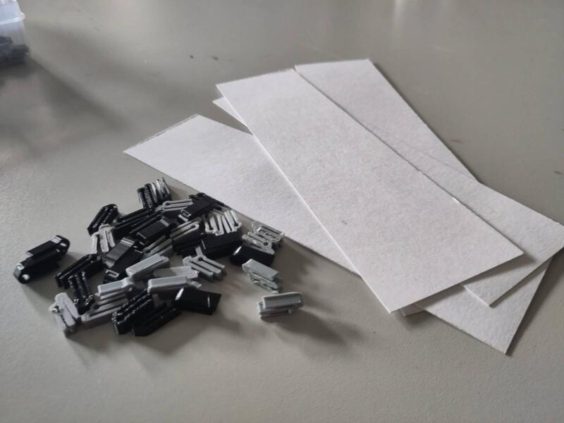
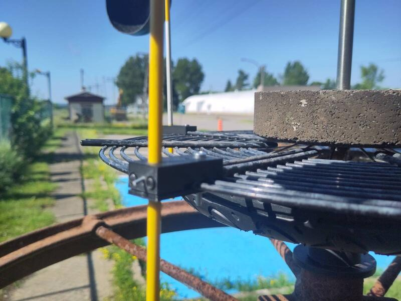
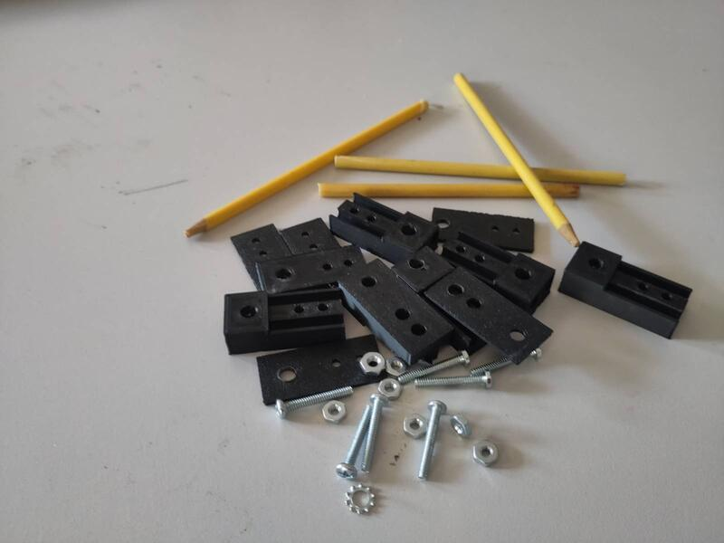
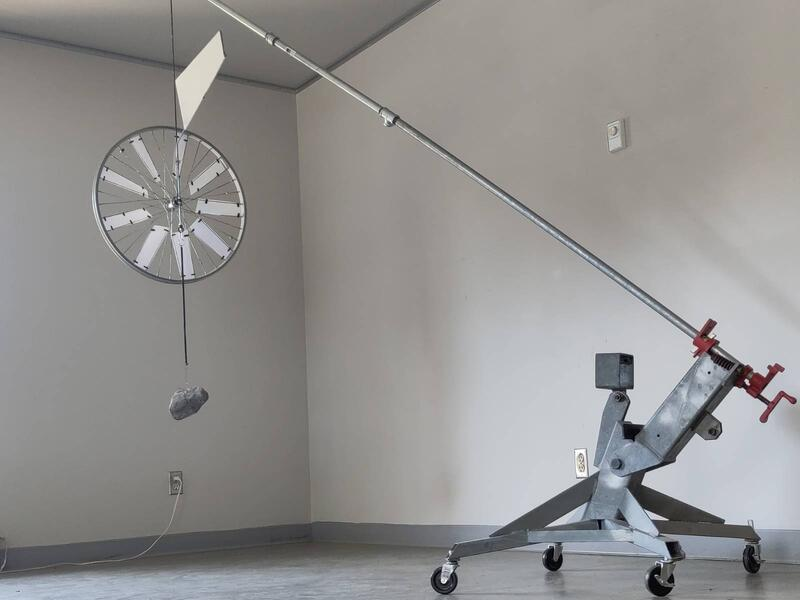
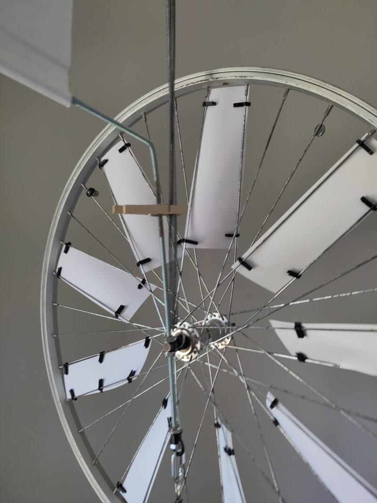
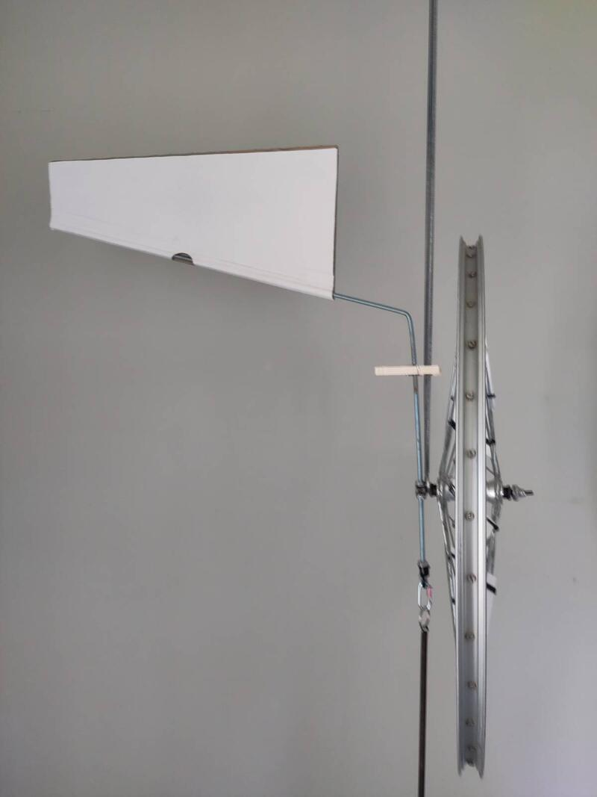
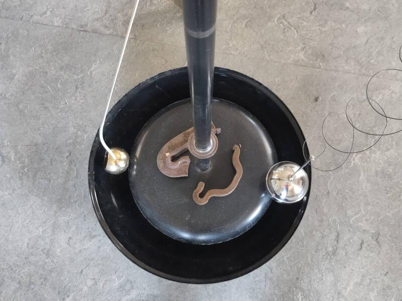
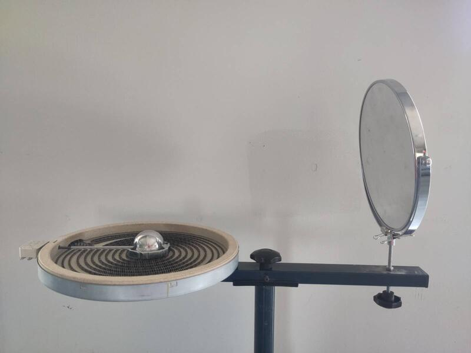

With this second phase of exploration and prototyping work, I created a series of objects/artifacts that seek to balance form and function while exploring different kinetic applications of solar and wind energy. The work was carried out very intuitively, shaped along the way by the materials found during my daily visits to the eco-center; each element took form, and the complementary relationship between them revealed itself gradually.

At the same time, I also created a first proposal for a miniature-scale sculpture that translates "to scale" a principle for visualizing natural energy.

### Circular motion, superposition, and optical effects

Using the bicycle wheel as a visual leitmotif, I experimented with the repetition and superposition of moving graphic elements to study the potential for creating optical effects. Each wheel is mounted on a tripod and decorated with combinations of white and black cardboard.

Attaching the cardboard pieces to the spokes was very laborious. I made small 3D-printed clips to hold the cardboard onto the spokes.

Through this exercise, I arrived at the idea of the infinite possibilities offered by combining patterns of different tones, colors, and shapes.

[CAD file for the clip](byciclewheelclip.stl)

### The horizontal wind principle
I created a horizontal application for capturing wind energy. This approach minimizes the impact of gravity by resting the weight of the moving components on a horizontal pivot point. With this approach, friction on the axle is reduced compared to the vertical setup, allowing very low-intensity wind to be visualized.

The sculpture is made mainly from recycled materials: an old steel base and an old cast-iron piece, a child's wagon wheel, a fan grille, marker-beacon rods, toilet float balls, and ball bearings. For assembly, I made 3D-printed clips to support the wind sensors.

This piece represents a very rough first sketch of the integration of the horizontal wind principle and its kinetic application. It is easy to imagine this sculpture projected at a monumental scale, onto which a system for capturing mechanical energy and converting it into electric current could be grafted.

### The memory of materials and the visualization of balance.

The memory of materials makes visible the fragile balance that exists among the different elements of the world, offering a formal visualization of it. The spring is an object that fascinates me for its ability to make the energy of gravity perceptible. Among the natural forms of energy, gravity is the only one that is constant and omnipresent. When the wind blows, you see it; then, when it dies down, it disappears. Solar energy is the same, and so is hydraulic energy: it changes with time and environment, and tends to run out. Gravity, on the other hand, is different; hidden in shadow, we never see it, yet it is always there. In fact, it is intrinsic to everything that is kinetic.
I revisited an element I had introduced last year in my installation "the coincidence of opposites." I extrapolated it to apply it to a new artifact that can be seen either as an object in its own right or as a scale model of a possible sculpture. I use the bicycle wheel again, but this time I suspend it, in balance, to stage the inevitable tension gravity exerts on matter and to turn it into a poetic representation.

This proposal brings the natural energies of gravity and wind into interaction. It raises major physical challenges that will need to be addressed at a later stage, out in a natural environment and in interaction with real elements. The simulation exercises carried out in the studio are promising.

### The complementarity of forms and the sound of their interaction.

Following this same idea of exploring the principles of material memory and the use of springs, I juxtaposed completely disparate materials into a musical artifact that materializes the interaction between complementary forms subjected to an external force and interacting with the energy of gravity. In this particular case, the artifact provides a sensory experience that is both visual and auditory, taking the form of an interactive musical instrument.

An old cymbal pedal can be activated manually, causing the vertical movement of an old fan base suspended from springs, which knocks against the base of a barbecue grill set on the ground, along with two metal balls also suspended from springs. The contact between the different elements creates a sonorous resonance reminiscent of a church bell.

### Solar energy and the expansion of liquids.

I started research into the principle of liquid expansion as an interface for converting solar energy into mechanical energy. With this idea in mind, I gathered materials that could be used to build a prototype. It consists of a concave half-sphere used to concentrate the sun's rays onto a focal point, and a base made of geometric metal pieces held together by magnetic welding clamps.

The idea I am pursuing is to place, in the high-temperature zone, a sealed container holding ethanol and connected to an inflatable element that expands and contracts depending on the amount of solar energy captured. I added a small bicycle wheel floating on the surface to bring in a second energy source, following the horizontal-turbine principle, which will make it possible to power a "sun-tracking" system without casting a shadow on the solar collector.

This project is at a preliminary stage and rests essentially on a theoretical basis. I am well aware that the elements chosen will not allow me to create an efficient system. My goal, in fact, is to play at the very edge of feasibility and to observe — and represent — the minimal effect natural energy has on matter.

I developed the theory and explored a material representation of the prototype's main element.

See:
[research document and bill of materials](solar_kinetic_sculpture_README.md).

### Mecca, or the sun as divine energy.

Continuing to experiment with solar energy while looking for alternatives to photovoltaic applications.

The main element is an electrical heating coil taken from some appliance, circular in shape, containing a parallel circuit forming a spiral. The simplicity of its form visually expresses the complexity of its function. It is held up by a tripod and positioned facing an articulated bathroom mirror capable of reflecting the sun's rays to the exact point where the coil's two poles meet, allowing thermal energy to be transmitted to it. This project is purely speculative and not functional in any way at this stage. I see it as a narrative system for visualizing a theoretical principle of extracting solar energy and converting it into thermal energy through interaction with matter. More symbolically, the central form of this artifact evokes Mecca, the site of pilgrimage through which the Muslim community communes with God. The relationship between matter and the natural energy of the sun acts as a metaphor for humanity's transcendence toward the divine.

