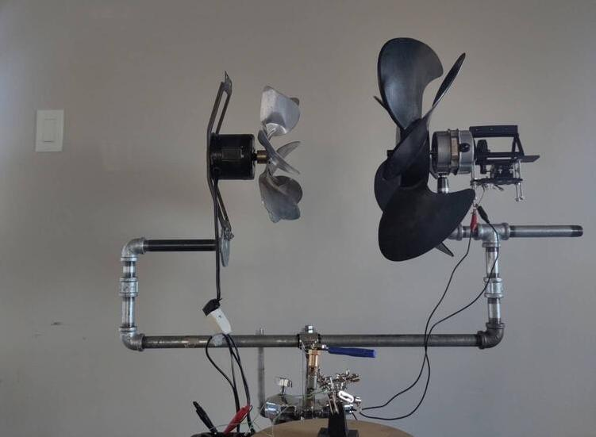
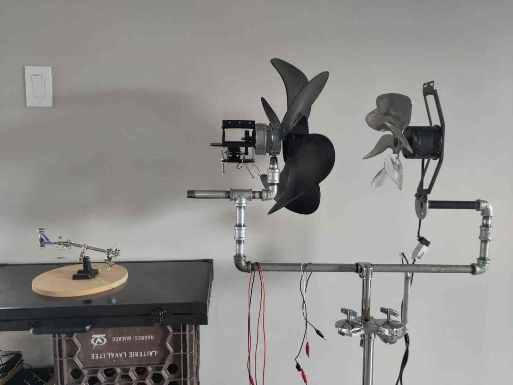
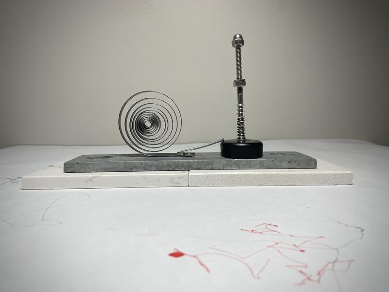

The research project consists of creating a model of a kinetic sculpture made from recycled materials that is energetically autonomous, with the original idea proposing the creation of a single monumental element. The process of exploring the various dimensions of the sculpture takes the form of an installation composed of several complementary elements in interaction.

Starting from found materials I created a series of artifacts to explore the capture and visualization of natural energy sources, primarily wind. From another angle I assembled elements allowing me to simulate wind in order to gain more autonomy to experiment with visualisation of the energy of the wind. Those are prototypes and set the bases for further applications.  

I fabricated several "artifacts" that interact with wind energy and place technical and functional materiality in the foreground to suggest the experience of energy and make it tangible.

In parallel and as my findings accumulated I created other non-functional compositions in aim to symbolyses relationships through juxtaposition of everyday life obsoleted objects. I udsed this opportunity to continue exploring forms, their meaning and dialogue, and seek to put them in balance.

  

The video medium allows for a better appreciation of the kinetic nature of the studies carried out using the energy of the passing train — the wind it creates and the vibrations it produces. I then experimented with transferring this energy into electrical current and activating visualization artifacts.











