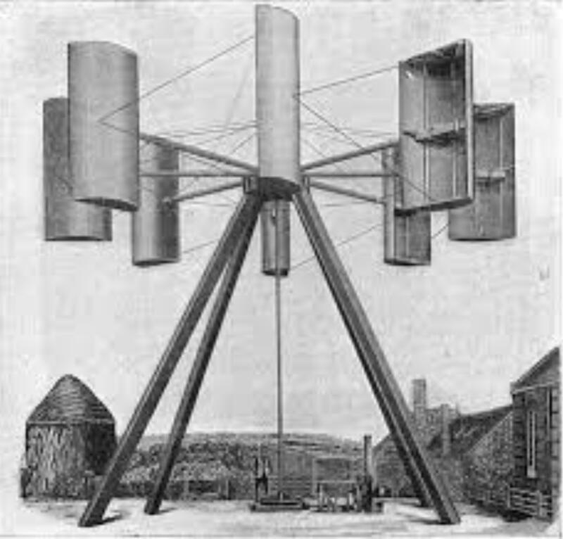
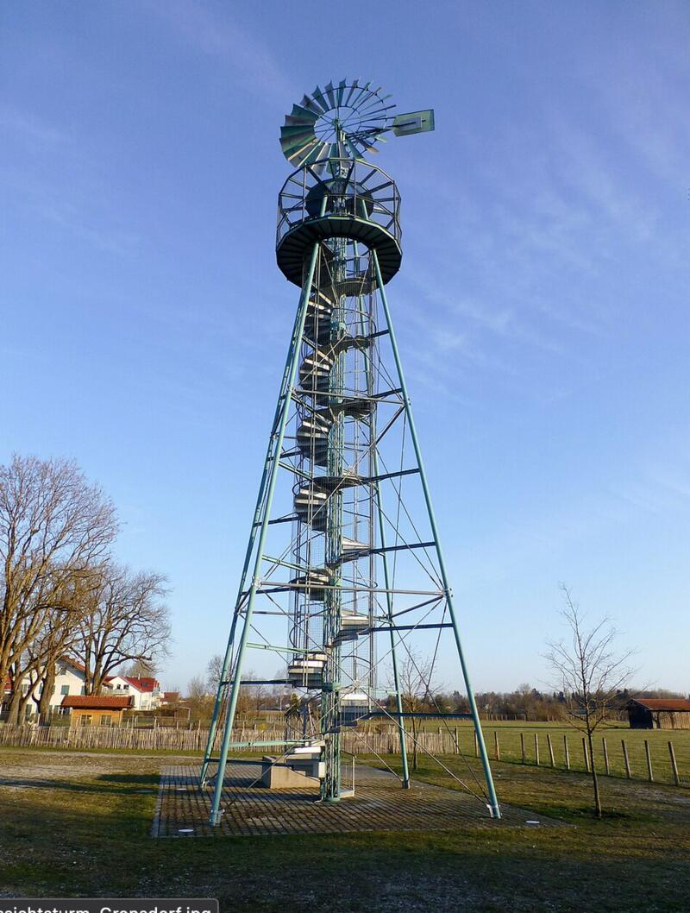
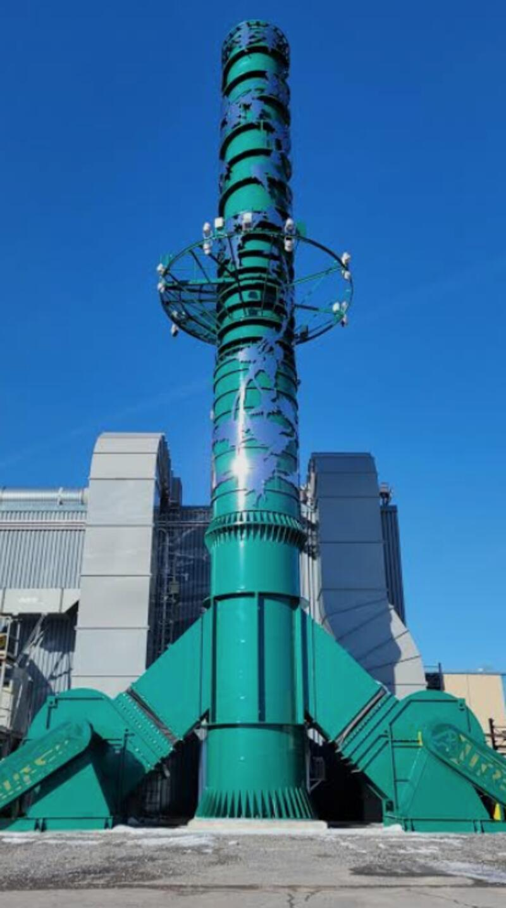
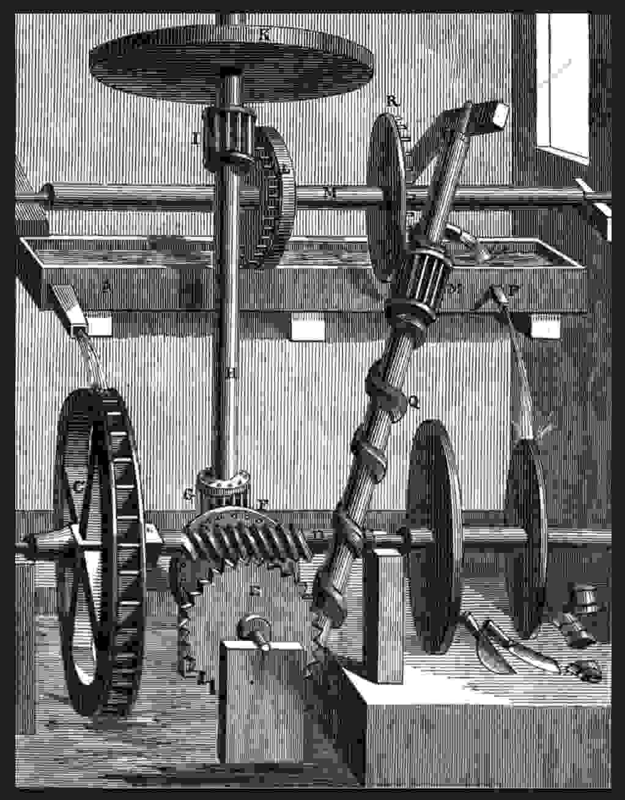

#### I cultivate a sense of wonder at the phenomena of the world through direct interaction with the visual representation of its energy.  

A compilation of images that evoke the themes explored by the project and that align with my particular interests. 

We are talking about optical illusion, point of view, and the encounter of matter with the energy of matter under the influence of nature over time and in relation to humanity and its need to extract all resources from it.

The circular element is predominant, in allusion to the terrestrial sphere and for the propensity of the form to suggest and provoke movement and its sensations. Also manifest are the weight of masses, proportions, the play with scales of magnitude, and the point of view of the gaze on materiality. The idea above all is to represent the magic of human engineering and the obsolescence of the quest to perpetuate itself in the world. 

  

The processes suggesting possible application in the project bring us back to varied technological approaches that share a common denominator: the search for autonomy through the circularity of interactions between them and with the environment. Whether physical, intellectual or social, the link created between the different representations of reality becomes an integral and utopian gesture that only art can make possible when it articulates itself around real constraints while refraining from seeking to produce anything other than sensations open to all the senses as well as to the notion of discovering the impossible. This project, like the rest of my work, implicitly references the conceptual idea of perpetual motion seeking to transcend the notion of God through technique and the mastery of knowledge.

. 

*Perpetual motion Engraving of a "closed-cycle water mill," a perpetual-motion machine designed by English physician Robert Fludd in the 17th century. The energy delivered by water falling from a reservoir onto a mill wheel was erroneously purported to be enough to turn an Archimedes screw and return the water to the reservoir, thus keeping the machine in [perpetual motion](https://www.britannica.com/science/perpetual-motion)*