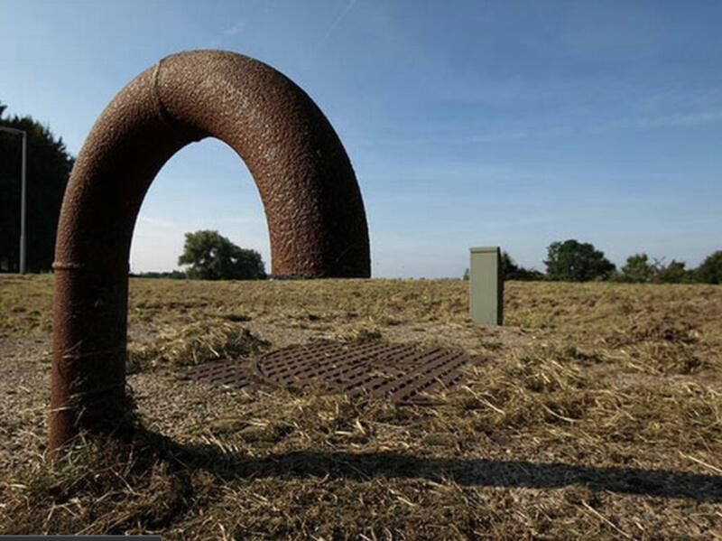
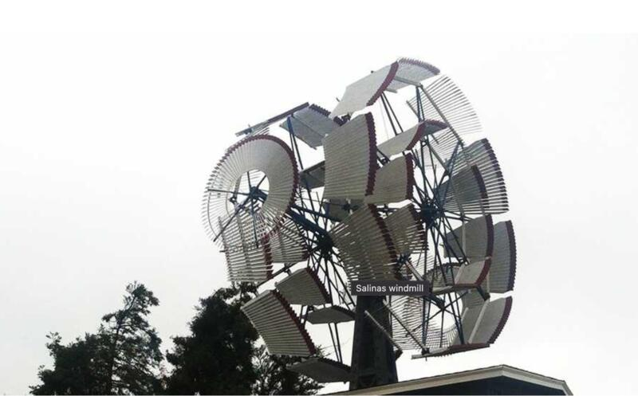
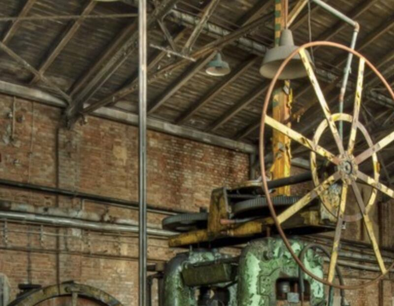

A compilation of images that evoke the themes explored by the project and that align with my particular interests.
#### I cultivate a sense of wonder at the phenomena of the world through direct interaction with the visual representation of its energy.

We are talking about optical illusion, point of view, and the encounter of matter with the energy of matter under the influence of nature over time and in relation to humanity and its need to extract all resources from it.

The circular element is predominant, in allusion to the terrestrial sphere and for the propensity of the form to suggest and provoke movement and its sensations. Also manifest are the weight of masses, proportions, the play with scales of magnitude, and the point of view of the gaze on materiality. The idea above all is to represent the magic of human engineering and the obsolescence of the quest to perpetuate itself in the world.

