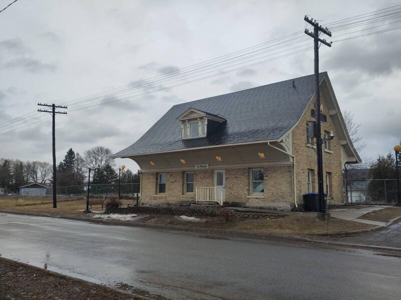
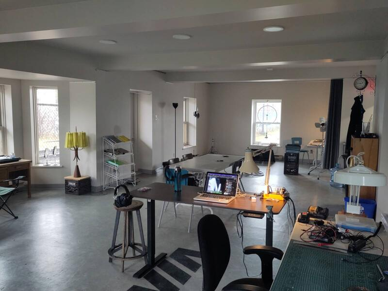
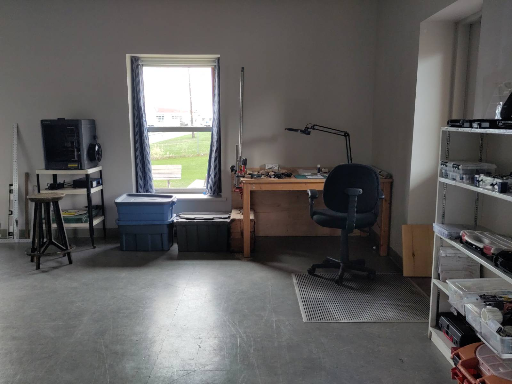
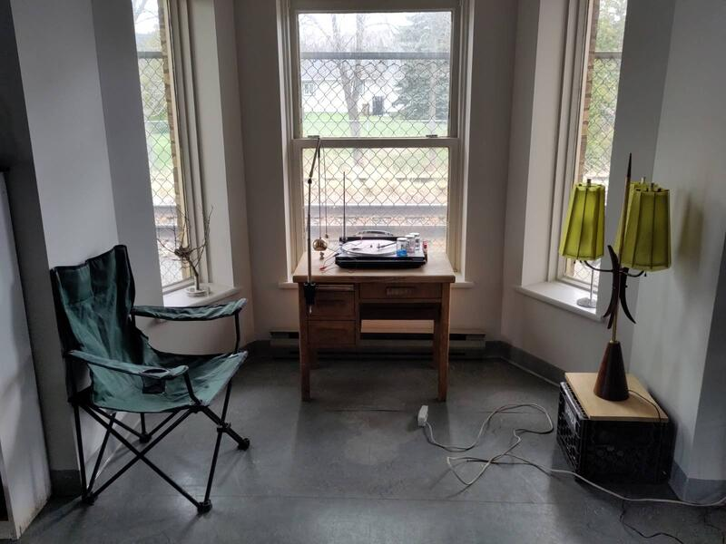

Para la realización de este proyecto, la ciudad de St-Pascal me ofrece acceso a la planta baja de la antigua estación de tren para instalar mi taller. El exterior del edificio conserva su arquitectura original, aunque un poco deteriorada — lo que le da un encanto particular muy apropiado para el proyecto. Como si este edificio algo abandonado, que vive en el barrio como el fantasma de un pasado caído, volviera a la vida.

La estación es accesible por la puerta principal, que abre a un pequeño vestíbulo que da acceso al taller y al segundo piso, alquilado por una escuela de música que no parece muy activa por el momento. La parte trasera da directamente a la vía del tren. Se instaló una valla de tipo malla cuando la empresa ferroviaria abandonó el servicio de pasajeros, para restringir el acceso a las vías. Se accede también al estudio por la parte trasera de la estación. Prefiero que se use esa entrada para acceder al taller en lugar de por la entrada principal. Lo hace más íntimo y más difícil de encontrar. Y eso me gusta.

El interior fue renovado recientemente, con las mejores intenciones — pero haciendo que el carácter original fuera reemplazado por los criterios de nuestra época: el afán de estandarizarlo todo.

Dicho esto, el espacio es neutro, funcional y fácil de apropiarse. El área de la que dispongo es suficientemente grande para crear los distintos espacios de trabajo que necesitaré.

El tren de mercancías pasa varias veces al día. Se trata de un tren de carga de proporciones norteamericanas — gigantesco. Cuando se acerca a la estación se escucha un silbido y, momentos después, el tren pasa a 80km/h a apenas unos metros del edificio, que tiembla al ritmo de la cadena de vagones de uno y dos pisos — una secuencia experiencial excepcional de unos 2 minutos y 30 segundos. Pasa normalmente hacia el este alrededor de las 15h45 y hacia el oeste alrededor de las 17h45, por el momento. Ya veremos con el tiempo. Por ahora hace que la estancia sea bastante interesante.

He instalado distintas estaciones de trabajo para responder a los diferentes campos de aplicación de mi proyecto.

Ahora puedo empezar a trabajar y he decidido que mi primer proyecto de exploración cinética va ser sobre la manifestación de la energía de este magnifico tren. Se percibe a través él sonido y la vibración del suelo a su paso, y me propongo visualizarla mediante el viento que genera y como se puede traducir en movimiento de la materia. (ver proximo artículo: La energía del tren)

