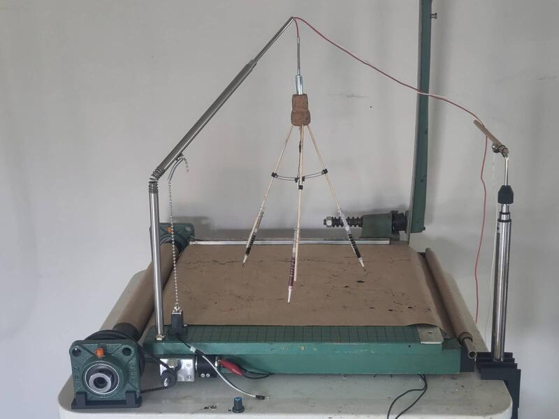
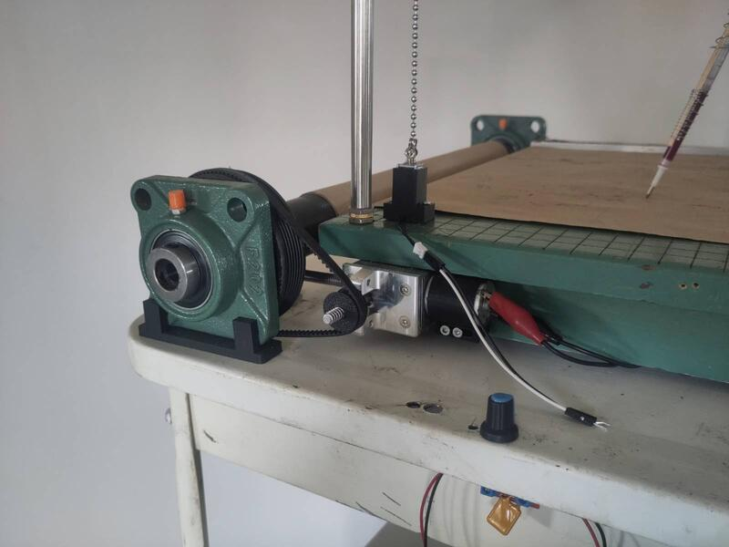
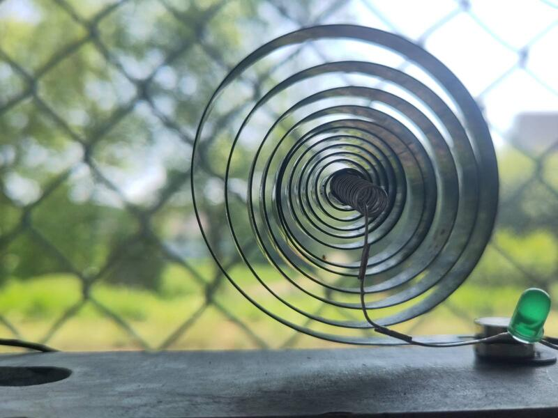
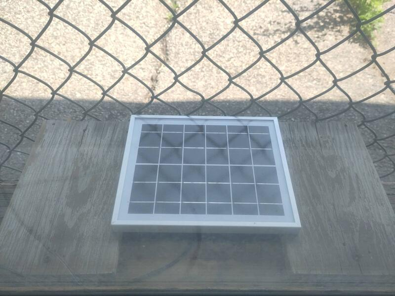

### ... y el viento que provoca.

La primera idea que se me ocurrió cuando confirmé que desarrollaría este proyecto en la antigua estación de St-Pascal fue trabajar con la energía del tren. Desde mi llegada empecé a trabajar en un artefacto cuya función es visualizar la energía de ese tren que pasa haciendo estruendo varias veces al día, haciendo temblar el edificio de la estación a su paso, y cuya ausencia, por contraste, sumerge al taller en un lugar de calma y de un silencio aparentemente absoluto.
El desarrollo de este proyecto se extiende a lo largo de toda la residencia y se articula en paralelo con el trabajo de investigación y exploración de la escultura o del proceso de creación de la maqueta. Está relacionado indirectamente con ese trabajo y sirve, ante todo, para experimentar con una escala de tecnología aplicable a la escala miniatura. Este proyecto también funciona como "benchmark" para experimentar con los principios de autonomía energética.

#### Capturar la energía del tren.

En un primer momento creé un mini aerogenerador provisto de dos pequeños motores que se activan con el movimiento de la hélice para producir dos fuentes de corriente paralelas. Colgué el aerogenerador de un poste de la cerca que separa la vía del taller, y conecté un cable que permite llevar hasta el interior del taller la corriente eléctrica producida.

.

Trabajar, por un lado, con un viento que sopla cuando le place y, por otro, con un tren que pasa sin puntualidad durante unos minutos y solo algunas veces al día, se convirtió rápidamente en un obstáculo para el desarrollo de mi aprendizaje. Comprendí entonces que era necesario poder simular el viento. Creé una base que me permite activar mi aerogenerador con la ayuda de un ventilador al que le incorporé un pedal de regulación de velocidad.
(fotos y videos)

#### Soporte material y registro lineal

Utilicé una vieja cortadora de papel como estructura de soporte para el papel, y le integré un sistema de soporte para el rollo de papel en cada uno de los extremos, así como un motor de arrastre del papel y componentes electrónicos de control de velocidad y de puesta en marcha automática al paso del tren.
Para alimentar estos componentes, se fabricó una segunda generadora eólica de mayor voltaje a partir de un motor reciclado de una vieja cinta de correr.
Luego creé una estructura de soporte para tres bolígrafos, a la que sujeté un mini motor vibratorio alimentado por el aerogenerador. Cuando sopla el viento, la hélice se activa, impulsa el motor que genera una corriente eléctrica, la cual produce una vibración transmitida a los bolígrafos, que se ponen a dibujar el viento.

#### Sensor de vibración

A veces el viento que activa el aerogenerador proviene del ambiente y no directamente del paso del tren. Para distinguir el viento que proviene del tren, creé un dispositivo capaz de detectar la vibración del edificio causada por el paso del tren. Está compuesto por un resorte de reloj despertador en espiral, colocado distendido en posición vertical, y un circuito eléctrico dotado de un diodo que se ilumina al contacto con el resorte cuando este entra en vibración.

#### La tinta y el papel

Cuando la punta de los bolígrafos está en contacto con el papel, la tinta fluye de manera continua, lo que hace que se consuma tinta innecesariamente. Para remediar este inconveniente, ideé un sistema de palanca sujeto al mástil de soporte de la estructura que sostiene los bolígrafos. Primero hice pruebas con un solenoide, pero la cantidad de corriente requerida era demasiado alta. Opté entonces por integrar un mini servomotor controlado por un circuito integrado de tipo temporizador 555 (555 timer IC).
Elaboré la teoría de un sistema así porque hubiera querido evitar recurrir a un microcontrolador, pero lamentablemente sin éxito.

Mis conclusiones me llevan a creer que, dada la funcionalidad de este elemento en el contexto global de mi proyecto, será más eficaz integrar un microcontrolador (Arduino, ESP32 o Raspberry Pi Pico) como interfaz de control de las interacciones entre los distintos componentes.

Este ejercicio me da la ocasión de construir un flujo de trabajo genérico de entradas y salidas (inputs/outputs) que servirá eventualmente para la realización de la dimensión funcional de la maqueta.
