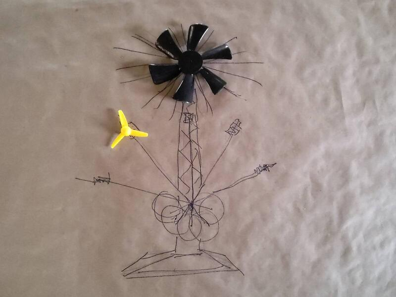
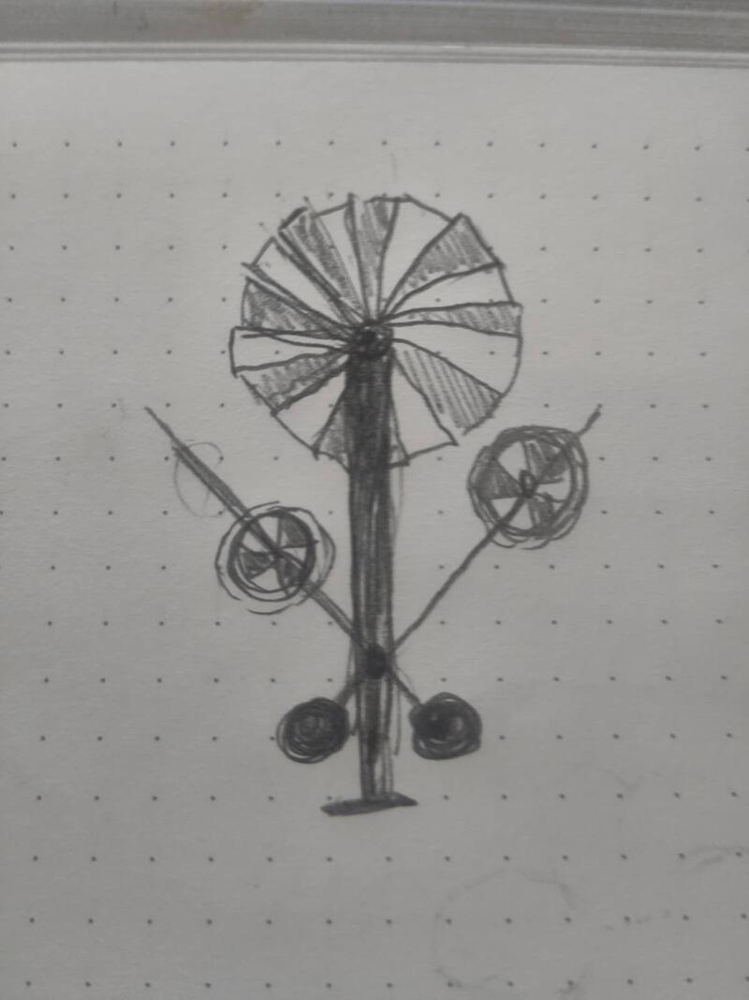
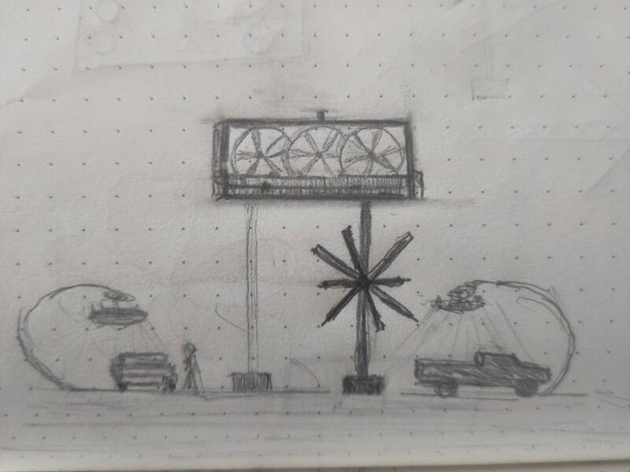
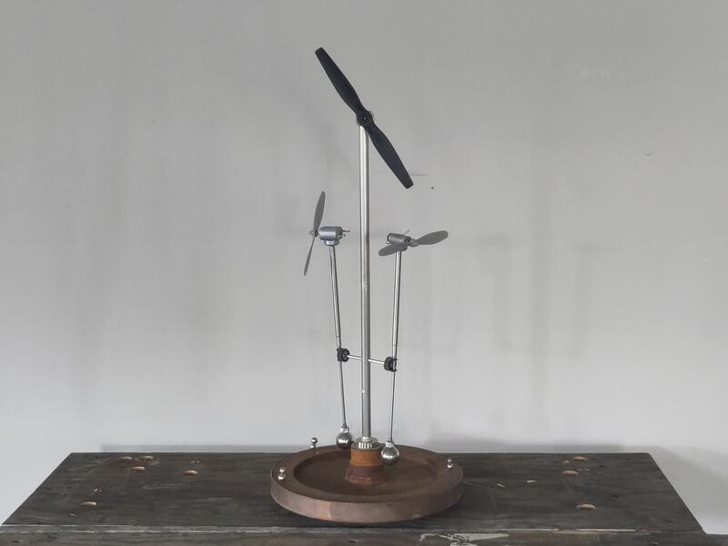
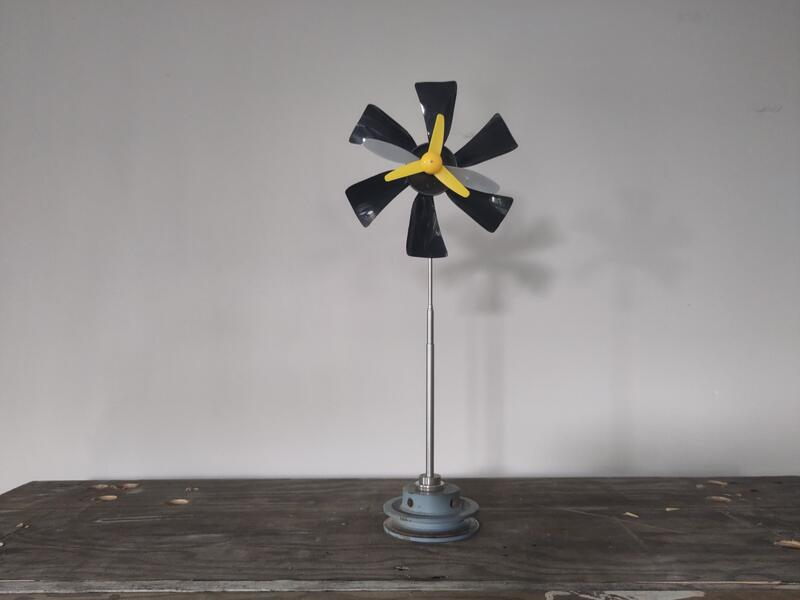

### Bocetos y proporción  

  

El proceso de creación de los artefactos me ha permitido identificar los principios fundamentales de la escultura: el equilibrio y la autonomía. Y toda mi experimentación me lleva a la pregunta esencial de la resiliencia. ¿Cuál sería la forma ideal de una escultura cinética energéticamente autónoma que requiera el mínimo mantenimiento posible?

#### Bocetos
Con esta pregunta en mente me puse a dibujar inspirándome en referencias visuales y materiales cuya existencia y disponibilidad conozco.

  

#### Bocetos tridimensionales  
La idea de crear la maqueta de la escultura implica proyectar lo miniatura en la proporción de lo real. Realicé un ejercicio de especulación para poner en relación elementos en miniatura en la forma simbólica evocada por elementos presentes en la dimensión real. Reuní una serie de pequeños motores DC y palas eólicas en miniatura de diferentes formas con elementos estructurales genéricos en proporción con el fin de dar una representación proporcionada de la maqueta. No se trata de una propuesta formal sino de un "boceto tridimensional" de la dimensión física y los principios cinéticos que propongo explorar con la escultura. La elección deliberada de cada uno de los elementos sirve ante todo para establecer un sistema de coherencia entre los materiales, su estética y su valor simbólico. Este primer boceto de la maqueta sirve principalmente como soporte de desarrollo de la escultura y cumple la función de prueba de concepto.

  

