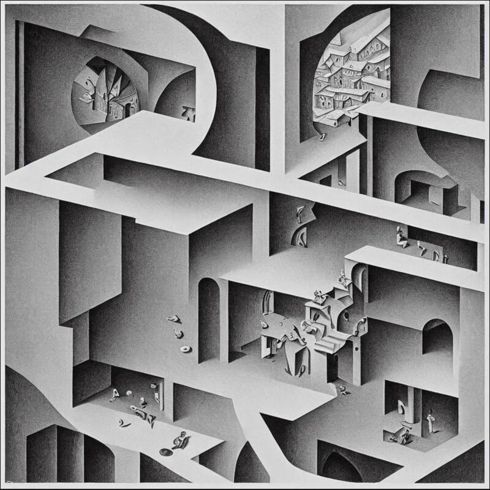
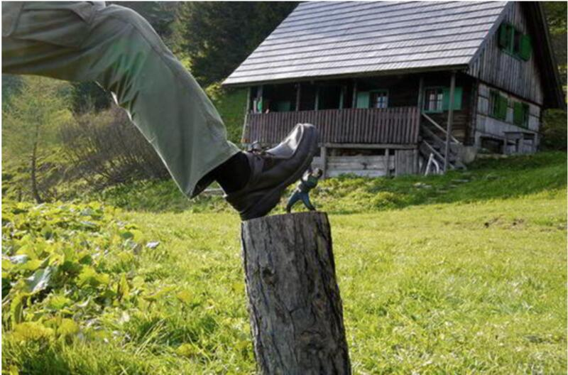
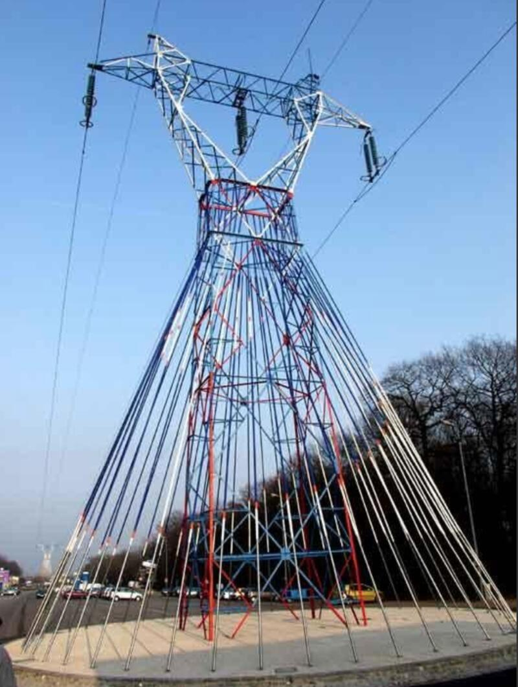
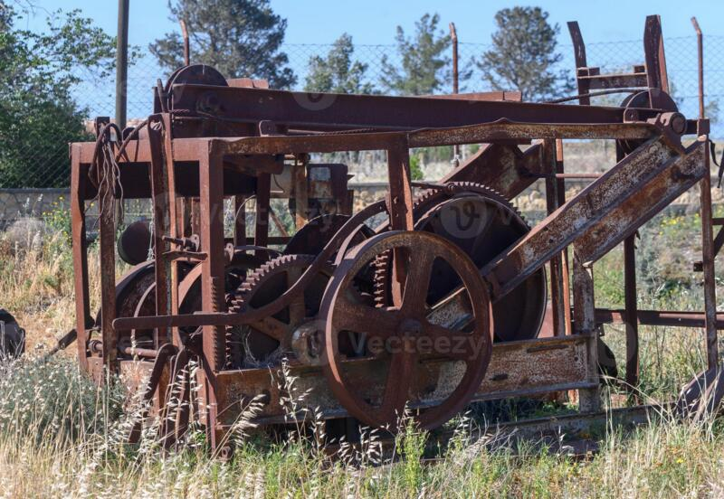
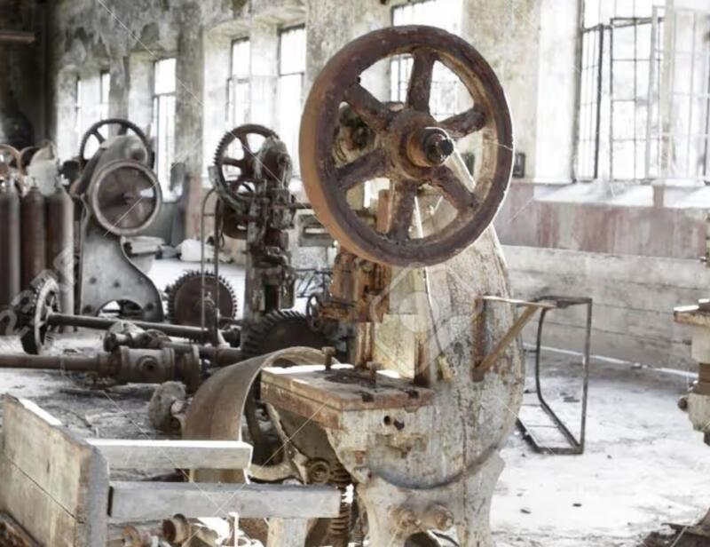
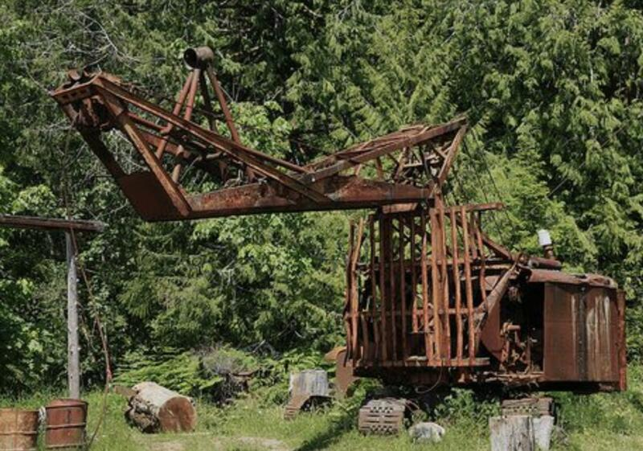

Una compilación de imágenes que evocan los temas explorados por el proyecto y que se corresponden con mis intereses particulares.
#### Cultivo el asombro ante los fenómenos del mundo mediante la interacción directa con la representación visual de su energía.

Hablamos de ilusión óptica, de punto de vista y del encuentro de la materia con la energía de la materia bajo la influencia de la naturaleza en el tiempo y en relación con la humanidad y su necesidad de extraer todos sus recursos.

El elemento circular es predominante en alusión a la esfera terrestre y por la propensión de la forma a sugerir y provocar el movimiento y sus sensaciones. También es manifiesto el peso de las masas, las proporciones y el juego con las escalas de magnitud y el punto de vista de la mirada sobre la materialidad. La idea ante todo es representar la magia de la ingeniería humana y la obsolescencia de la búsqueda por perpetuarse en el mundo.

