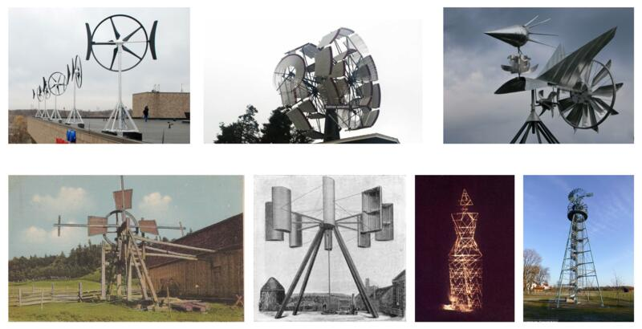

Autour du Moulin es un proyecto de investigación y experimentación formal y técnica con vistas a la realización de una escultura de arte público cinética y autónoma que explora la temática del molino.

_"En Saint-Pascal de Kamouraska, a orillas de una carretera provincial del Bajo San Lorenzo, se yergue la silueta de un coloso mecánico. Expuesto a las inclemencias del tiempo, las fuerzas del viento y del sol animan sus miembros compuestos de vestigios industriales, transformándolos en espejismos sensoriales de día, e iluminando a este guardián de las llanuras como un faro en la noche."_

Nacido de una invitación de la ciudad de Saint-Pascal de Kamouraska, el proyecto tiene como objetivo desarrollar una propuesta de escultura permanente de arte público, en el marco de su programa de revitalización del espacio urbano y con motivo del 200º aniversario del municipio, en 2027.

Partiendo de esta premisa, el proyecto se concentra en las etapas previas a la realización de la escultura para establecer su dimensión simbólica y definir su materialidad, su estética y sus funciones cinéticas. Distribuido a lo largo de diez meses — entre marzo y diciembre de 2026 — el proyecto dará lugar a la realización de un prototipo funcional a escala reducida de la escultura, así como a una serie de artefactos tecnológicos, máquinas-objetos que permiten explorar y poner a prueba la capacidad de las energías solar y eólica para iluminar la escultura y asegurar su autonomía energética.

Los resultados de la investigación y los procesos explorados serán presentados en forma de instalación que ofrece una simulación de la futura escultura en su sitio de implantación y de su potencial de interacción con el entorno.

### La temática:

El molino, símbolo de la ingeniería humana, ha evolucionado a lo largo de las épocas y los descubrimientos tecnológicos para responder mejor a nuestras necesidades. Habita tanto los relatos de Don Quijote como el paisaje quebequense, sirviendo para moler el grano, aserrar la madera, fabricar papel y ahora para producir una parte de la electricidad del planeta.
Su principio es simple: transforma la energía natural en movimiento rotativo. Sin embargo, opera también como emblema visual que da testimonio de la magia de esta transferencia de energía natural en la transformación de la materia.

La región de Kamouraska está recorrida por varios ríos y goza de corrientes de viento que han favorecido la implantación de todo tipo de molinos en su territorio. Saint-Pascal, que albergaba antiguamente aserraderos y molinos de harina y de cardado de lana, fue conocida durante mucho tiempo como la _tierra de los molinos_. Debido a su rico pasado industrial ligado a la explotación hidráulica de los ríos Kamouraska y Goudron, el molino representa el icono de un patrimonio local desaparecido que el proyecto propone reintroducir en el paisaje físico, cultural y social de la región.

### Arraigo en la comunidad

Producido en colaboración con la Ciudad de Saint-Pascal y los FabLabs de los cégeps de Rivière-du-Loup y La Pocatière, Autour du moulin se apoya en una metodología abierta que favorece la implicación ciudadana en el proceso de creación, situando la interacción social en el centro de la obra y creando un lugar de encuentro intergeneracional.

A través de los FabLabs, se ofrecerán prácticas remuneradas a 2 egresados de nivel universitario de los departamentos de artes y diseño e ingeniería civil, poniendo en valor sus competencias en un contexto de creación artística. Esta colaboración aportará al proyecto los recursos físicos e intelectuales necesarios para la realización del prototipo de la escultura, con el fin de garantizar su conformidad técnica de cara a su homologación. Su dominio de las técnicas y aplicaciones tecnológicas actuales complementará mi enfoque autodidacta basado en la experimentación material y la manipulación directa, creando así una sinergia entre visión creativa, saber hacer tradicional e innovación. Esta iniciativa también busca integrar una perspectiva intergeneracional susceptible de ampliar el impacto social y cultural del proyecto.

Como preámbulo del proyecto, se creará un sitio web para documentar la evolución del proyecto y asegurar su difusión pública. Paralelamente, se habilitará un taller en la planta baja de la antigua estación de tren de Saint-Pascal. Este lugar de gran valor histórico, por el que llegaban y partían los productos transformados de los molinos, desempeñará una función híbrida de lugar de fabricación y de mediación en modo abierto con el público. Se organizará una serie de encuentros de mediación, que favorecerán la interacción y el intercambio de conocimientos, para marcar las distintas etapas del proyecto.

Autour du Moulin aspira a convertirse en un catalizador de orgullo colectivo al reinscribir el patrimonio en la vida cotidiana y crear un espacio de encuentro entre generaciones. Al situar el proceso creativo en el centro de la obra, intento un acercamiento entre el arte y la sociedad para reforzar el sentido de pertenencia de la comunidad, al tiempo que contribuyo a posicionar Saint-Pascal y Kamouraska como territorio de innovación artística, capaz de conjugar memoria colectiva y visión contemporánea.

### Desarrollo del proyecto:

#### 1- Búsqueda de materiales, relevamientos de terreno, concepto y primeros bocetos

Esta etapa consiste en conceptualizar la escultura y definir una composición que ponga en coherencia simbolismo, función y materialidad. Comienza con la búsqueda de materiales (mobiliario urbano, estructuras industriales, piezas de maquinaria, aparatos domésticos, etc.) entre el inventario municipal, los ecocentros, vertederos, chatarrerías o anticuarios de la región, así como entre la población local.
Continúa con un estudio del terreno y la recopilación de datos atmosféricos. Y se completa con la realización de los primeros bocetos de composición de la escultura y de los artefactos de simulación de la instalación.

#### 2- Experimentación mediante proceso iterativo y prototipado

La segunda etapa consiste en un ejercicio de experimentación formal y prototipado orientado a la exploración de soluciones técnicas que apunten a la autonomía energética y a la transformación de la energía solar y eólica en experiencias sensoriales. Esto da lugar a la creación de una serie de artefactos (máquinas-objetos) que permiten establecer y poner a prueba los principios de ingeniería de la escultura, las funcionalidades cinéticas, la resiliencia de los mecanismos, así como distintas soluciones tecnológicas de generación y acumulación de energía eléctrica. Paralelamente, se realizarán ejercicios de simulación en el taller para explorar la creación de efectos visuales mediante el movimiento de los distintos componentes. En colaboración con los pasantes, se elaborará una versión en miniatura de la escultura; los materiales elegidos serán digitalizados en formato CAD paramétrico para producir un modelo funcional de la escultura a escala 1:8.

#### 3- Instalación in situ y presentación pública.

La tercera etapa consiste en la producción de una instalación que servirá para presentar los resultados de esta investigación. Los distintos "artefactos" serán probados en el sitio real de implantación y finalmente instalados allí junto con el prototipo en miniatura. Una escenografía que juega con los puntos de vista y la perspectiva forzada, yuxtaponiendo elementos en miniatura con el paisaje a escala real del sitio, creará la ilusión de ver la escultura a su escala real en el lugar de implantación previsto. La instalación será inaugurada el 3 de octubre de 2026 en un evento público y permanecerá accesible al público durante 4 semanas para observar su potencial de interacción con el entorno específico del lugar.
Las conclusiones de estos aprendizajes servirán para el diseño final de la escultura con vistas a su realización prevista para el otoño de 2027.

### Enfoque artístico y pertinencia del proyecto

Mi práctica explora la capacidad de los materiales para trascender el tiempo mediante la integración de materiales reciclados provenientes del patrimonio histórico. Ya se trate de mobiliario urbano en desuso, estructuras industriales, un fragmento reciclado o maquinarias abandonadas, la materialidad expone la obsolescencia tecnológica e inscribe la obra en una búsqueda de circularidad. Busco así contribuir a una toma de conciencia sobre la naturaleza limitada de los recursos y al surgimiento de una cultura de la artesanía tecnológica ecológica y colectiva.

Mis esculturas son "artefactos" cinéticos hechos de materiales recuperados que vuelven a la vida como interfaces entre fuentes de energía natural y el entorno físico y social. Impredecibles como la naturaleza, se activan bajo su influencia. Extraen sus referencias formales de Picabia, el Machine Art, Tinguely, Takis y Len Lye, y llevan una reflexión sobre el progreso, sobre las cosas que genera y destruye, situando el patrimonio material como testigo de nuestra memoria colectiva.

En 2025, inicié la serie Perpétuelle — tres instalaciones cinéticas efímeras fabricadas a partir de materiales reciclados que exploran respectivamente las energías naturales del viento, el agua y la planta. Con este nuevo proyecto propongo explorar el uso de materiales industriales e integrar más de una fuente de energía natural en una misma escultura. Gran parte de mi trabajo reside en la búsqueda de soluciones resilientes y autónomas.

Concedo gran importancia al hecho de que mi trabajo refleje la realidad cultural y social de las personas a quienes está destinado. Con esta perspectiva, el proyecto propone un desarrollo en modo abierto, dando la oportunidad al público local de participar en las distintas etapas del proceso de creación. El prototipado, la presentación de los resultados de la investigación y la maqueta servirán también a la Ciudad de Saint-Pascal para confirmar la aceptabilidad social del proyecto e iniciar el financiamiento para la realización de la obra final.