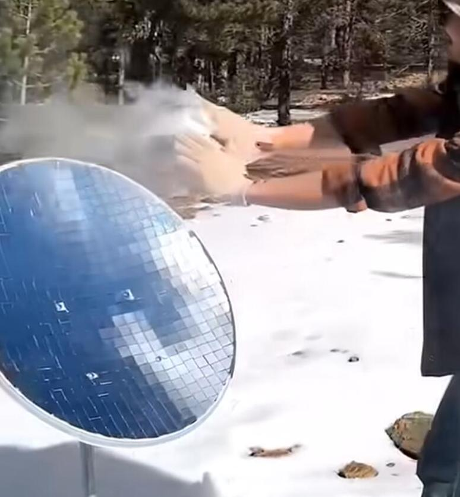
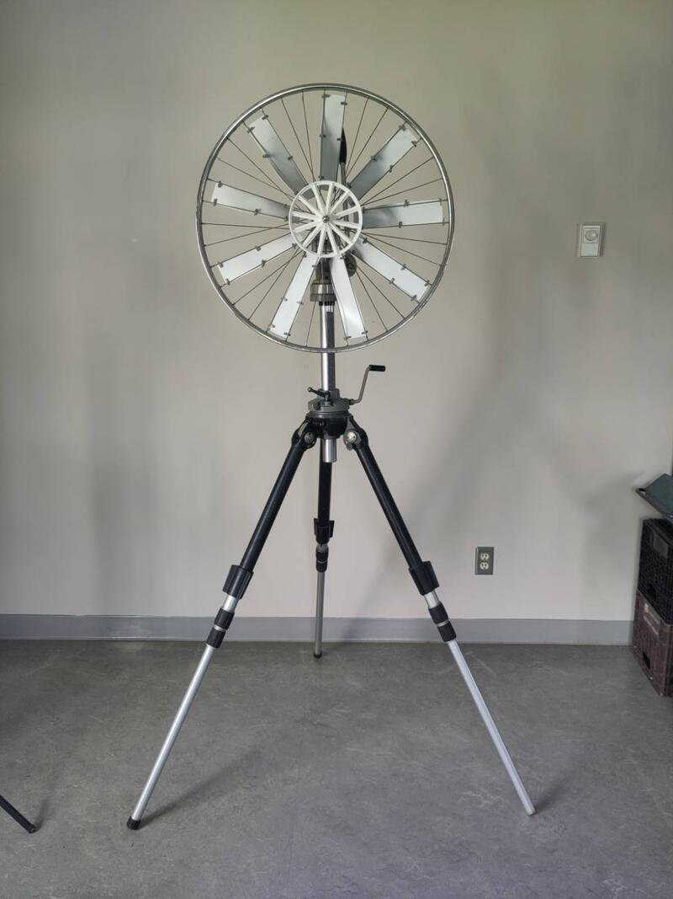
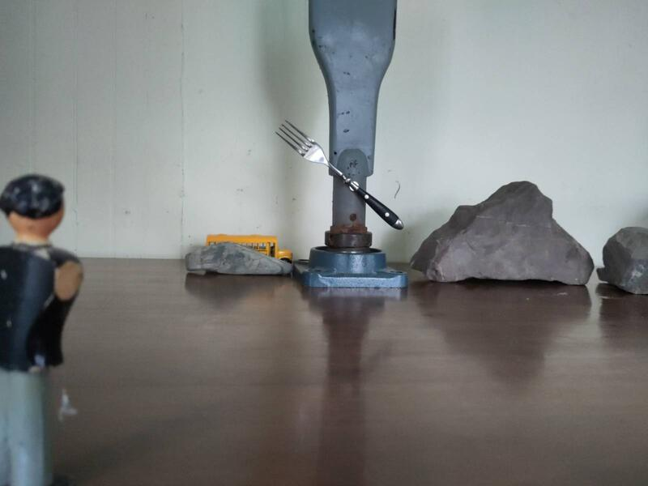

#### Reflexión sobre los materiales
Este proyecto de investigación consiste en crear la maqueta de una escultura cinética fabricada con materiales reciclados y energéticamente autónoma. La idea original supone la creación de un único elemento monumental, pero durante esta etapa de investigación y exploración quiero liberarme de todas las ideas preconcebidas y permanecer abierto a la posibilidad de una instalación compuesta por varios elementos complementarios en interacción.

Trabajo de manera intuitiva de modo que la etapa de búsqueda de materiales me pone en contacto con la realidad concreta. Me dejo guiar por lo que surge mientras realizo gestos concretos de interacción con el mundo. La espontaneidad opera siempre, pero en un plano donde la aparente oposición del mundo real y la imaginación entra en sinergia.
Las funciones primarias de cada elemento material se basan en 3 necesidades principales:
- estructural
- técnica
- estética.

Cada elemento debe cumplir estas tres funciones y servir para transformar una energía natural en movimiento (energía cinética), visualizar esa transformación y participar en la autonomía energética del conjunto. Este concepto de autonomía no implica necesariamente que la obra deba estar operativa en todo momento. Al contrario, supone que la obra trabaja con la energía disponible y, según las condiciones, puede encontrarse en un estado de apatía cuando no hay energía y/o en un estado de euforia cuando hay un exceso. Esto nos lleva a la pregunta: ¿qué hacemos cuando hay un corte de energía y qué hacemos cuando hay demasiada? Lo que significa la circularidad está en el centro del debate y también se aborda a través de la procedencia de los materiales. Tanto su calidad simbólica como su origen consisten esencialmente en revalorizarlos para revelar los conocimientos que materializan; a menudo caracterizados por su función original y en adelante por su recontextualización.

El objetivo es integrar el mayor número posible de elementos usados o reciclados. Esto puede volverse muy amplio, lo que representa un riesgo intrínseco a la investigación y exploración que emprendo con este proyecto. ¿Qué proporción de los materiales que forman la escultura puede provenir de fuentes usadas? ¿Y afecta esto a la integridad de la obra y a su valor fundamental?

#### Toma de contacto
Jérome Bouchard de FabBulles me refirió a la Sra. Emilie Dupont de [La Société d'Aide aux développement des Communauté du Kamouraska - SADC](https://www.sadc-cae.ca/fr/sadc/sadc-kamouraska/) quien me refirió a Alexandre Jolicoeur, responsable del proyecto La Simbiosis Industrial, a través del cual pude obtener un listado de todas las industrias de la región con excedentes de materiales. La lista es muy exhaustiva pero poco práctica y no muy fiable. Dicho esto, durante una conversación con Alexandre pudimos discutir el proyecto y me propuso algunos contactos que trabajan en áreas de interés para el proyecto.

- D'Amour métal, Lislet.
- [Acier JM Bastille](https://www.jmbastille.com/), Rivière du Loup
- [CoÉco](https://co-eco.org/), Philippe Bigonesse, R.D.L. 418 856 2628 ext 204 o 581 337 8514 (cel.)
- [Bélanger Électrique](https://belanger-electrique.com/) att. Tommy Bélanger - conoce el sector de las turbinas eólicas en la región. Teléfono - 80 Route Jeffrey Sainte-Anne-de-La-Pocatière, G0R 1Z0 Taller: 418-856-4617.

Con Alexandre Jolicoeur aprovechamos la conversación para discutir posibles enfoques de visualización de la energía natural y su acumulación:

- fototropismo solar (parábola recubierta de material reflectante) como alternativa al fotovoltaico basándose en el concepto de dilatación líquida o sólida.
- elemento Peltier para señal de muy bajo voltaje utilizando como ejemplo una placa bi-material (cobre y acero)
- Para el almacenamiento de energía o mejor dicho el 'efecto batería' hablamos de columna de agua y del principio de bombeo citando la vieja bomba manual utilizada antaño para extraer agua de los pozos.

Desarrollé el ritual de pasar religiosamente por el eco centro — ese lugar donde se clasifican los objetos que la gente viene a tirar. Para la fase de prototipado esto me convino perfectamente y encontré elementos muy interesantes.

Una amiga también me dio unos viejos trípodes que agradecí mucho ya que me son muy útiles para sostener elementos y poder ajustar fácilmente los ángulos, la altura y la posición en el espacio. Uno de los que me ofreció es un objeto notable; muy alto, sólido y de gran calidad. Aproveché de inmediato para colgar en él una rueda de bicicleta que servirá para la parte de mi investigación sobre los efectos ópticos a través de la cinética.

Realicé una sesión fotográfica para trabajar sobre las proporciones, la relación de objetos simbólicos de diferentes escalas. Un primer intento de aproximación a esta dimensión que quiero explorar con la presentación de los resultados de mi investigación en septiembre de 2026.

