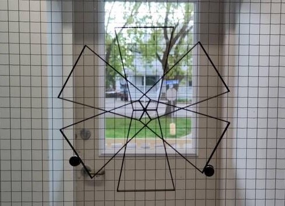

Sesión de mediación
- fecha: 09 de junio de 2026
- duración: 1h30 a 2hrs
- lugar: 536 ave de la Gare, St-Pascal

La reunión inicial con el comité 'Obra Pública' de la Ciudad de St-Pascal dará lugar a una presentación del proyecto "Autour du Moulin", una visita al taller seguida de una conversación sobre los temas:

- la función del arte público en el contexto contemporáneo: crisis climática y arte responsable.
- la pertinencia de Autour du Moulin: limitaciones y desafíos de la propuesta cinética.
- la ubicación de la futura escultura: los diferentes lugares potenciales en el territorio del municipio.

Para concluir será posible conversar libremente e interactuar con algunos de los artefactos que hemos producido desde la puesta en marcha del taller el 04 de mayo.

Aprovecho este comunicado para informar al comité de mi intención de documentar el encuentro. Si alguna persona tuviera una objeción y quisiera participar, se le pide que nos lo comunique y con mucho gusto evitaremos grabarla o fotografiarla.

