Con esta segunda fase del trabajo de exploración y prototipado, creé una serie de objetos/artefactos que buscan equilibrar forma y funcionalidad mientras exploran distintas aplicaciones cinéticas de la energía solar y eólica. El trabajo se realizó de manera muy intuitiva, a medida que iba encontrando materiales durante mis visitas diarias al eco-centro; cada elemento fue tomando forma y la relación complementaria entre ellos se fue revelando progresivamente.

Al mismo tiempo, creé también una primera propuesta de escultura en versión miniatura que traslada "a escala" un principio de visualización de la energía natural.

### El movimiento circular, la superposición y los efectos ópticos

Utilizando la rueda de bicicleta como leitmotiv visual, experimenté con la repetición y superposición de elementos gráficos en movimiento para estudiar el potencial de creación de efectos ópticos. Cada una de las ruedas está montada sobre un trípode y decorada con combinaciones de cartones blancos y negros.

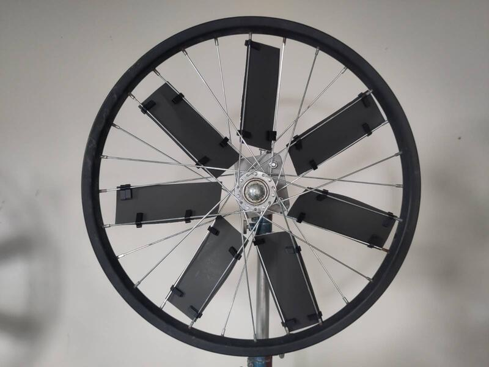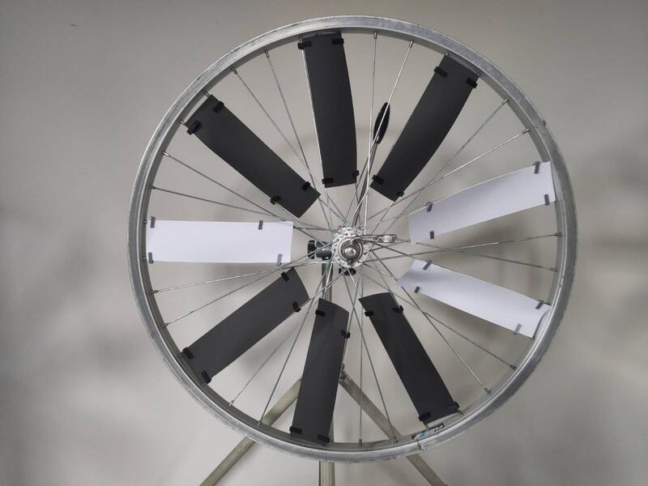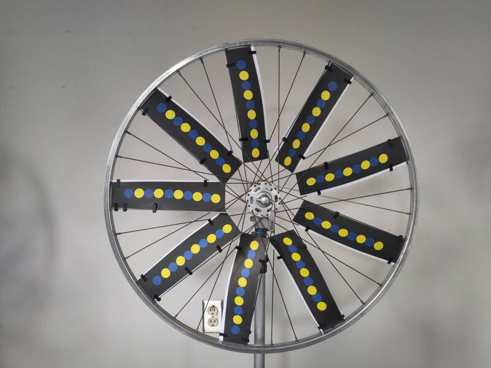

Colocar los cartones sobre los rayos fue muy laborioso. Fabriqué pequeñas grapas impresas en 3D para sujetar los cartones a los rayos.

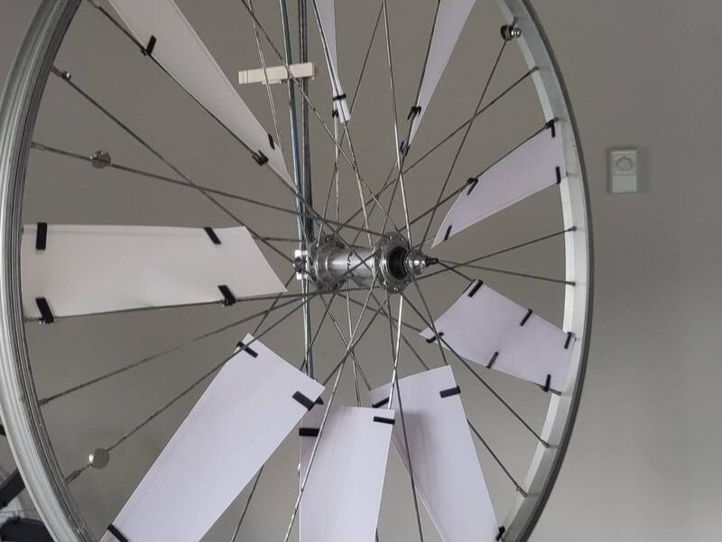

Con este ejercicio establezco la idea de las posibilidades infinitas que se abren al combinar motivos de diferentes tonalidades, colores y formas.

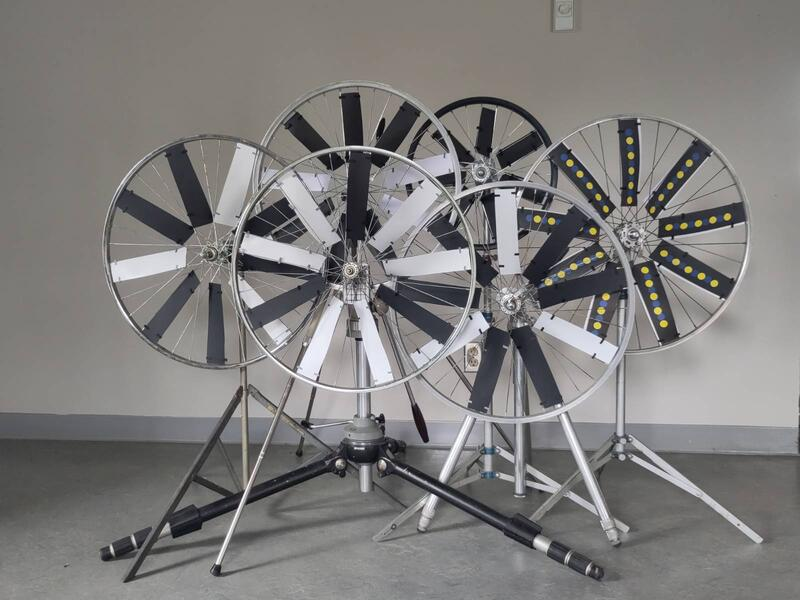

[Archivo CAD de la grapa](byciclewheelclip.stl)

### El principio eólico horizontal
Creé una aplicación horizontal de captación de energía eólica. Este enfoque minimiza el impacto de la gravedad al apoyar el peso de los componentes en movimiento sobre un punto de rotación horizontal. Con este enfoque, la fricción sobre el eje se reduce en comparación con la aplicación vertical y permite visualizar vientos de muy baja intensidad.

La escultura está compuesta principalmente de materiales reciclados: una vieja base de acero y una vieja pieza de hierro fundido, una rueda de carrito infantil, una rejilla de ventilador, varillas de baliza, flotadores de inodoro y rodamientos de bola. Para el ensamblaje, fabriqué piezas de sujeción impresas en 3D para sostener los sensores de viento.

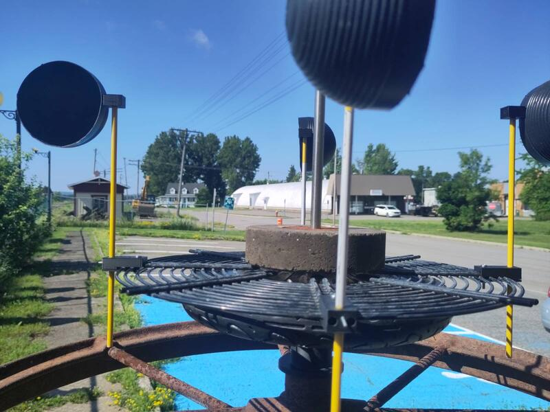

Esta pieza representa un primer boceto muy sumario de la integración del principio eólico horizontal y su aplicación cinética. Es fácil imaginar esta escultura proyectada a una escala monumental, a la que podría incorporarse un sistema de captación de energía mecánica y su transformación en corriente eléctrica.

### La memoria de los materiales y la visualización del equilibrio.

La memoria de los materiales hace manifiesto el frágil equilibrio que existe entre los distintos elementos del mundo y ofrece de él una visualización formal. El resorte es un objeto que me fascina por su capacidad de hacer perceptible la energía de la gravedad. Entre las energías naturales, la gravedad es la única constante y omnipresente. Cuando el viento sopla, se lo ve; luego, cuando se calma, desaparece. Con la energía solar pasa lo mismo, y con la hidráulica también: cambia con el tiempo y el entorno, y tiende a agotarse. La gravedad, en cambio, es diferente: en la sombra nunca la vemos, pero siempre está ahí. De hecho, es intrínseca a todo lo que es cinético.
Recuperé un elemento que había incorporado el año pasado en mi instalación "la coincidencia de los opuestos". Lo extrapolé para aplicarlo a un nuevo artefacto que puede considerarse tanto un objeto en sí mismo como una maqueta a escala de una posible escultura. Retomo la rueda de bicicleta, pero esta vez la pongo en suspensión, en equilibrio, para escenificar la inevitable tensión que la gravedad ejerce sobre la materia y convertirla en una representación poética.

Esta propuesta pone en interacción las energías naturales de la gravedad y el viento. Plantea desafíos físicos de gran importancia que deberán abordarse en una próxima etapa, en un entorno natural y en interacción con los elementos reales. Los ejercicios de simulación realizados en el taller son prometedores.

### La complementariedad de las formas y el sonido de su interacción.

Siguiendo esta misma idea de explorar los principios de la memoria de los materiales y el uso de resortes, yuxtapuse materiales completamente heterogéneos para un artefacto musical que permite materializar la interacción entre formas complementarias sometidas a una fuerza externa y en interacción con la energía de la gravedad. En este caso particular, el artefacto ofrece una experiencia sensorial a la vez visual y auditiva, y toma la forma de un instrumento musical interactivo.

Un viejo pedal de platillos puede activarse manualmente, provocando el movimiento vertical de una vieja base de ventilador suspendida de resortes, que choca contra la base de una parrilla (BBQ) apoyada en el suelo y contra dos bolas metálicas también suspendidas de resortes. El contacto entre los distintos elementos crea una resonancia sonora que recuerda al tañido de una campana de iglesia.

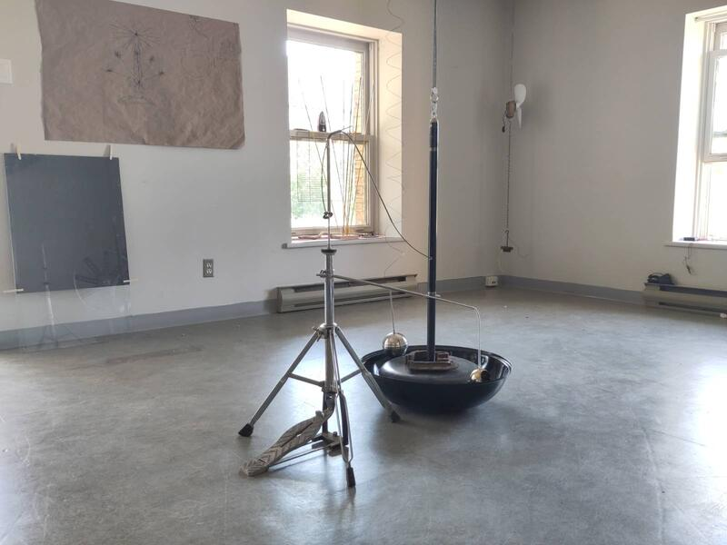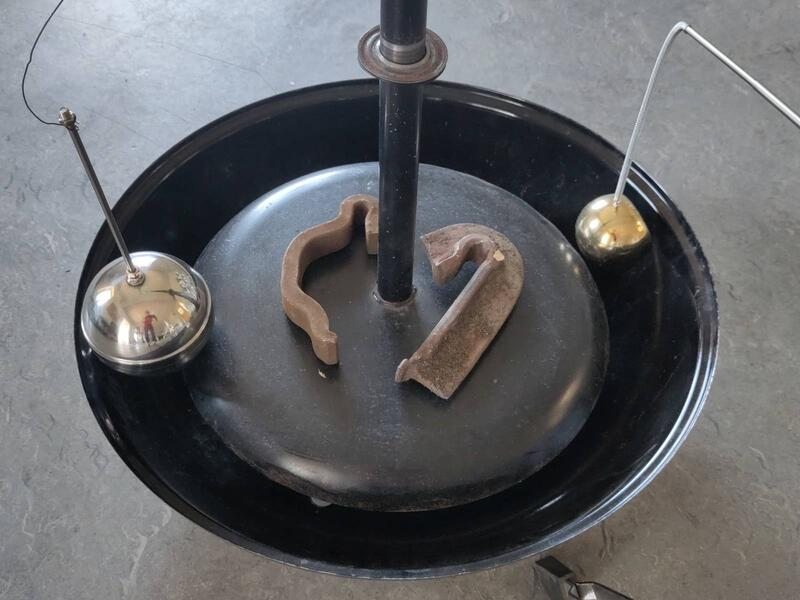

### La energía solar y la expansión de los líquidos.

Inicié una investigación sobre el principio de expansión de los líquidos como interfaz para transformar la energía solar en energía mecánica. Con esta idea en mente, reuní materiales que podrían servir para elaborar un prototipo. Está compuesto por una semiesfera cóncava que sirve para concentrar los rayos solares en un punto focal, y una base formada por piezas metálicas geométricas sostenidas por piezas imantadas usadas en soldadura.

La idea que persigo es colocar, en la zona de alta temperatura, un recipiente estanco que contenga etanol y esté conectado a un elemento inflable que se expande y se retrae según la cantidad de energía solar captada. Añadí una pequeña rueda de bicicleta flotando en la superficie para integrar una segunda fuente de energía, siguiendo el principio del aerogenerador horizontal, que permitirá alimentar un sistema de "sun-tracking" (seguimiento solar) sin proyectar sombra sobre el captador solar.

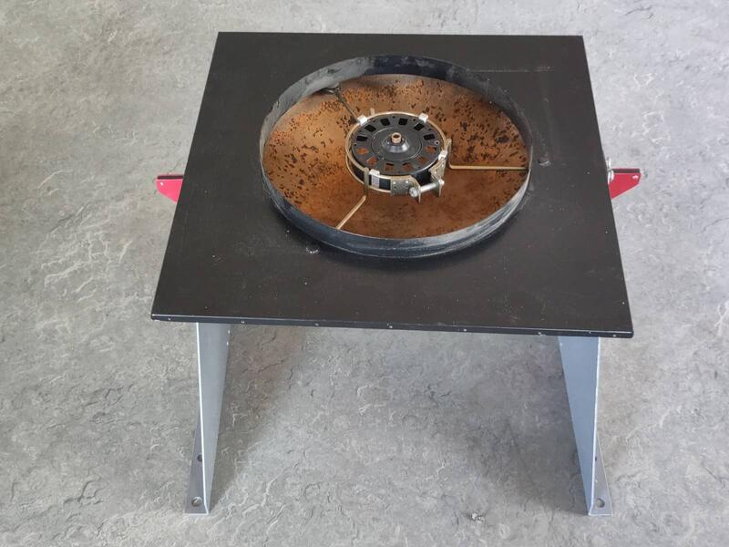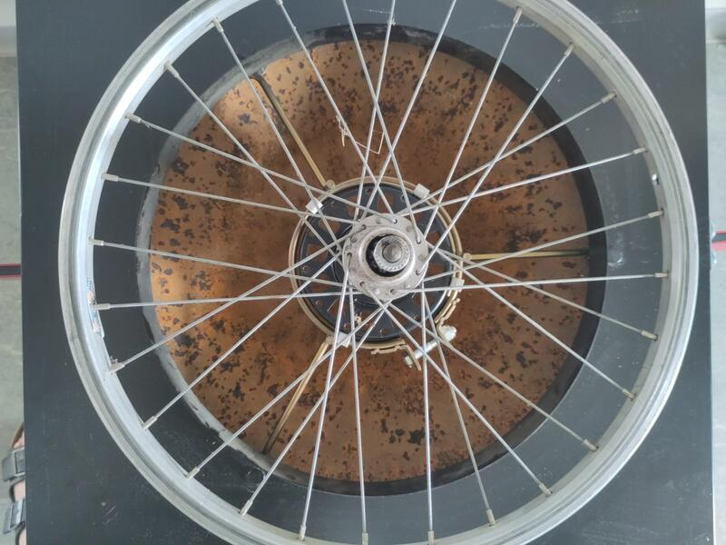

Este proyecto está en una etapa preliminar y se sostiene esencialmente sobre una base teórica. Soy muy consciente de que los elementos elegidos no me permitirán crear un sistema eficiente. Mi objetivo es, de hecho, jugar en el límite de lo factible y observar —y representar— la incidencia mínima de la energía natural sobre la materia.

Desarrollé la teoría y exploré una representación material del elemento principal del prototipo.

Ver:
[documento de investigación y la lista de materiales (bill of materials)](solar_kinetic_sculpture_README.md).

### La Meca, o el sol como energía divina.

En el impulso de seguir experimentando con la energía solar, buscando a la vez alternativas a las aplicaciones fotovoltaicas.

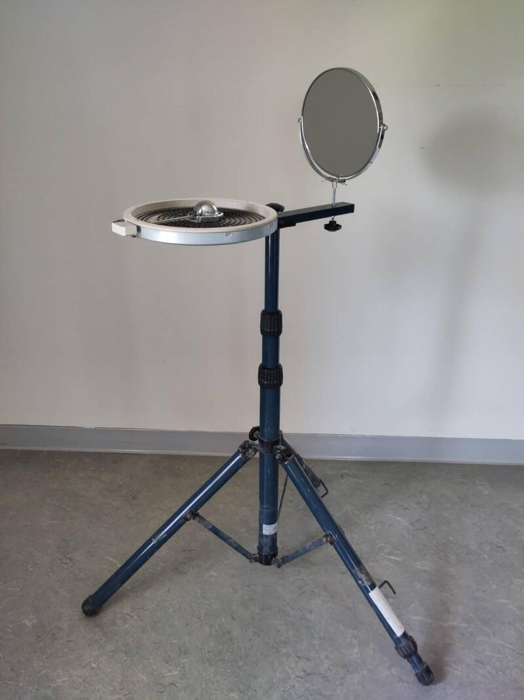

El elemento principal es una resistencia eléctrica proveniente de algún aparato, de forma circular, que contiene un circuito paralelo formando una espiral. La simplicidad de su forma expresa visualmente la complejidad de su función. Está sostenida por un trípode y ubicada frente a un espejo de baño articulado capaz de reflejar los rayos del sol exactamente en el punto donde se encuentran los dos polos de la resistencia, permitiendo que la energía térmica se transmita a esta. Este proyecto es puramente especulativo y, por el momento, no es funcional en absoluto. Lo concibo como un sistema narrativo para visualizar un principio teórico de extracción de la energía solar y su conversión en energía térmica mediante la interacción con la materia. De manera más simbólica, la forma central de este artefacto evoca La Meca, ese lugar de peregrinación a través del cual la comunidad musulmana comulga con Dios. La relación entre la materia y la energía natural del sol actúa como una metáfora de la trascendencia del hombre hacia lo divino.

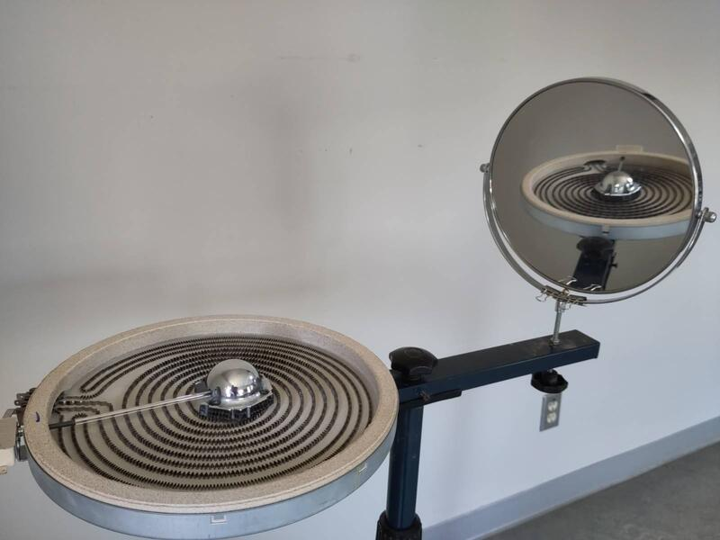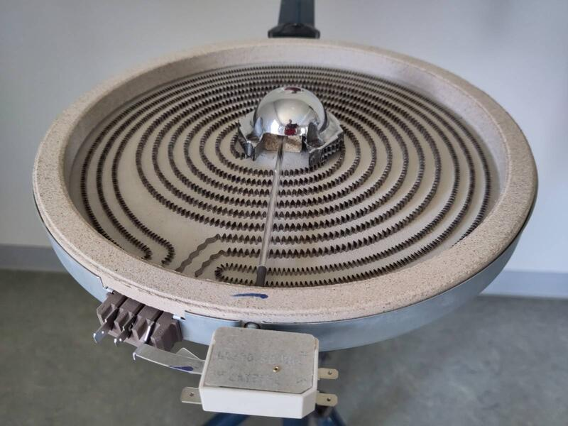
