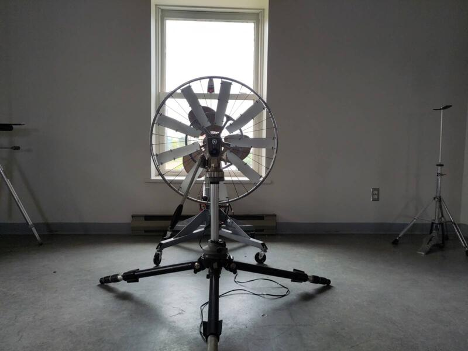
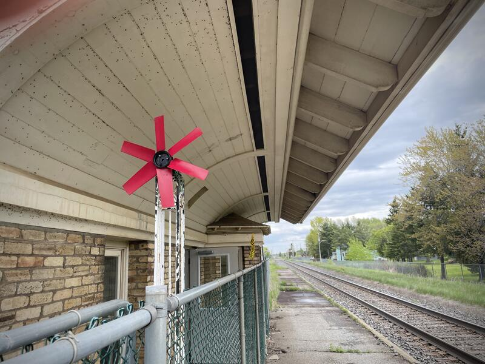
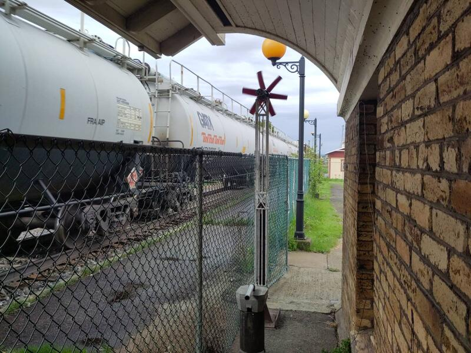
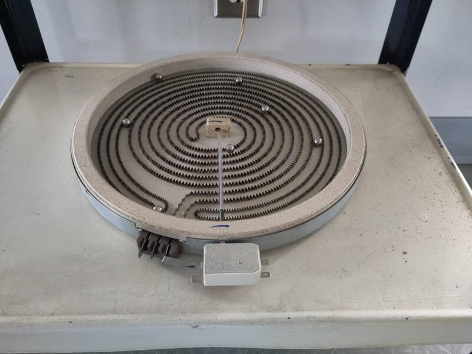

Ese proyecto de investigación consiste en crear la maqueta de una escultura cinética fabricada con materiales reciclados y energéticamente autónoma, siendo la idea original la creación de un único elemento monumental. El proceso de exploración de las diferentes dimensiones de la escultura se articula en forma de instalación compuesta por varios elementos complementarios en interacción.

Partiendo de materiales encontrados creé una serie de artefactos que permiten explorar la captura y visualización de fuentes de energía natural, principalmente del viento. Ensamblé elementos que me permitieran simular el viento con el fin de obtener mayor autonomía en el desarrollo de las aplicaciones formales de visualización de su energia. Fabriqué algunos "artefactos" que interactúan con la energía eólica y sitúan la materialidad técnica y funcional en primer plano con el objectivo de hacerla tangible.

Paralelamente y a medida que avanzaban mis hallazgos creé otras composiciones no funcionales para crear relaciones simbólicas yuxtaponiendo objetos de la vida cotidiana. Aproveché esa oportunidad para seguir explorando la temática de las formas, su sentido y diálogo, y observarlos en equilibrio.

  

El medio video permite apreciar mejor la naturaleza cinética de los estudios realizados utilizando la energía del tren que pasa, con el viento que crea y las vibraciones que produce. Luego experimenté con su transferencia en corriente eléctrica y con activar artefactos de visualización.




