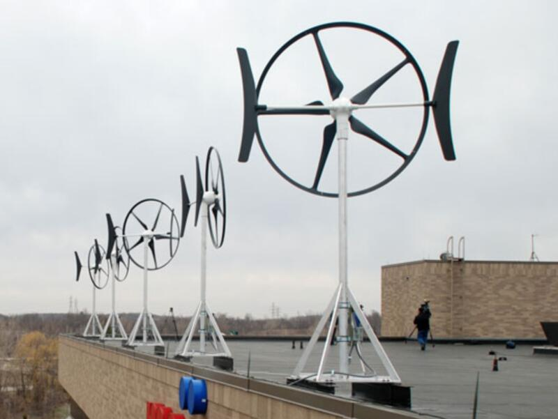
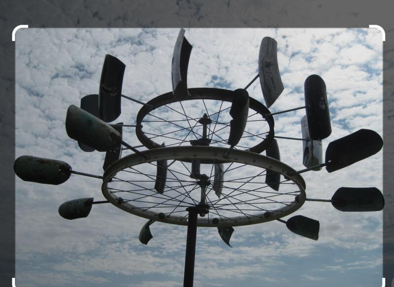

#### Cultivo el asombro ante los fenómenos del mundo mediante la interacción directa con la representación visual de su energía.  

Una compilación de imágenes que evocan los temas explorados por el proyecto y que se corresponden con mis intereses particulares.  

Hablamos de ilusión óptica, de punto de vista y del encuentro de la materia con la energía de la materia bajo la influencia de la naturaleza en el tiempo y en relación con la humanidad y su necesidad de extraer todos sus recursos.

El elemento circular es predominante en alusión a la esfera terrestre y por la propensión de la forma a sugerir y provocar el movimiento y sus sensaciones. También es manifiesto el peso de las masas, las proporciones y el juego con las escalas de magnitud y el punto de vista de la mirada sobre la materialidad. La idea ante todo es representar la magia de la ingeniería humana y la obsolescencia de la búsqueda por perpetuarse en el mundo.

  

Los procesos que suscitan una posible aplicación en el proyecto nos remiten a enfoques tecnológicos variados que comparten el denominador común que implica la búsqueda de autonomía a través de la circularidad de interacciones entre ellos y con el entorno. Ya sea físico, intelectual o social, el vínculo que se crea entre las diferentes representaciones de la realidad se convierte en un gesto integral y utópico que solo el arte puede hacer posible cuando se articula en torno a limitaciones reales pero se abstiene de buscar producir algo que no sean sensaciones abiertas a todos los sentidos así como a la noción de descubrimiento de lo imposible. Este proyecto, como el resto de mi trabajo, hace referencia implícita a la idea conceptual de un movimiento perpetuo que busca trascender la noción de Dios a través de la técnica y el dominio del conocimiento.  

. 

 *Movimiento perpetuo. Grabado de un «molino de agua de ciclo cerrado», una máquina de movimiento perpetuo diseñada por el médico inglés Robert Fludd en el siglo XVII. Se afirmaba erróneamente que la energía producida por el agua al caer desde un depósito sobre una rueda de molino era suficiente para accionar un tornillo de Arquímedes y devolver el agua al depósito, manteniendo así la máquina en movimiento perpetuo.*

