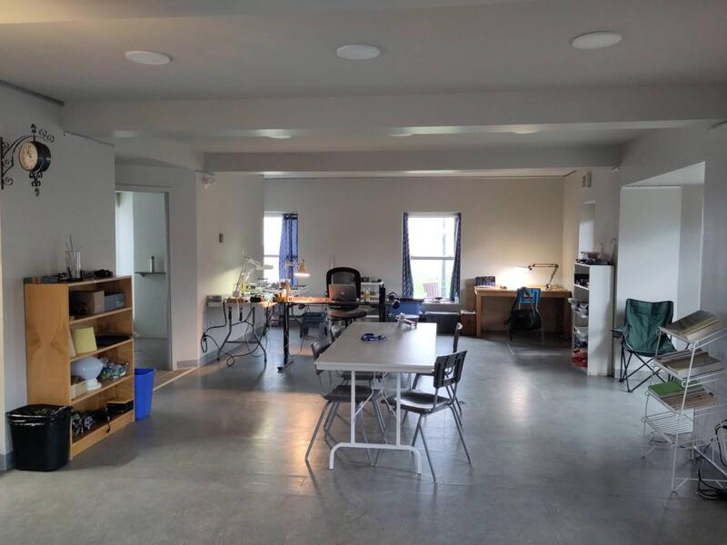
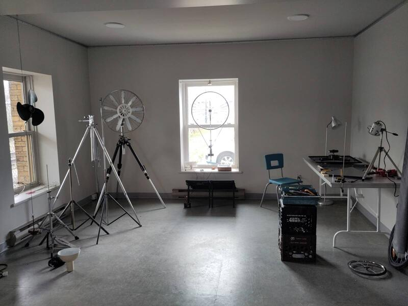
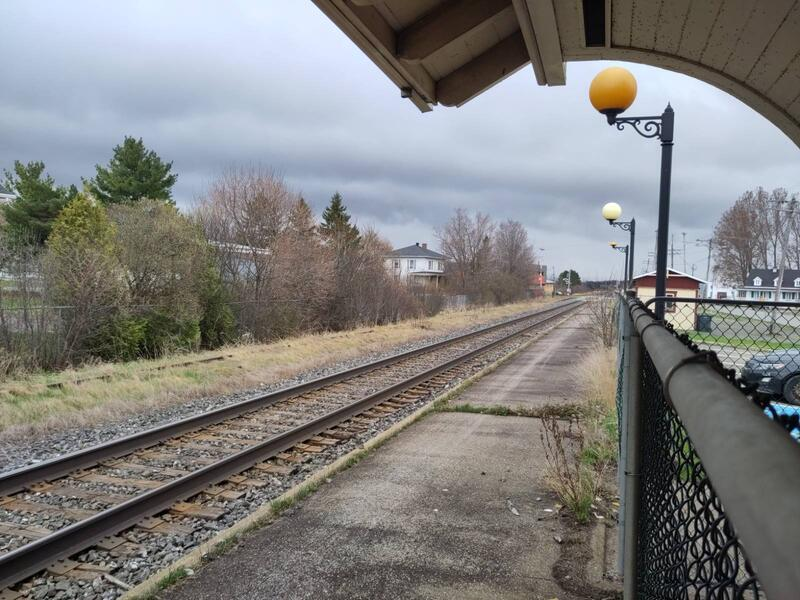

Pour la réalisation de ce projet la ville de St-Pascal m'offre accès au rez-de chaussé de la vieille gsre pour y installer mon atelier. L'extérieur de l'édifice respecte son architecture originale bien que un peu défraîchi mais ça lui donne un charme particulier très approprié pour le projet. Comme si cet édifice un peu délaissé qui vît dans le quartier comme le fantôme d'un passé déchû qui revient à la vie. 

La gare est accessible par la porte principale qui ouvre sur un petit hall donnant accès à l'atelier et au deuxième étage qui est loué par une école de musique mais qui semble pas très active pour le moment. La partie arrière donne directement sur la voie de chemin de fer. Une clôture de type frost a été installé lorsque la compagnie de train a abandonné le service de passager pour restreindre l'accès à la voie ferré. Il y a deux autres portes donnant accès â l'atelier â l'arrière de l'édifice. Elles sont situés sous le préeau et me semble bien adéquate piur qu'elles deviennet la porte d'entré officielle du studio. Ça fait plus intime et me semble plus naturel. 

L'intérieur a été rénové récemmment, avec les meilleures intentions mais faisant en sorte que le cachet original a été remplacé par les critères de notre époque; c'est-à-dire avec le souci de tout standardiser. 

Ceci dit le lieu est neutre, fonctionnel et il est facile à investir. L'espace dont je dispose est assez grand pour que je puisse créer les différents espaces de travail dont j'aurai besoin.

Le train de marchanside passe quelques fois par jour. Il s'agît d'un train de fret dans les proportions de l'amérique du nord, donc gigantesque. Lorsqu'il s'approche de la gare on entend un sifflement et quelques instants plus tard le train fonce à 80km/h à quelques mètres seulement de l'édifice qui tremble en cadence avec la chaine de wagons de un et deux étages - Une séquence expérientielle exceptionelle d'une durée d'environ 2.min.30sec. Il passe normalement direction est vers 15h45 et vers l'ouest vers 17h45, pour le moment. On verra avec le temps. Pour le moment ça rend le sejour plutôt intéressant.  

J'ai installé différentes station de travail pour répondre aux différents champs d'application de mon projet. 

Maintenant je peux commencer à travailler et j'ai décidé que mon premier projet d'exploration cinétique portera sur la manifestation de l'énergie de ce train. Elle est manifeste par le son et la vibration de la terre à son passage et je me propose de la visualiser son influence par la matière en mouvement.(voir prochain post: L'énergie du train)

