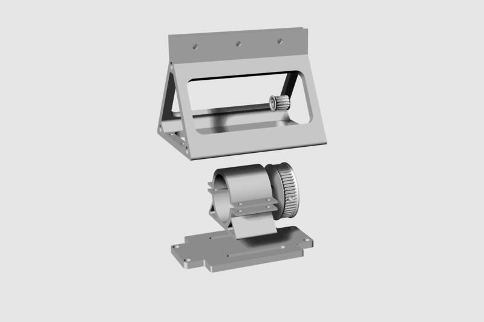
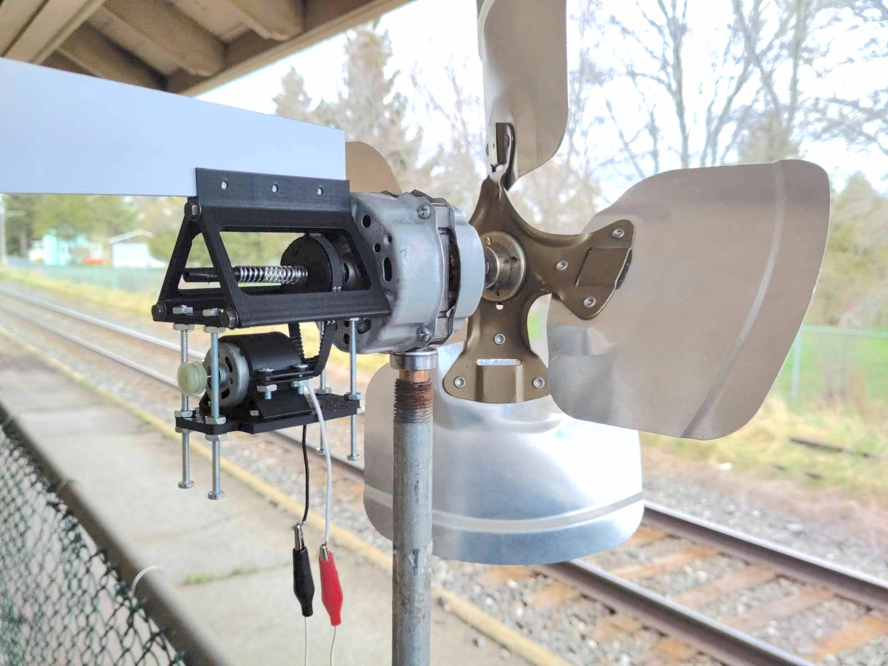
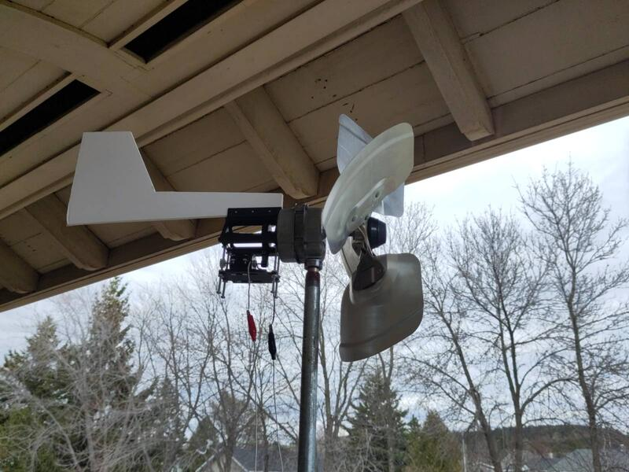

A première vue le train semble passer de façon régulière mais plus je passe de temps dans l'atelier plus je constate que son horaire est aléatoire. Puisque mon objectif est de capturer son énergie et que je ne suis ni présent ni disponible à tous les moments de la journée (et de la nuit) je me suis proposé de construire un artefact qui me permettrait de créer un registre de son passage et ainsi peut-être déduire son horaire habituel. Le thème de cet exerise s'intitule l'énergie du train et consiste à capturer sous différentes formes l'énergie que le passage du train produit. Je traite de façon plus précise les sources provenant du vent et des vibrations que le train provoque à son passage. 

Dans un premier temps j'ai crée une mini-éolienne muni des deux petits moteurs qui s'activent avec le mouvement de l'élice pour produire 2 sources de courant paralèles. J'ai accroché l'éolienne à un poteau de la clôture séparant le rail de l'atelier et j'y ai connecté un fil qui permet d'acheminer à l'intérieur de l'atelier le courant électrique produit.  

. 

Dans un deuxième temps j'ai crée un artefact vibratoire connecté à un des moteurs de l'éolienne auquel j'ai attaché trois stylos de couleurs différentes qui, sous l'effet des vibrations créent des représentations graphiques de l'énergie du train. 

Le deuxième moteur de l'éolienne active un deuxième artefact faisant bouger le papier de façon linéaire pour ainsi déplacer la surface sur laquelle l'empreinte graphique est imprimée et ainso créer une ligne de temps.

Comme le vent souffle est autonome, inprévisible et indépendant du train j'ai voulu  m'assurer que le registre graphique corresponde précisément au vent produit par le passage du train. J'ai donc installé un senseur de vibration qui capture les secousses que l'approche et le passage du train produit. Ce senseur est programmé pour activer le mouvement linéaire au moment précis où le train passe. 

Cet exercise me donne l'occasion de construire un work-fow générique d'inputs et de outputs qui servira éventullement dans un nouveau contexte d'application adapté à la maquette de la sculpture finale.  

Pour accélérer le processus d'expérimentation et mettre en place le système d'interaction des artefacts et tester leur fonctionalité, j'ai créé une infrastructure pouvant simuler le vent en récupérant de vieux ventilateurs epermettant de crér du vent au besoin.  
