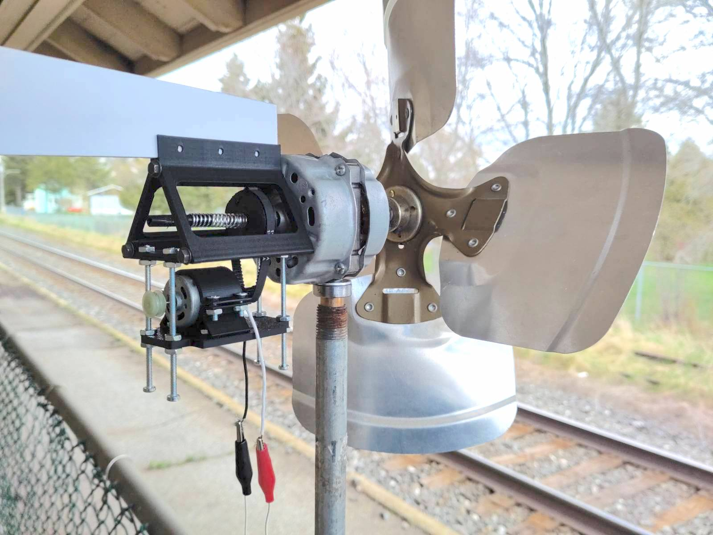
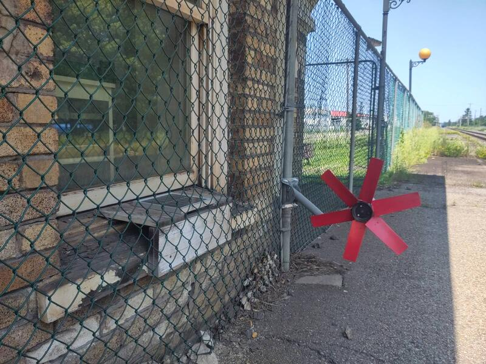
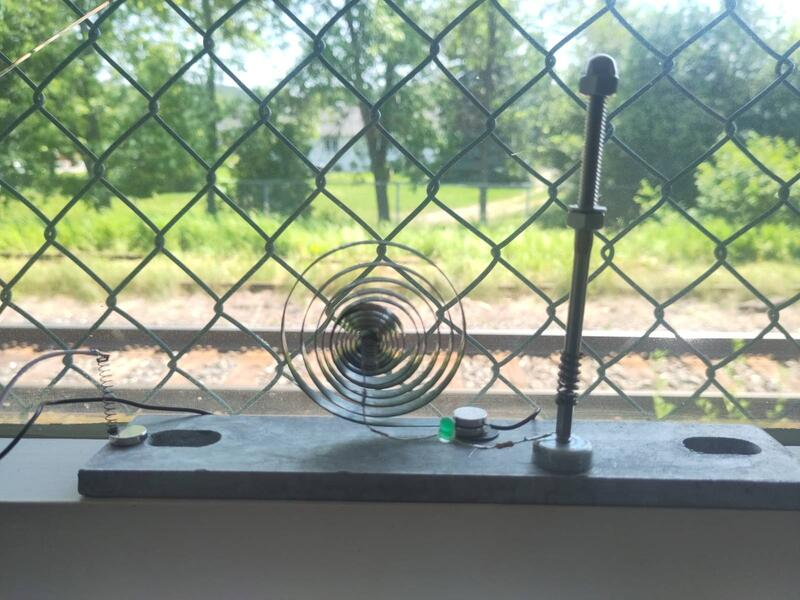
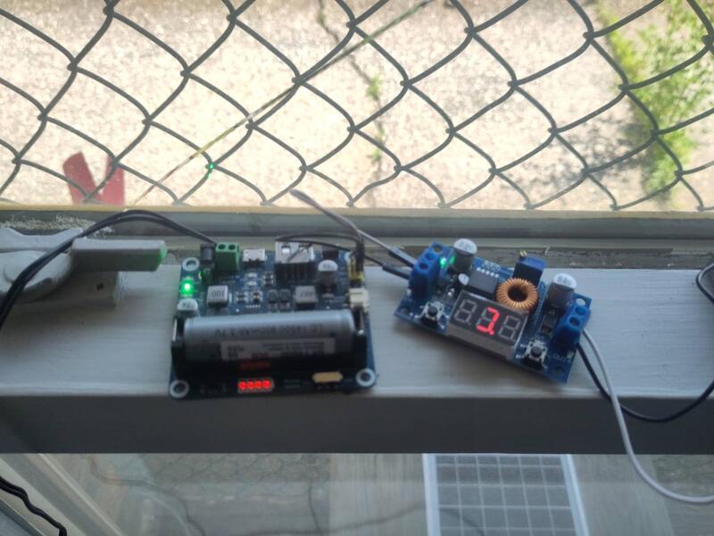

### ... et le vent qu'il provoque.  

La première idée qui m'est venu lorsque j'ai confirmé que je ferais le développement de ce projet dans la vieille gare de St-Pascal a été de travailler avec l'énergie du train. Dès mon arrivée j'ai commencé à travailler sur un artefact dont la fonction est de visualiser l'énergie de ce train qui passe en vacarme quelques fois par jour; faisant trembler l'édifice de la gare sur son passage et dont l'absence par contraste plonge l'atelier dans un lieu de calme et d'un silence apparamment absolu.
Le développement de ce projet est échelonné sur toute la durée de la résidence et s'articule en parallèle avec le travail de recherche et d'exploration de la sculpture ou du processus de création de la maquette. Il y est relié indirectement et sert d'abords et avant à expérimenter avec une échelle de technologie applicables à l'échelle du miniature. Ce projet fonctionne aussi comme 'benchmark' pour expérimenter avec les pricipes d'autonomie énergétique.    

#### Capturer l'énergie du train.  

Dans un premier temps j'ai crée une mini-éolienne muni des deux petits moteurs qui s'activent avec le mouvement de l'élice pour produire 2 sources de courant paralèles. J'ai accroché l'éolienne à un poteau de la clôture séparant le rail de l'atelier et j'y ai connecté un fil qui permet d'acheminer à l'intérieur de l'atelier le courant électrique produit.  

. 

Le fait de travailler d'une part avec le vent qui souffle quand bon lui semble et d'autre part avec un train qui passe sans ponctualité pendant quelques minutes et seulement quelque fois par jour est rapidement devenu un handicap pour le développement de mes apprentissages. J'ai donc compris qu'il était nécessaire de pouvoir simuler le vent. J'ai crée un socle me permettant d'activer mon éolienne à l'aide d'un ventilateur que j'ai muni muni d'une pédale de régulation de vitesse.
(photos et vidéos)

#### Support matériel et registre linéaire

J'ai utilisé une vielle trance à papier comme structure de support du papier et j'y ai intégré un système de support pour le rouleau de papier à chacune des extrémitées ainsi qu'un moteur d'entrainement du papier et des composant électroniques de contrôle de vitesse et mise en marche automatique lors du passage du train.  
Pour alimenter ces composants une deuxième gnératrice éolienne de plus haut voltage fabriqué à partir d'un moteur recyclé d'un vieux tapis-roulant.  
Puis j'ai crée une structure de soutient de 3 stylos auquel j'ai rattaché un mini motuer vibratoire alimenté par l'éolienne. Lorsque le vent souffle l'hélice s'active, entraîne le moteur qui génère un courant électrique qui produit un vibration transmise au stylos qui se mettent à dessiner le vent.  

  

 
  

#### Senseur de vibration  

Il arrive que le vent qui active éolienne provient de l'ambiance et non directmement provoqué par le passage du train. Pour distinguer la source de vent provenant du train j'ai crée un appareil capable de détecter la vibration de l'édifice causé par le passage du train. Il est composé d'un ressort réveil-matin en spirale placé détendu à la verticale et d'un circuit électrique doté d'une diode qui s'illumine au contact du ressort lorsqu'il entre en vibration. 
  

  

#### L'encre et le papier

Lorsque la pointe des stylos est en contact avec le papier, l'encre s'écoule de façon continuelle faisant en sorte de consommer de l'encre inutilement. Pour rémédier à cet inconvénient j'ai imaginé un systeme de levier rattaché au mat de soutient de la structure de support des stylos. J'ai d'abords fait des tests avec un selonoïd mais la quantité de courant requise est trop élévé. J'ai donc opté pour intégrer un mini servo-moteur controlé par un circuit intégré de type 555 timer ICC. 
J'ai élaboré la théorie d'un tel système car j'aurais aimé éviter  avoir recours à un micro-controlleur mais sans obtenir de succès malheureusement.  

Mes conclusions me mènent à croire que, vu la fonctionalité de cet élémnet dans le contexte global de mon projet il sera plus efficace d'intégrer un micro-controleur (Arduino, ESP32 ou Rasberri pico) comme interface de contrôles des interactions entre les différents composants.  

Cet exercise me donne l'occasion de construire un work-fow générique d'inputs et de outputs qui servira éventullement lors de la réalisation de la dimension fonctionelle de la maquette.
