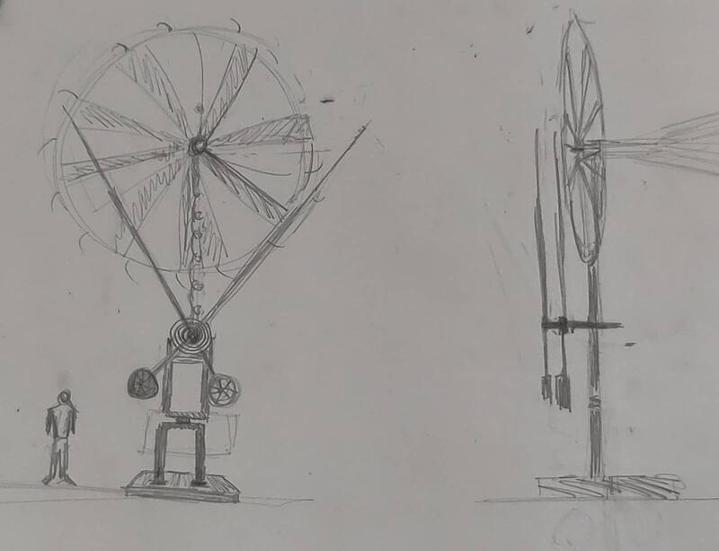
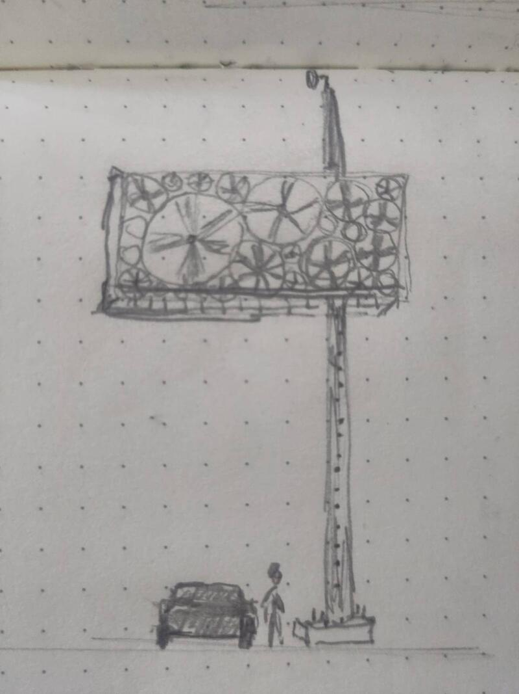
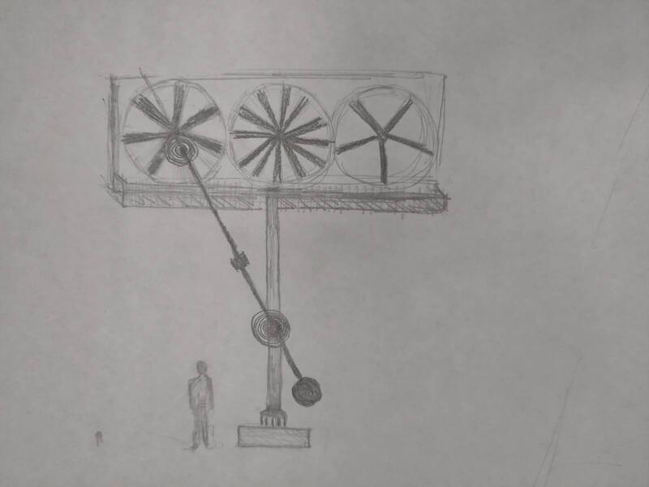
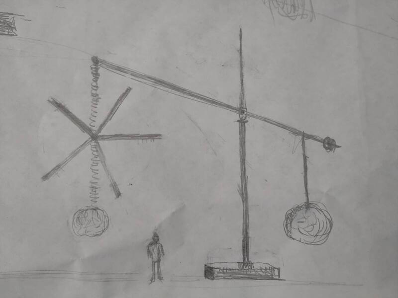
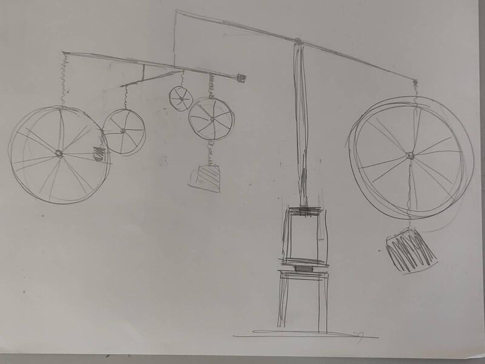
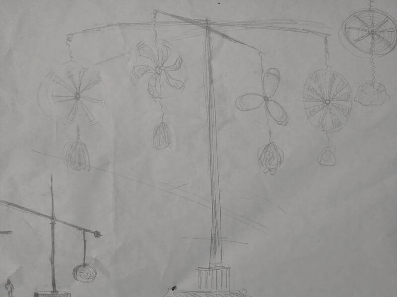

### Esquisses et proportion  

  

Le processus de recherche et d'exploration ainsi que la création m'a permis de réfléchir à différentes formes d'intégration des principes fondamentaux de la sculpture. J'ai dévelopé quelques proposition à la fois différentes et complémentaires partagé entre l'idée de donner un caractère monumental à la sculpture soit par l'usage d'un élémnet principal surdimensionné ou par la répétition d'une même élément sur des échelles différentes. Ces deux tendances sont explicites dans les différentes esquisses que j'ai produit Mon expérimentation est conditionné par à la question essentielle de la résilience. Quelle serait la forme idéale d'une sculpture cinétique énergétiquement autonome qui requiert le minimum d'entretien et de maintenance possible? 

Avec la création des des premières esquisses j'ai cherché à mettre en relation les forces opposées (le grand et le petit, mouvement et la quiétude, la lourdeur et la légèreté, la fonctionalité et l'esthétique) tout en imaginant des matériaux dont la symbolique cherche à placer le passé et le présent dans un même espace. 

### Esquisses
Avec toutes ces idées en tête je me suis mis à dessiner en m'inspirant de matériaux dont je connais l'existence et la disponibilité et me permettant d'imaginer certains autres que je peux imaginer possible de trouver. 

#### Métronome

.

 

#### Halte routière  

  

  

#### Mobile  

  

#### Esquisse tridimensionelles  
L'idée de créer la maquette de la scultpture implique de projeter le minuature dans la proportion du réel. J'ai procédé à un exercise de spéculation pour mettre en relation des éléments miniatures dans la forme symbolique évoques des éléments présents dans la dimension réelle. J'ai réuni une séries de petits moteurs DC et des pales éoliennes miniatures de différentes formes avec des éléments structurels génériques en proportion afin de donner une représentation proportionné de la maquette. Il ne s'agît pas d'une proposition formelle mais bien d'une "esquisse tridimensionelle" de la dimension physique et des principes cinétiques que je propose explorer avec la sculpture. Le choix délibéré de chacun des éléments sert dmabords et avant tout à établir un système de cohérence entre les matériaux, leur esthétique et leur valeur symbolique. Cette première esquisse de la maquette sert principalement comme support de développement de la sculture et fait fonction de preuve de concept.  

  

