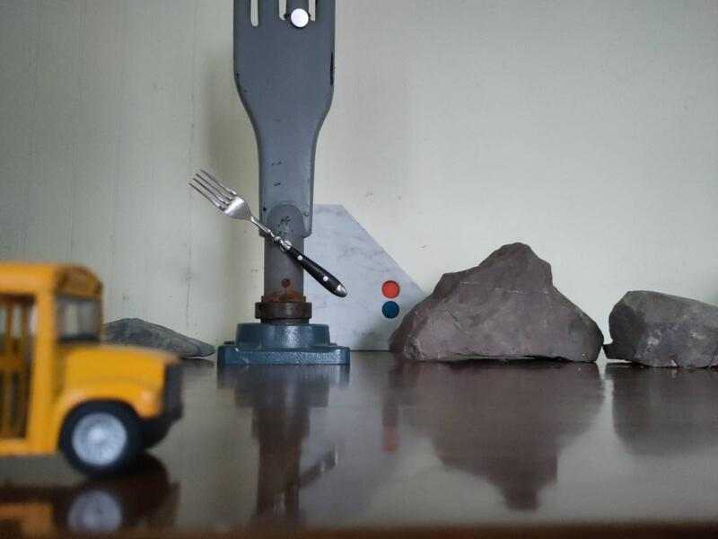
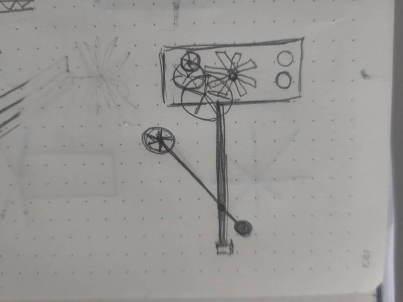
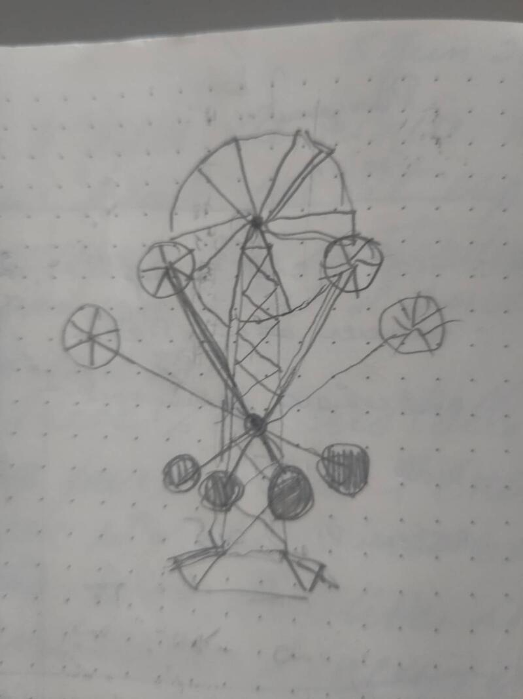

### Esquisses et proportion  

  

Le processus de création des artefacts m'a permis d'identifier les principes fondamentaux de la sculpture: l'équilibre et l'autonomie. Et toute mon expérimentation me mène à la question essentielle de la résilience. Quelle serait la forme idéale d'une sculpture cinétique énergétiquement autonome qui requiert le minimum d'entretien et de maintenance possible? 

#### Esquisses
Avec cette question en tête je me suis mis à dessiner en m'inspirant des références visuelles et de matériaux dont je connais l'existence et disponibilité.  

.

  

#### Esquisse tridimensionelles  
L'idée de créer la maquette de la scultpture implique de projeter le minuature dans la proportion du réel. J'ai procédé à un exercise de spéculation pour mettre en relation des éléments miniatures dans la forme symbolique évoques des éléments présents dans la dimension réelle. J'ai réuni une séries de petits moteurs DC et des pales éoliennes miniatures de différentes formes avec des éléments structurels génériques en proportion afin de donner une représentation proportionné de la maquette. Il ne s'agît pas d'une proposition formelle mais bien d'une "esquisse tridimensionelle" de la dimension physique et des principes cinétiques que je propose explorer avec la sculpture. Le choix délibéré de chacun des éléments sert dmabords et avant tout à établir un système de cohérence entre les matériaux, leur esthétique et leur valeur symbolique. Cette première esquisse de la maquette sert principalement comme support de développement de la sculture et fait fonction de preuve de concept.  

  

