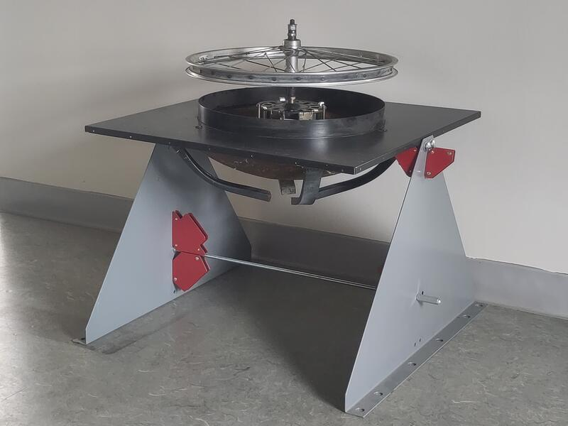

# Sculpture cinétique solaire — Projet SoulGem
*Notes de session pour assurer la continuité — à téléverser au début d'une nouvelle session*

---

  

  

## Concept du projet

Une sculpture cinétique alimentée entièrement par l'énergie solaire. Le soleil chauffe un petit récipient scellé contenant de l'éthanol, ce qui le fait se vaporiser et gonfler un élément d'expansion (actuellement un ballon en latex). La nuit, l'éthanol se condense de nouveau en liquide et le ballon se dégonfle. Le système est entièrement autonome, scellé, ne nécessite aucun ravitaillement, et suit un cycle continu avec le soleil — créant une illusion de mouvement perpétuel.

---

## Capteur solaire

- **Objet trouvé :** fond d'un bol de barbecue, retourné, doublé d'un matériau réfléchissant
- **Dimensions :** 21,5 po de diamètre, 4,5 po de profondeur
- **Forme :** à peu près sphérique (non parabolique), fond non aplati
- **Doublure réfléchissante :** on commence avec du mylar / une couverture de survie (pouvant être améliorée avec de l'aluminium poli ou des morceaux de miroir)
- **Objectif :** non pas un point focal précis (ce qui exigerait un système de suivi solaire), mais une **zone focale** diffuse — tolérante aux variations de l'angle du soleil tout au long de la journée

---

## Calculs optiques

| Paramètre | Valeur |
|---|---|
| Rayon du bol (R) | 10,75 pouces (0,273 m) |
| Profondeur du bol (d) | 4,5 pouces |
| Distance focale (f = R²/2d) | ~12,8 pouces au-dessus du centre du bol |
| Diamètre de la zone chaude | ~3-4 pouces |

Le récipient thermique devrait être placé à environ **12,8 pouces au-dessus du centre du bol**, et mesurer **2 à 3 pouces de diamètre** pour tenir dans la zone chaude.

---

## Calculs d'énergie solaire

- Surface d'ouverture : 0,234 m²
- Puissance solaire brute interceptée (à 1000 W/m²) : **234 W**

| Surface réfléchissante | Réflectivité | Chaleur utilisable à la zone focale (après ~70 % d'efficacité de concentration) |
|---|---|---|
| Papier d'aluminium froissé | ~70 % | ~115 W |
| Mylar / feuille plate | ~85 % | **~140 W** ← chiffre de référence |
| Aluminium poli | ~90 % | ~148 W |
| Verre miroir | ~95 % | ~155 W |

**Chiffre de référence : 140 W**

Remarque : la différence entre le mylar et le miroir est modeste. Le mylar constitue un bon point de départ.

---

## Choix du fluide

- **Éthanol à 99 % ou plus (anhydre)** — pas de l'alcool à 80 %
- L'alcool à 80 % contient 20 % d'eau, ce qui augmente le point d'ébullition, réduit la production de vapeur et dégrade le système au fil des cycles à mesure que l'eau s'accumule dans la phase liquide
- L'éthanol anhydre est disponible en quincaillerie ou en pharmacie au Canada

---

## Calculs thermodynamiques

**Pour vaporiser l'éthanol :**
- Chaleur sensible (20 °C à 78 °C) : ~142 J/g
- Chaleur latente de vaporisation : ~841 J/g
- Total : ~1000 J/g

**Pour gonfler un ballon de 2,5 L (selon la loi des gaz parfaits à 78 °C / 351 K) :**
- n = PV/RT = ~0,087 mole
- Masse d'éthanol = 0,087 × 46 g/mol = **~4 grammes**

**Constat clé :** seuls ~4 grammes d'éthanol sont nécessaires pour gonfler un ballon de 2,5 L. Les 140 W disponibles sont largement supérieurs au besoin réel — le système dispose d'une bonne marge thermique et réagira rapidement au soleil.

---

## Liste des matériaux (en cours d'élaboration)

**Capteur solaire**
- Fond de bol de barbecue — 21,5 po de diamètre, 4,5 po de profondeur
- Doublure réfléchissante — mylar/couverture de survie (point de départ)

**Récipient thermique** *(dimensions exactes encore à déterminer)*
- Petit cylindre en cuivre — ~2-3 po de diamètre (pour tenir dans la zone focale)
- Extérieur noirci
- Scellé de façon permanente
- Contient ~5-10 ml d'éthanol à 99 % ou plus

**Élément d'expansion**
- Ballon en latex (point de départ — à peaufiner selon les besoins esthétiques et de durabilité)
- Alternatives envisagées : vase d'expansion de plomberie (plus durable, déjà conçu pour la pression)

**Élément de raccordement**
- Tubulure entre le récipient et le ballon — cuivre ou silicone, résistant à la chaleur

**Fluide**
- Éthanol à 99 % ou plus (anhydre) — ~10 ml

---

## Éléments encore à déterminer

- Dimensions exactes du récipient (hauteur, épaisseur des parois)
- Comment le récipient est soutenu à la hauteur focale (~12,8 po au-dessus du bol)
- Conception de la structure de support (objet trouvé)
- Comment le ballon est logé et présenté
- Méthode de scellement pour le système fermé
- Faut-il remplacer le ballon par un élément d'expansion plus durable

---

## Principes de conception

- **Objets trouvés** dans la mesure du possible
- **Plus simple, c'est mieux**
- **Entièrement autonome** — aucun ravitaillement, aucun suivi, aucune électricité
- **Système fermé et scellé** — l'éthanol cycle indéfiniment entre liquide et vapeur
- Échelle : à déterminer selon le choix de l'élément d'expansion

---

*À poursuivre ici lors de la prochaine session*
