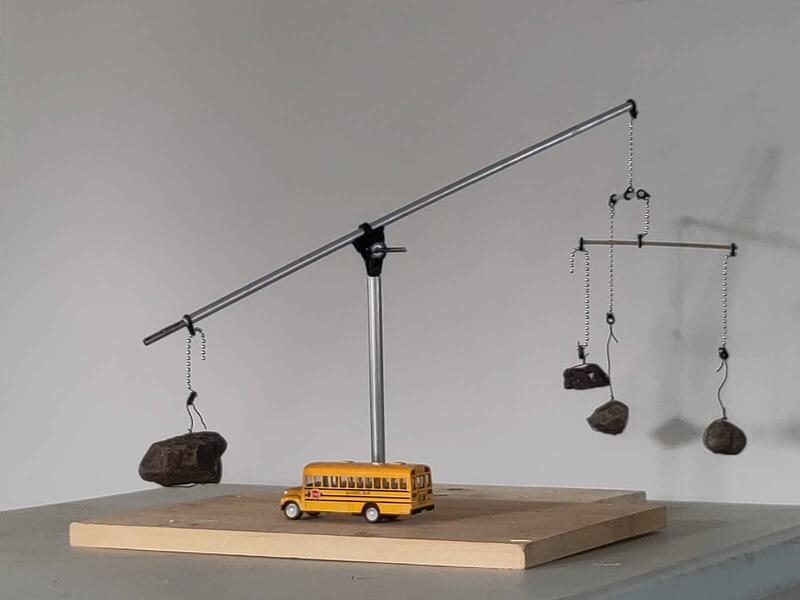
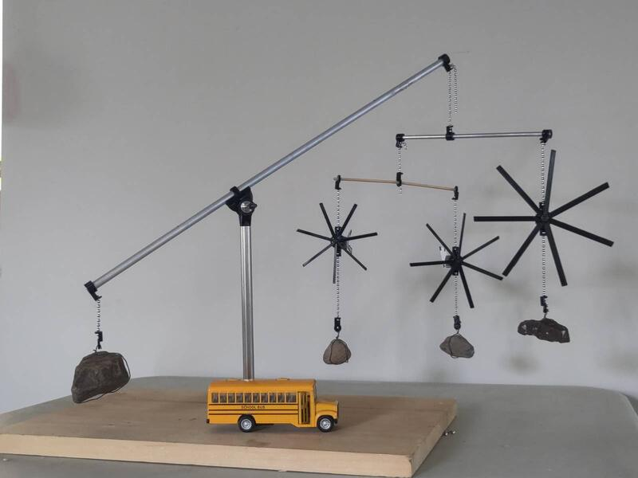
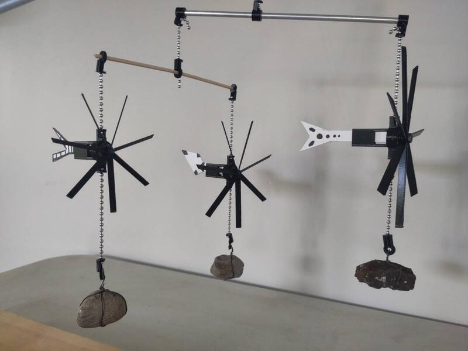

Première application formelle des principes de la sculpture - representation physique de la matière en interaction avec l'énergie du vent et de la gravité. 

  

Cette première esquisse de la sculpture déclare une direction précise visant à observer une mise en équilibre des différentes forces en interaction et en révéler la nature vivante. 

  

