Cet article contient deux concepts d'application des principes de la sculpture qui explorent l'idée de recherche d'un équilibre entre la nature et l'être humain; placant en interaction des éléments organiques et d'autres technologiques soumis à l'influence des énergies naturelles du vent et de la gravité.  

Il s'agît d'esquisses en forme de maquette dont l'objectif principal est d'explorer différents principes d'ingénierie offrant le potentiel d'intégration de deux des conctraintes tecniques de la sculpture (cinétique et autonomie énergétique) sans toutefois intégrer la matérialité propre de la sculpture finale composée principalement d'éléments recyclés. 

### Concept 1 - version 1 - Manège
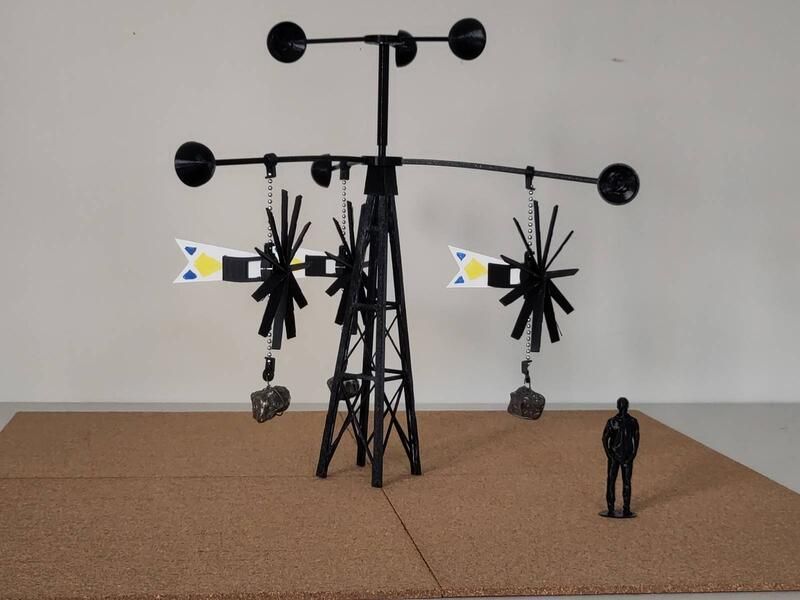  
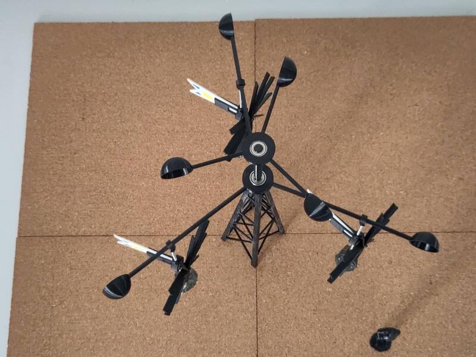  



### Concept 1 - version 2 - Mobile éolien
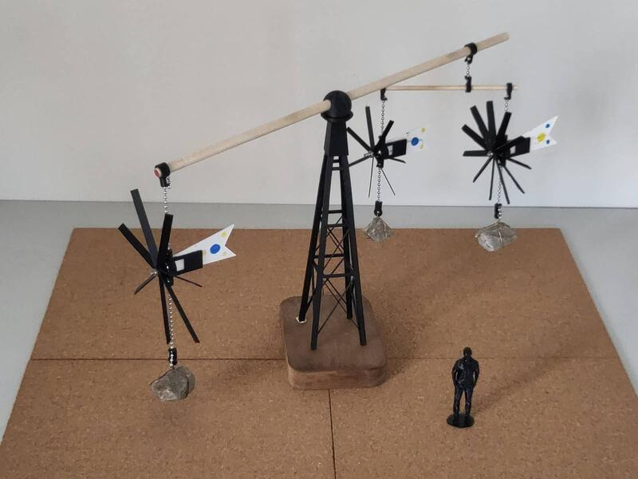  
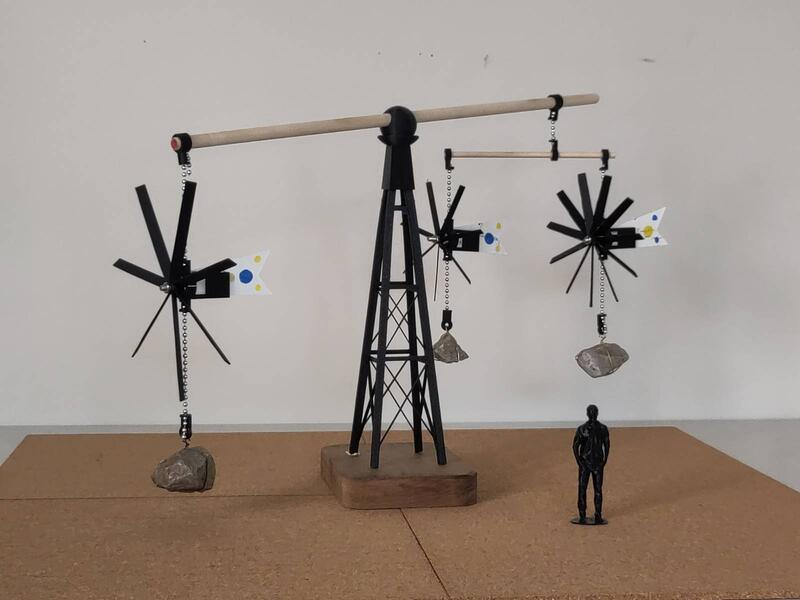  



### Concept 1 - version 3 -Mobile éolien

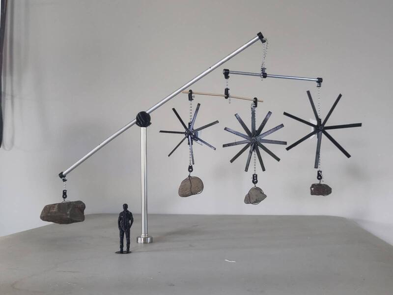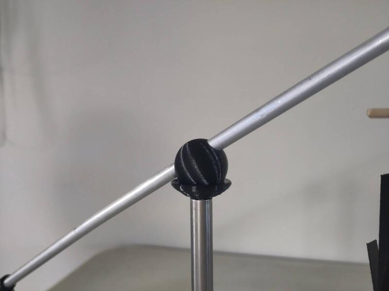  



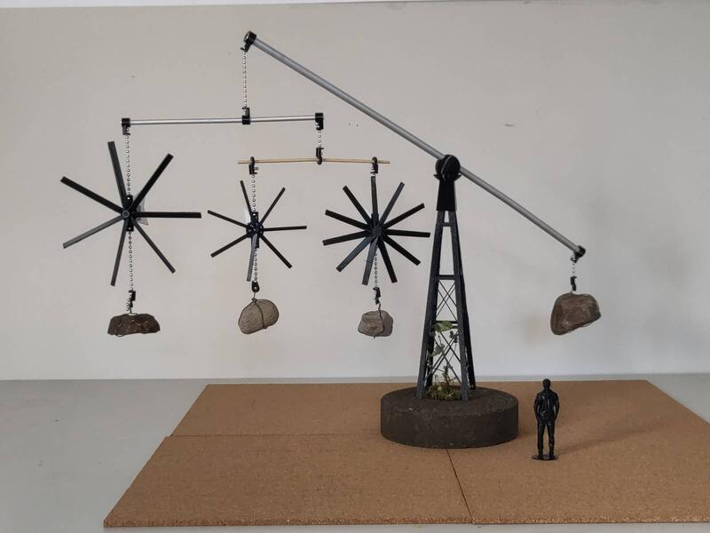  
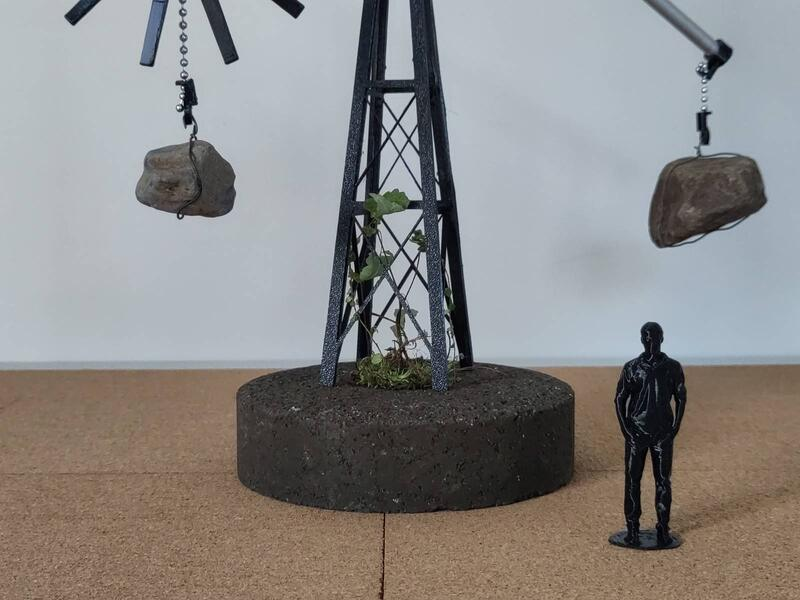  



### Concept 2 - Spirale
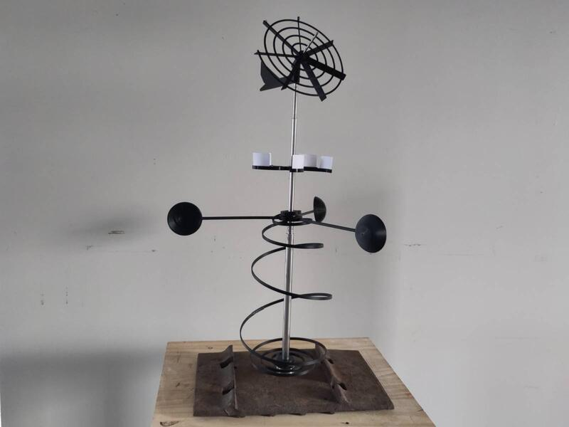  



### Concept 3 - Métronom éolien
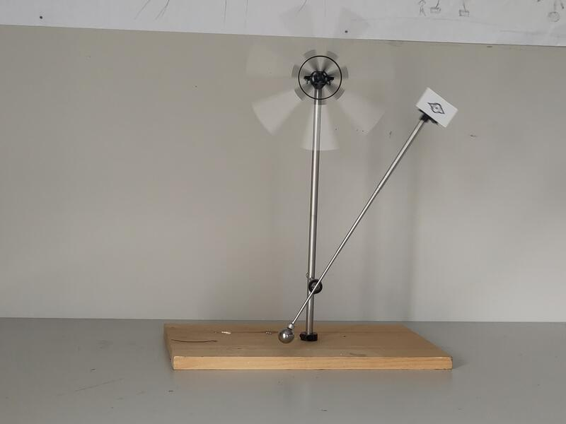  

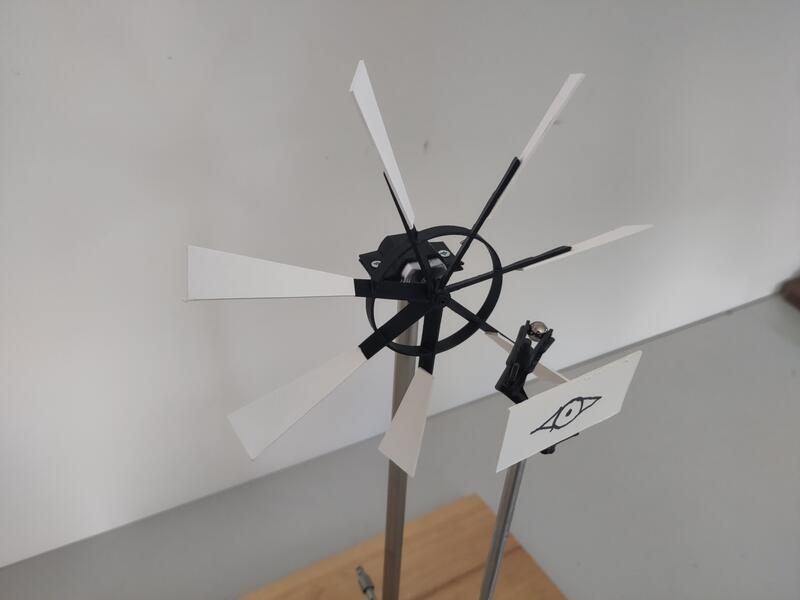   


  




