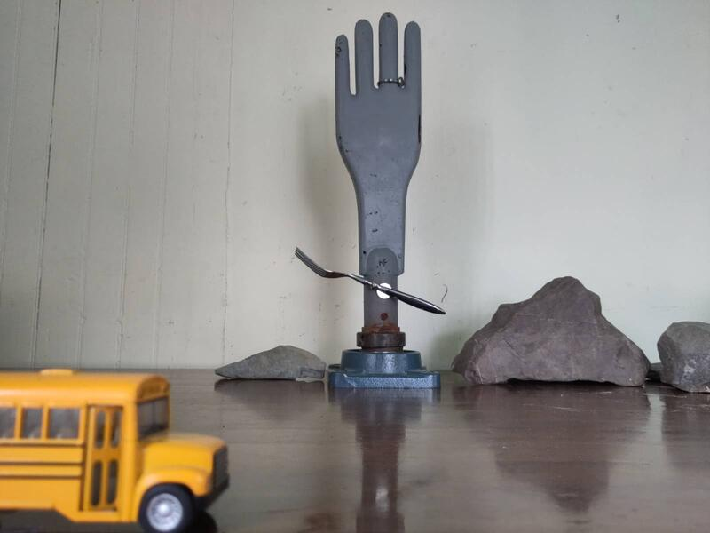
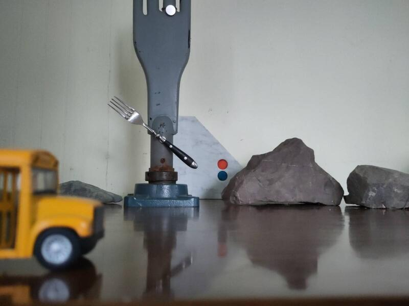
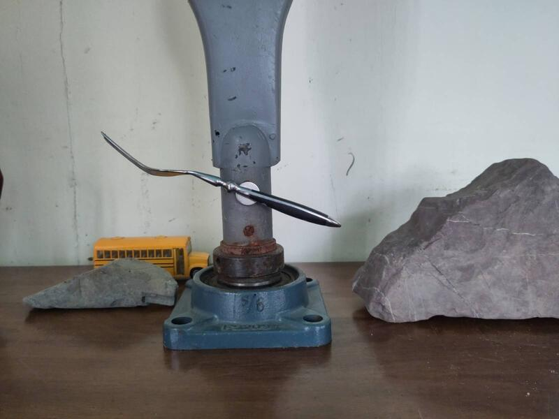

 

#### Réflexion sur les matériaux
Ce projet de recherche consiste à consiste à créer la maquette d'une sculpture cinétique fabriqué de matériaux recyclés et qui est énergétiquement autonôme. L'idée originale suppose la création d'un seul élément monumental mais pendant cette étape de recherche et d'exploration je veux me libérer de toutes idées pré-conçues et rester ouvert à la possibilité d'une installation composées de plusieurs éléments complémentaires et en interaction.  

Je fonctionne d'une façon intuitive de sorte que l'étape de la recherche des matériaux me met en contact avec la réalité concrète. Je me laisse guider par ce qui survient tout en posant des gestes concrets d'interaction avec le monde. La spontanéité opère toujours mais sur un plan oü l'apparente opposition du monde réel et de l'imagination entre en sysnergie.  
Les fonctions primaires de chaque élément matériel se base sur les 3 besoins principaux: 
- structurel
- technique 
- estétique.  

Chaque élément doit remplir ces trois fonctions et servir à transformer une énergie naturelle en mouvement (énergie cinétique), à visualiser cette transformation et participer à l'autonomie énergétique du tout. Ce concept d'autonomie n'implique pas nécessairement que l'oeuvre doivent être opérationelle en tout temps. Bien au contraire cela suppose que l'oeuvre travaille avec l'énergie disponible et, selon les conditions, peut se retrouver dans un état d'apathie lorsqu'il n'y a pas d'énergie et/ou dans un état d'euphorie lorsqu'il y en a un excès. Ça nous ramène à la question: Qu'est-ce que l'on fait lorsqu'il y a une panne d'énergie et qu'est-ce qu'on fait lorsqu'il y en a trop. Ce que signifie la circularité est au centre du débat et se voit aussi traité par la provenance des matériaux. Autant leur qualité symbolique que leur origine et consiste essentiellement à les remettre en valuer pour révéler les connaissances qu'ils mat/rialisent; souvent caractérisé par sa fonction originale et dorénavant par sa recontextualisation.  

L'objectif est d'intégrer le plus d'éléments usagés ou recyclés possible. Cela peut devenir trés large ce qui représente un risque intrinsèque à la recherche et l'exploration que j'entreprends avec ce projet. Quelle proportion des matériaux formant la sculpture peuvent provenir de l'usagé? Et est-ce que cela affecte la l'intégralité de l'œuvre et sa valeur fondamentale?

#### Prise de contact
Jérome Bouchard du Fabbulles m'a référé à Mme Emilie Dupont de [La Société d'Aide aux développement des Communauté du Kamouraska - SADC](https://www.sadc-cae.ca/fr/sadc/sadc-kamouraska/) qui m'a référé à Alexandre Jolicoeur, responsable du projet La symbiose Industrielle et à travers lequel j'ai pu obtenir un listing de toutes les industries de la région possédant des excédentaires de matériaux. La liste est très exhaustive mais peu pratique et pas très fiable. Ceci dit lors d'une conversation avec Alexandre nous avons pu discuter du projet et il m'a proposé quelques contacts qui traitent de domaines d'intérêt pour le projet. 

- D'Amour métal, Lislet.
- [ Acier JM Bastille](https://www.jmbastille.com/), Rivière du Loup
- [CoÉco](https://co-eco.org/), Philippe Bigonesse, R.D.L.  418 856 2628 ext 204 ou 581 337 8514 (cell.)
- [Bélanger Électrique](https://belanger-electrique.com/) att. Tommy Bélanger - connaît le milieu des éoliennes dans la région. Téléphone - 80 Route Jeffrey Sainte-Anne-de-La-Pocatière, G0R 1Z0Shop: 418-856-4617.  

Avec Alexandre Jolicoeur nous avons profiter de la conversation pour discuter de possibles approches de visualisation de l'énergie naturelle et et son accumulation: 

- phototropysme solaire (parabole enduits de matière réfléchissante) comme alternative au photovoltaïque en se basant sur le concept de la dilatation liquide ou solide.  
- élément Pelletier pour signal très bas voltage utilisant comme example un plaque bi-matériau (cuivre et acier)
- Pour le storage de l'énergie ou mieux dit 'effet batterie nous avons parlé de colonne d'eau et de principe de pompage en citant la vielle pompe manuelle utilisés jadis pour extraire l'eau de puits. 

J'ai développé le rituel de passer religieusement à l'éco centre - cet endroit où on classe les objets que les gens viennent jeter et s'en débarasser. Pour la phase de prototypage cela m'a parfaitment convenu et j'ai trouvé des éléments très intéressants.  

Une amie m'a aussi donné de vieux trépieds que j'ai apprécié car il m'est très utile pour  soutenir des éléments et de pouvoir ajuster les angles, la hauteur et position dans l'espace facilement. Un de ceux qu'elle m'a offert est un objet remarquable; très grand, solide et d'une grande qualité. J'en ai tout de suite profiter pour y accrocher une roue de vélo qui servira la partie de ma recherche sur les effets optiques par la cinétique.  

  

J'ai effectué une session photographique pour travailler sur les proportions, la relation d'objets symbolique d'échelle différente. Une premier essai d'approche à cette dimension que je veux explorer avec la présentation du résultat de ma recherche en septembre 2026.  

