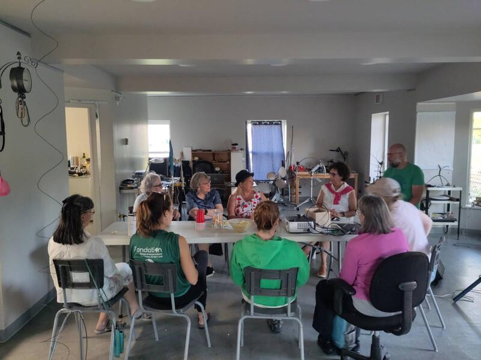
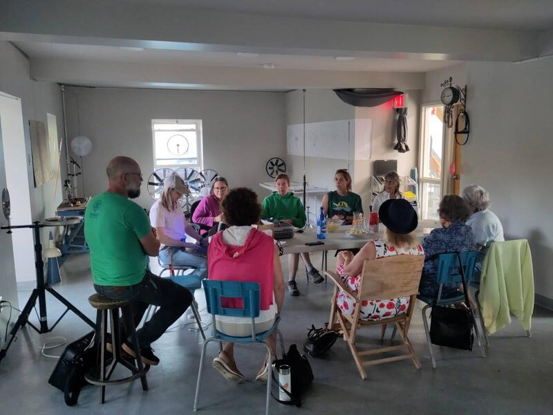

#### Deuxième séance de médiation

Cette séance de médiation aura lieu en présence de certains membres des comité Art Public et "200 ème". Pour cette occasion je présente la 2 éme phase du travail de recherche et d'exploration et j'introduis mes premières esquisses de l'éventuelle sculpture.  

Dans un premier temps je rapellerai les caractéristiques fondamentales du projet correspondant aux contraintes me servant de guide pour sa réalisation:

- cinétique - movement permettant de visualiser une ou plusieurs sources d'énergie naturelle
- faite de matériaux usagés (industriels et patrimoine)- remise en valeur de la matière existante
- autonomie énergétique - utiliser l'énergie naturelle pour générer l'énergie nécessaire au fonctionnement de la sculpture 
 
Par la suite je situe le moment actuel dans le calendrier global de réalisation du projet, puis je ferai un brève description de ce que j'ai réalisé depuis la dernière rencontre (2 ème phase de recherche et d'exploration) mettant l'emphase sur le développement de différentes avenues d'application à la sculpture. 
En conclusion je décrirai mes objectifs pour la prochaine étape. 

L'objectif de cette rencontre consiste à mettre les membres des comités à jour sur l'évolution du projet, présenter les différentes directions que j'ai envisagé pour la sculpture et recevoir des commentaires en vue de détermniter la direction à prendre pour le développement de la proposition finale et qui donnera lieu à la réalisation de la maquette. 

#### Retour sur le calendrier
  - mise en production du projet / recherche théorique et préparation (mars/ 15 avril)
  - protypage phase 1 ( 15 avril/8 juin)
  - prototypage phase 2 (8 juin/ 5 juillet)
  - 2 ème session de médiation (NOUS SOMMES ICI) 
     - recherche et exploration ([voir prtotype phase 2](https://isaacpierreracine.github.io/fr/art/autour-du-moulin/prototype--phase-2/))
      - énergie éolienne 
        - horizontal
        - vertical
        - autres avenues de recherche (non applicables au projet)
        - l'énergie du train      
     - recherche des matériaux
     - premières esquisses ([Esquisses et proportions](https://isaacpierreracine.github.io/fr/art/autour-du-moulin/esquisse/))
      - différentes options et intégration des matériaux ([Mat/riaux et processus](https://isaacpierreracine.github.io/fr/art/autour-du-moulin/materiaux-et-processus/))
      - jeu de proportion (en vue de la présentation de la maquette) 
      - période de questions, commentaires 
      - conclusion et choix de proposition
  
  - prochaine étape (5 au 25 aout)
   - élaboration de la proposition finale
   - intégration des matériaux
   - études du lieu réel et implantation
   - esquisses finales et dessins techniques 
   - expertise d'ingénierie et confirmation d'assistants techniques 

  - Réalisation de la maquette (25 aout au 18 sept.)
   - modélisation des matériaux trouvés
   - réalisation des éléments sculpturaux à l'échelle
   - réalisation des éléments environnementaux réels (situation de la sculpture)  

  - Installation maquette et préparation de l'exposition (21 au 25 sept.)
    - montage de la maquette sur le lieu réel (jeu de prespective)
    - démontage de l'atelier et montage de l'exposition.
    
  - Exposition (25 sept au 01 octobre) 
  - rédaction du mémoire du projet (25 sept. au 31 octobre)
