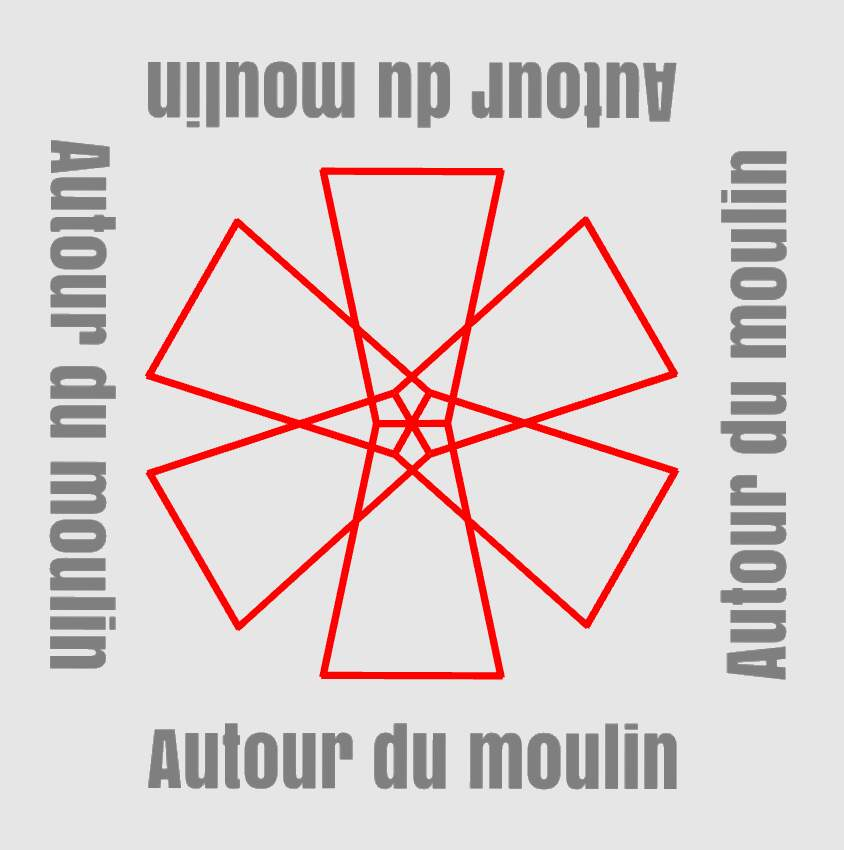

Session de médiation
- date: 09 juin 2026
- durée: 1h30 à 2hrs
- lieu: 536 ave de la Gare, St-Pascal

Cette rencontre initiale avec le comité 'Œuvre Publique' de la Ville de St-Pascal donnera lieu à une présentation du projet "Autour du Moulin", une visite d'atelier suivie d'une conversation sur les thèmes:

- la fonction de l'art public dans le contexte contemporain: crise climatique et l'art responsable.
- la pertinence de Autour du Moulin: contraintes et défis de la proposition cinétique.
- l'emplacement de la future sculpture: les différents lieux potentiels sur le territoire de la municipalité.

Pour conclure il sera possible de discuter librement et d'interagir avec certains artefacts que nous avons produits depuis la mise en place de l'atelier le 04 mai.

Je profite de ce communiqué pour informer le comité de mon intention de documenter la rencontre. Si une personne avait une objection et aimerait participer, on lui demande de nous en avertir et il nous fera plaisir d'éviter son enregistrement et sa prise de vue.

### Presentation du projet:

- Origine de l’initiative
	- rencontre avec Jean Philippe lors du projet perpétuelle en 2025
	- invitation à développer une proposition de sculpture d’art public en vue du 200ème anniversaire de St-Pascal en 2027

- Démarche 
	- carrière en Cinéma (direction artistique en Espagne -35 ans)
	- retour au Québec transition aux Arts Visuels 
	- Perpétuelle, établir les base de ma pratique artistique basé sur un principe de contraintes:
		- cinétique (mouvement généré par de l'énergies naturelle)
		- matériaux recyclés (obsolescence)
		- visualization de l’énergie naturelle - ce qui existe mais que l’on ne perçoit pas
            - créer des expériences sensorielles
            - visualiser le transfert d'énergie

- Autour du Moulin (maquette). 

    - poursuivre la démarche initié avec Perpétuelle +
		- sculpture permanente/résilience
		- explorer le concept d’autonomie énergétique  

	- Réalisation de la maquette de la sculpture
		- effectuer l’étape préliminaire à la réalisation de la sculpture 
	        - esthétique
			- technique
			- sociale
			- économique 

	- thématique du Moulin 
		- ancrer le projet dans le patrimoine historique 
		- médium de visualisation l’énergie naturelle (du vent)
		- créer un lien avec la réalité historique de la communauté locale  

	- matérialité
		- revalorisation du patrimoine matérielle industriel
		- redonner une nouvelle vie à des matériaux considérés obsolètes 
		- juxtaposer des matériaux et leur donner une nouvelle fonction symbolique

	- objectifs  
		- résilience et autonomie de la sculpture
		- acceptation et identification sociale et culturelle
        - situer St-Pascal comme lieu d'innovation

	- Contemporanéité
		- conscientisation: la valeur de l’énergie dans le contexte de la crise climatique 
        - utiliser la technologie pour favoriser un usage intelligent
		- pénurie/vs/abondance: implication et conséquence

    - étapes de développement du projet
        - maquette / recherche et exploration
            - phase 1 - 04 avril au 09 juin
                - mise en place d'une infrastructure de capture d'énergie
                - aménagement de l'atelier 
                - création de la page web
                - création de prototype
                - médiation et processus collaboratif (VOUS ÊTES ICI)

            - phase 2 - 10 juin au 10 juillet 
                - création d'artefacts de visualisation de l'énergie
                - études de création d'effets optiques
                - élaboration des prototypes
                - médiation - présentation publique

            - phase 3 - 01 aout au 15 septembre
                - recherche des matériaux réels
                - application des concepts à la sculpture réelle 
                - réalisation de la maquette de la sculpture réelle

            - phase 4 - 15 septembre au 15 novembre
                - diffusion publique (20 au 27 sept.)
                    - Atelier ouvert / exposition des prototypes
                    - exposition de la maquette dans un lieu public
                - étude de faisabilité 
                - rédaction du projet
                - financement

### Structure de Finacement

- Autour du Moulin 
    - maquette 
        - CALQ (fond principal)
        - Ville de St-Pascal (apportation logistique et financière)
        - Conseil des Arts du Canada (en attente)
        - FabLab RDL et Lapocatière (appui logistique)

    - Sculpture (préssenti 2027)
        - CALQ et CAK (commande d'oeuvre / artiste)
        - Ville St-Pascal (tbd)
        - Institution publique (tbd). 

