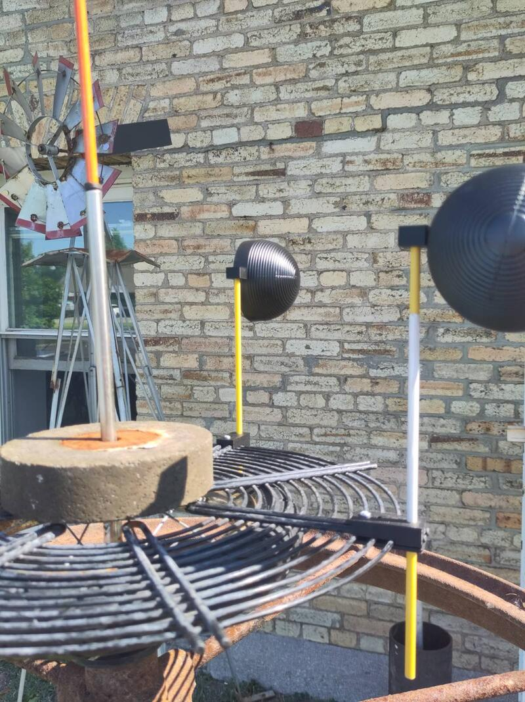

Avec cette deuxième phase du travail d'exploration et de prototypage j'ai créé une série d'objets/artefacts qui cherchent à mettre en équilibre forme et fonctionalité tout en explorant différents applicatioons cinétiques de l'énergie solaire et éolienne. Le travail s'est effectué de façon très intuitive, au fur et à mesure des matériaux trouvés lors de mes visites quotidiennes à l'éco-centre, chaque élément a pris forme et la relation complémentaire entre chacun s'est révélée progressivement.  

Paralèllement, j'ai aussi crée une première proposition de sculpture en version miniature qui met à 'l'échelle" un principe de visualisation de l'énergie naturelle.

### Le mouvement circulaire, superposition et effets optiques

Utilisant la roue de vélo comme leitmotif visuel, j'ai expérimenté avec la répétition et superposition d'éléments graphiques en mouvement pour étudier le potentiel de création d'effets optiques. Chacune des roues est accrochées à un trépied et décoré avec des combinaisons de cartons blancs et noirs.  

 

Les cartons sur les rayons a été très laborieux. J'ai fabriqué des petites agrafes en impression 3D pour soutenir les cartons sur les rayons.  

  

Avec cet exercise j'établit l'idée de possibilités infinies qui s'offrent en combinant des motifs de différentes tonalités, couleurs et formes.  

  

[Document CAD de l'agrafe](byciclewheelclip.stl)

### Le principe éolien horizontal  
J'ai crée une application horizontal de capture d'énergie éolienne. Cette approche minimalise l'impact de la gravité en appuyant les poids des composants en mouvement sur un point de rotation horizontal. Avec cette approche la friction sur l'axe est minimisée en comparaison à l'application verticale et permet une visualisation du vent de très faible intensité.  
  

La sculpture est composée principalement de matériaux recyclés. Un vieux socles d'acier et une vielle en fonte, une roue de chariot pour enfants, une grille de ventilateur, des tiges de balise, des flottes de toilettes et des roulements à bille. . Pour l'assemblage j'ai fabriqué des attaches imprimé en 3D pour soutenir les capteurs de vent.  

  

Cette pièce représente une première esquisse très sommaire d'intégration du principe èolien horizontal et son application cinétique. Il est facile d'imaginer cette sculture projeté sur une échelle monumentale et auquelle pourrait se greffer un système de capture de l'énergie mécanique et sa transformation en courant électrique.   

### La mémoire des matériaux et la visualisation de l'équilibre.  

La mémoire des matériaux rend manifeste l'équilibre fragile qui existe entre les différents éléments du monde et en offre une visualisation formelle. Le ressort est un objet qui me fascine par sa capacité de rendre perceptible l'énergie de la gravité. Parmi les énergies naturelles, la gravité est la seule qui est constante et omniprésente.Quand le vent souffle on le voit puis lorsqu'il se calme il disparaît. L'énergie solaire c'est pareil et l'hydrulique aussi elle change avec le temps, l'environnement et elle tend à s'épuiser. La gravité elle, elle est différente, dans l'ombre, on la voit jamais mais elle est toujours là. Elle est en fait intrinsèque à tout ce qui est cinétique. 
J'ai récupéré un élément instauré l'an dernier dans de mon installation "la coïncidence des oposés". Je l'ai extrapolé pour l'apliquer à un nouvel artefact qu'on peut considérer comme un objet en soi ou comme une maquette à l'échelle d'une possible scultpture. Je récupère la roue de vélo mais cette fois je le mets en suspension, en équilibre pour mettre en scène l'inévitable tension qu'ejerce la gravité sur la matière et en faire une représentation poétique.  

  

Cette proposition place en interaction les énergies naturelles de la gravité et du vent.  Elle pose des défis physiques de grande importance qu'il faudra traiter dans une prochaine étape dans un milieu naturel et en interaction avec les éléments réels. Les exercices de simulation effectués en atelier sont prometteurs.  

   

### La complémantarité des formes et le bruit de leur interaction.  

Dans cette même idée d'explorer les principes de la mémoire des matériaux et l'utilisation de ressorts j'ai juxtaposé des matériaux complètement hétéroclites pour artefact musicale permettant de matérialiser l'interaction entre formes complémentaires soumises à une force externe et en interaction avec l'énergie de la gravité. Dans ce cas précis, l'artefact procure une expérience sensorielle à la fois visuelle et auditive et prend la forme d'une instrument musical interactif.  
  

UNe vielle pédale de symbale peut être activé manuellement provoquant le mouvement vertical d'un vieux socle de centilateur suspendu à des ressort et qui entrechoque avec la base d'un B.B.Q posé au sol et deux boules métaliques aussi suspendu à des ressorts. Le contact des différents éléments crée une résonance somore qui rapelle le son de cloche d'une église.  

### L'énergie solaire et l'expansion des liquides.  

J'ai initié une recherche sur le principe d'expansion de liquide comme interface de transformation de l'énergie solaire en énergie mécanique. Avec cette idée en tête j'ai collecté des matériaux pouvant servir à l'élaboration d'un prototype. Il est composé d'une demi-sphère concave servant à concentré les rayons solaires sur un point focale et un socle composé de pièces métal géométriques soutenu par des pièces aimentées utilisé en soudure.  

L'idée que je poursuis est de situer dans la zone de haute température un récipient étanche contenant de l'étanol et connecté à un élément gonflable qui prend de l'expansion et se retracte selon la quantité d'énergie solaire capté. J'ai ajouté une petite roue de vélo flottant à la surface pour intégrer une deuxième source d'énergie suivant le principe de l'éolienne horizontale et qui permettra d'alimenter d'un système de "sun-tracking" sans créer de d'ombre sur le capteur solaire.  

Ce projet est à un stade préliminaire et se tient essentiellement sur une base théorique. Je suis très conscient que les éléments choisis ne me permettront pas de créer un système efficace. C'est en fait mon objectif de jouer à la limite du faisable et observer la minimum incidence de l'énergie naturelle sur la matière et de la représenter. 

J'ai développé la théorie et exploré une représantation matériel de l'élément principal du prototype.  

Voir: 
[document de recherche et le bill of materials](solar_kinetic_sculpture_README.md).

### La Mècque ou Le soleil comme énergie divine.  

Dasn la foulée d'expérimenter avec l'énergie solaire tout en cherchant des alternatives aux application photovoltaique. 

L'élément principal est une résistance électrique provenant d'un appareil quelconque, de forme circulaire et contenant un circuit paralèle formant une spirale.La simplicité de sa forme exprime visuellement la complexité de sa fonction. Il est soutenu par un trépied et situé face à un miroir de salle de bain articulé pouvant réfléchir les rayons du soleil à l'endroit précis de la rencontre des deux pôles de la résistance permettant à l'énergie thermique de se transmettre à la résistance. Ce projet est pûrement spéculatif et aucunement fonctionel pour l'instant. Je le considère comme un système narratif de visualisation d'un principe théorique d'extraction de l'énergie solaire et de sa conversion en énergie thermique par l'interaction avec la matière. De façon plus symbolique, la forme centrale de cet artefact évoque la Mèque, ce lieu de pélégrinage à travers lequel la communauté musulmane communie avec Dieu. La relation entre la matière et l'énergie naturelle du soleil agît comme une métaphore de la transcendance de l'homme avec le divin.  

### Esquisses et proportion  

Le processus de création des artefacts m'a permis d'identifier les principes fondamentaux de la sculpture: l'équilibre et l'autonomie. Et toute mon expérimentation me mène à la question essentielle de la résilience. Quelle serait la forme idéale d'une sculpture cinétique énergétiquement autonome qui requiert le minimum d'entretien et de maintenance possible? 

#### Esquisses
Avec cette question en tête je me suis mis à dessiner en m'inspirant des références visuelles et de matériaux dont je connais l'existence et disponibilité.  

(photos esquisses graphiques)

#### Esquisse tridimensionelles  
L'idée de créer la maquette de la scultpture implique de projeter le minuature dans la proportion du réel. J'ai procédé à un exercise de spéculation pour mettre en relation des éléments miniatures dans la forme symbolique évoques des éléments présents dans la dimension réelle. J'ai réuni une séries de petits moteurs DC et des pales éoliennes miniatures de différentes formes avec des éléments structurels génériques en proportion afin de donner une représentation proportionné de la maquette. Il ne s'agît pas d'une proposition formelle mais bien d'une "esquisse tridimensionelle" de la dimension physique et des principes cinétiques que je propose explorer avec la sculpture. Le choix délibéré de chacun des éléments sert dmabords et avant tout à établir un système de cohérence entre les matériaux, leur esthétique et leur valeur symbolique. Cette première esquisse de la maquette sert principalement comme support de développement de la sculture et fait fonction de preuve de concept.  
(photos et vidéos)
