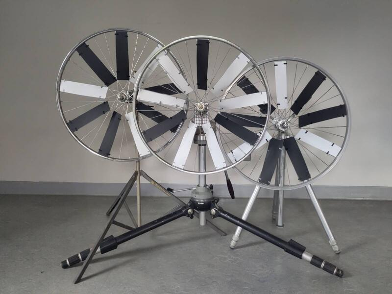
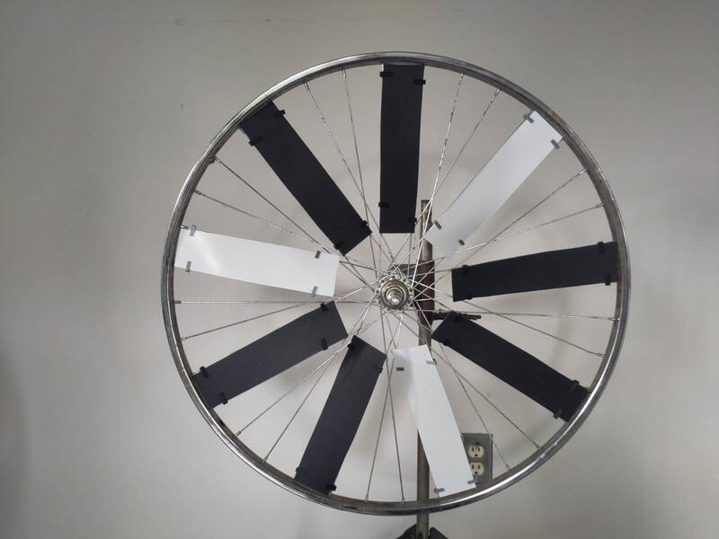
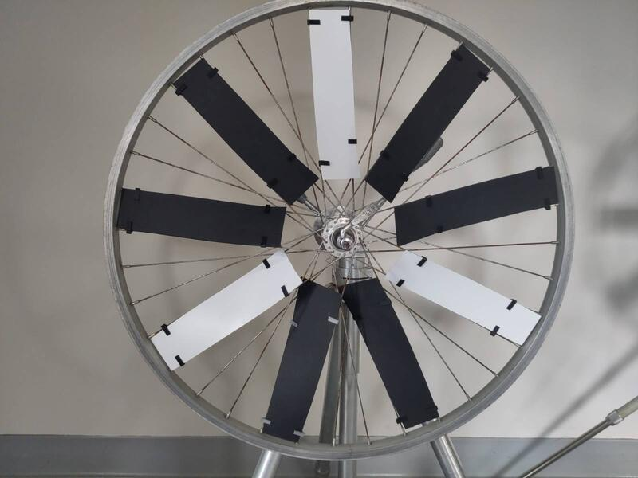
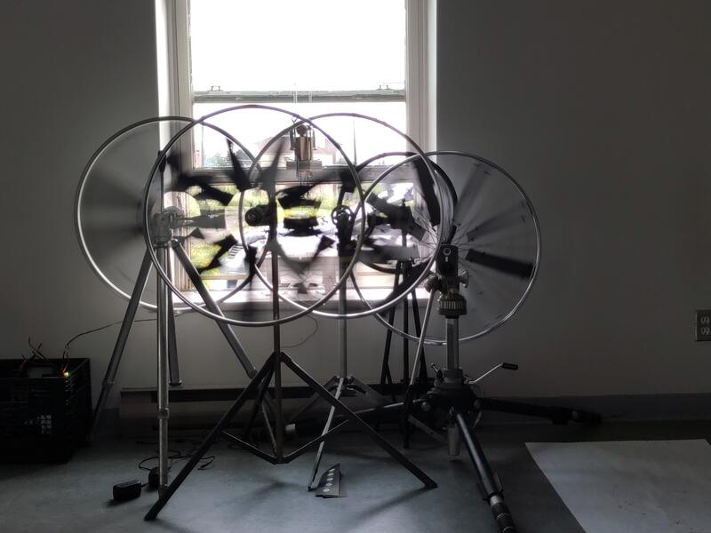
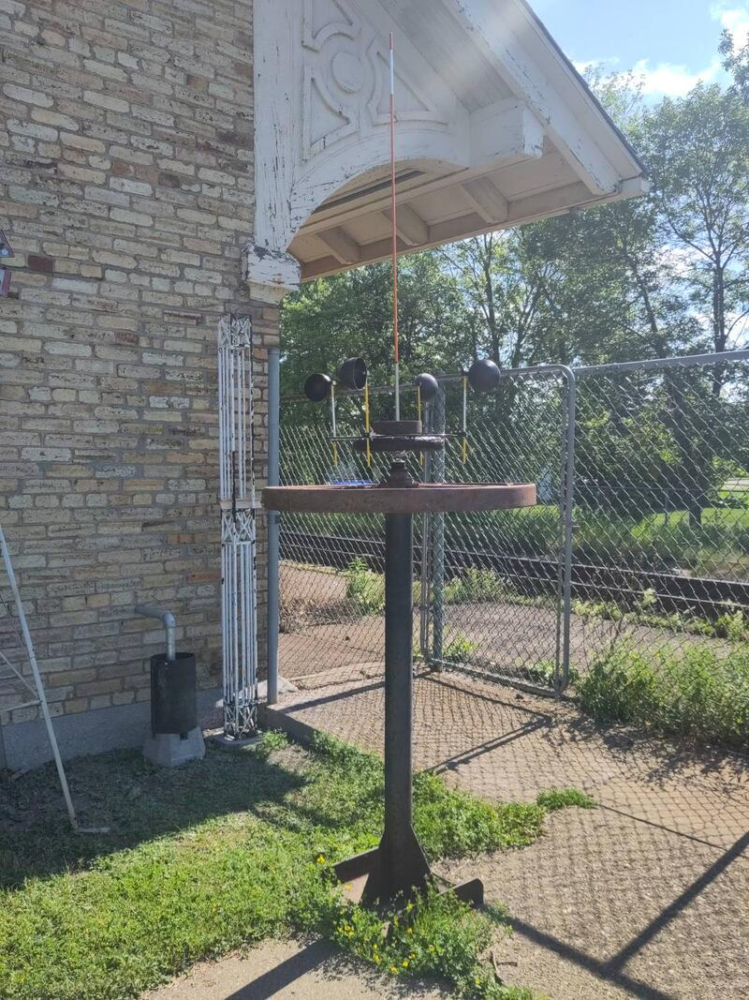
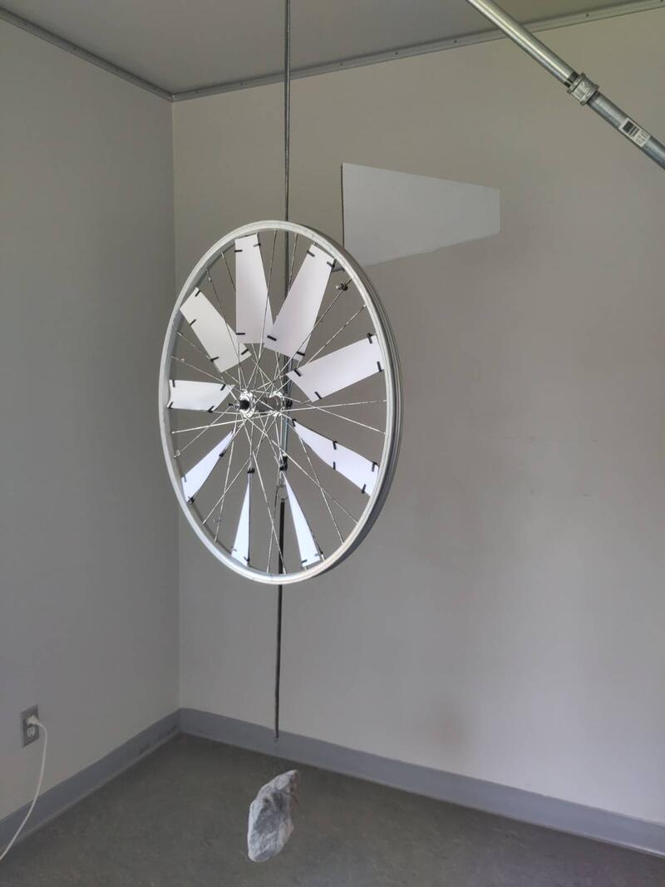
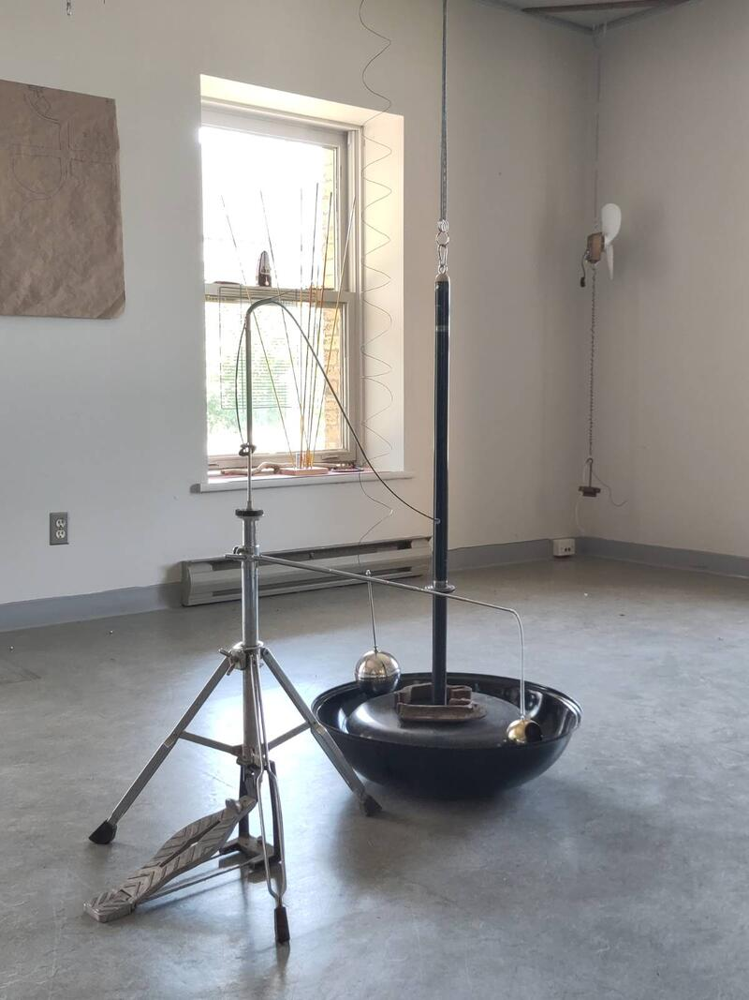
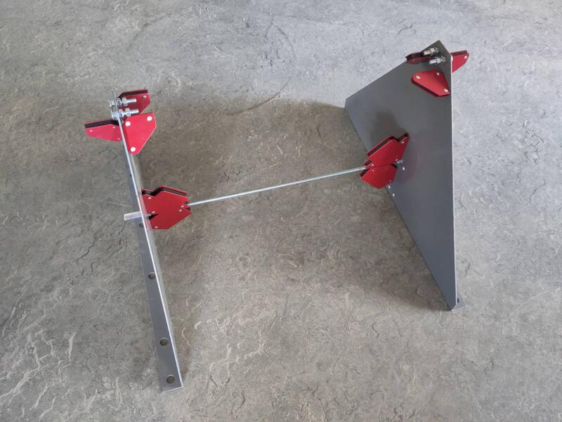
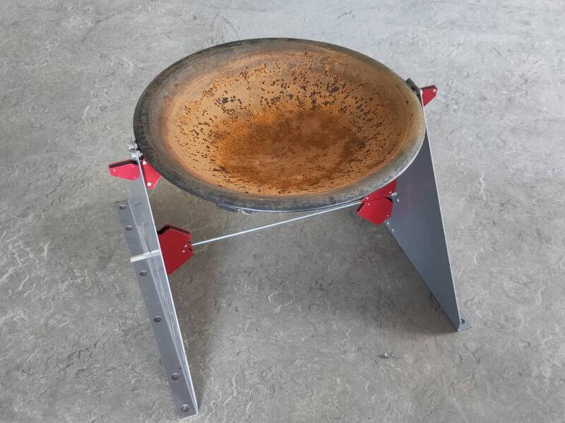
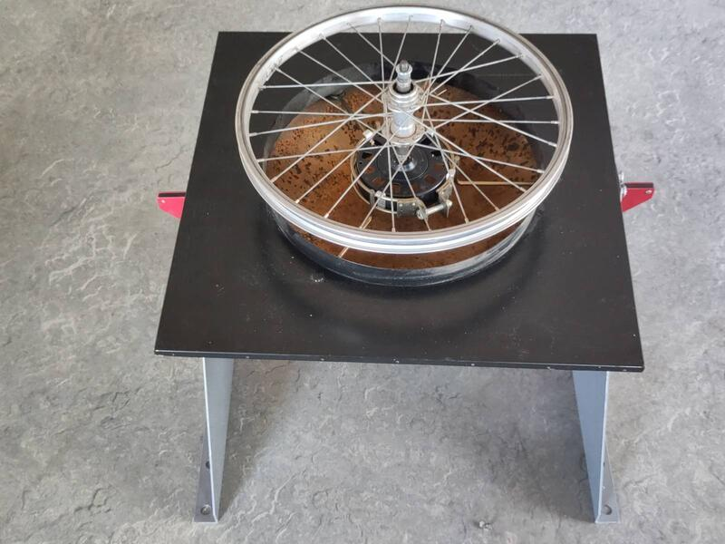

Avec cette deuxième phase du travail d'exploration et de prototypage, j'ai créé une série d'objets/artefacts qui cherchent à mettre en équilibre forme et fonctionnalité tout en explorant différentes applications cinétiques de l'énergie solaire et éolienne. Le travail s'est effectué de façon très intuitive, au fur et à mesure des matériaux trouvés lors de mes visites quotidiennes à l'éco-centre; chaque élément a pris forme et la relation complémentaire entre chacun s'est révélée progressivement.

Parallèlement, j'ai aussi créé une première proposition de sculpture en version miniature qui met « à l'échelle » un principe de visualisation de l'énergie naturelle.

### Le mouvement circulaire, superposition et effets optiques

Utilisant la roue de vélo comme leitmotiv visuel, j'ai expérimenté avec la répétition et la superposition d'éléments graphiques en mouvement pour étudier le potentiel de création d'effets optiques. Chacune des roues est accrochée à un trépied et décorée avec des combinaisons de cartons blancs et noirs.

La pose des cartons sur les rayons a été très laborieuse. J'ai fabriqué de petites agrafes imprimées en 3D pour maintenir les cartons sur les rayons.

Avec cet exercice, j'établis l'idée de possibilités infinies qui s'offrent en combinant des motifs de différentes tonalités, couleurs et formes.

[Document CAD de l'agrafe](byciclewheelclip.stl)

### Le principe éolien horizontal
J'ai créé une application horizontale de capture d'énergie éolienne. Cette approche minimise l'impact de la gravité en appuyant le poids des composants en mouvement sur un point de rotation horizontal. Avec cette approche, la friction sur l'axe est minimisée en comparaison à l'application verticale et permet une visualisation du vent de très faible intensité.

La sculpture est composée principalement de matériaux recyclés : un vieux socle d'acier et une vieille pièce en fonte, une roue de chariot pour enfants, une grille de ventilateur, des tiges de balise, des flotteurs de toilettes et des roulements à bille. Pour l'assemblage, j'ai fabriqué des attaches imprimées en 3D pour soutenir les capteurs de vent.

Cette pièce représente une première esquisse très sommaire de l'intégration du principe éolien horizontal et de son application cinétique. Il est facile d'imaginer cette sculpture projetée à une échelle monumentale, à laquelle pourrait se greffer un système de capture de l'énergie mécanique et sa transformation en courant électrique.

### La mémoire des matériaux et la visualisation de l'équilibre.

La mémoire des matériaux rend manifeste l'équilibre fragile qui existe entre les différents éléments du monde et en offre une visualisation formelle. Le ressort est un objet qui me fascine par sa capacité à rendre perceptible l'énergie de la gravité. Parmi les énergies naturelles, la gravité est la seule qui soit constante et omniprésente. Quand le vent souffle, on le voit, puis lorsqu'il se calme, il disparaît. L'énergie solaire, c'est pareil, et l'hydraulique aussi : elle change avec le temps, l'environnement, et elle tend à s'épuiser. La gravité, elle, est différente ; dans l'ombre, on ne la voit jamais, mais elle est toujours là. Elle est en fait intrinsèque à tout ce qui est cinétique.
J'ai récupéré un élément instauré l'an dernier dans mon installation « la coïncidence des opposés ». Je l'ai extrapolé pour l'appliquer à un nouvel artefact qu'on peut considérer comme un objet en soi ou comme une maquette à l'échelle d'une possible sculpture. Je récupère la roue de vélo, mais cette fois je la mets en suspension, en équilibre, pour mettre en scène l'inévitable tension qu'exerce la gravité sur la matière et en faire une représentation poétique.

Cette proposition met en interaction les énergies naturelles de la gravité et du vent. Elle pose des défis physiques de grande importance qu'il faudra traiter dans une prochaine étape, dans un milieu naturel et en interaction avec les éléments réels. Les exercices de simulation effectués en atelier sont prometteurs.

### La complémentarité des formes et le bruit de leur interaction.

Dans cette même idée d'explorer les principes de la mémoire des matériaux et l'utilisation de ressorts, j'ai juxtaposé des matériaux complètement hétéroclites pour un artefact musical permettant de matérialiser l'interaction entre formes complémentaires soumises à une force externe et en interaction avec l'énergie de la gravité. Dans ce cas précis, l'artefact procure une expérience sensorielle à la fois visuelle et auditive et prend la forme d'un instrument musical interactif.

Une vieille pédale de cymbale peut être activée manuellement, provoquant le mouvement vertical d'un vieux socle de ventilateur suspendu à des ressorts, qui entrechoque la base d'un barbecue posé au sol et deux boules métalliques elles aussi suspendues à des ressorts. Le contact des différents éléments crée une résonance sonore qui rappelle le son de cloche d'une église.

### L'énergie solaire et l'expansion des liquides.

J'ai initié une recherche sur le principe d'expansion des liquides comme interface de transformation de l'énergie solaire en énergie mécanique. Avec cette idée en tête, j'ai réuni des matériaux pouvant servir à l'élaboration d'un prototype. Il est composé d'une demi-sphère concave servant à concentrer les rayons solaires sur un point focal, et d'un socle composé de pièces de métal géométriques soutenu par des pièces aimantées utilisées en soudure.

L'idée que je poursuis est de situer, dans la zone de haute température, un récipient étanche contenant de l'éthanol et connecté à un élément gonflable qui prend de l'expansion et se rétracte selon la quantité d'énergie solaire captée. J'ai ajouté une petite roue de vélo flottant à la surface pour intégrer une deuxième source d'énergie, suivant le principe de l'éolienne horizontale, qui permettra d'alimenter un système de « sun-tracking » sans créer d'ombre sur le capteur solaire.

Ce projet est à un stade préliminaire et se tient essentiellement sur une base théorique. Je suis très conscient que les éléments choisis ne me permettront pas de créer un système efficace. C'est en fait mon objectif de jouer à la limite du faisable et d'observer l'incidence minimale de l'énergie naturelle sur la matière, et de la représenter.

J'ai développé la théorie et exploré une représentation matérielle de l'élément principal du prototype.

Voir :
[document de recherche et le bill of materials](solar_kinetic_sculpture_README.md).

### La Mecque, ou le soleil comme énergie divine.

Dans la foulée d'expérimenter avec l'énergie solaire, tout en cherchant des alternatives aux applications photovoltaïques.

L'élément principal est une résistance électrique provenant d'un appareil quelconque, de forme circulaire, contenant un circuit parallèle formant une spirale. La simplicité de sa forme exprime visuellement la complexité de sa fonction. Elle est soutenue par un trépied et située face à un miroir de salle de bain articulé, capable de réfléchir les rayons du soleil à l'endroit précis de la rencontre des deux pôles de la résistance, permettant à l'énergie thermique de se transmettre à celle-ci. Ce projet est purement spéculatif et nullement fonctionnel pour l'instant. Je le considère comme un système narratif de visualisation d'un principe théorique d'extraction de l'énergie solaire et de sa conversion en énergie thermique par l'interaction avec la matière. De façon plus symbolique, la forme centrale de cet artefact évoque La Mecque, ce lieu de pèlerinage à travers lequel la communauté musulmane communie avec Dieu. La relation entre la matière et l'énergie naturelle du soleil agit comme une métaphore de la transcendance de l'homme vers le divin.

