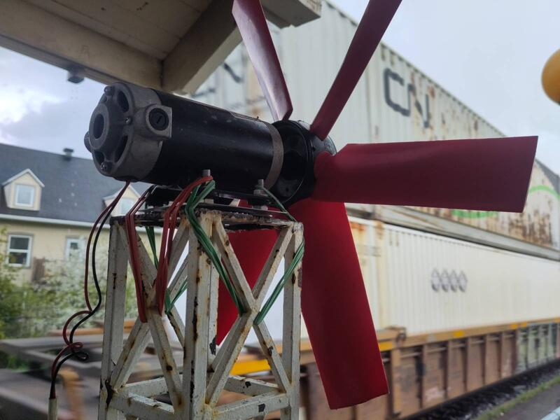
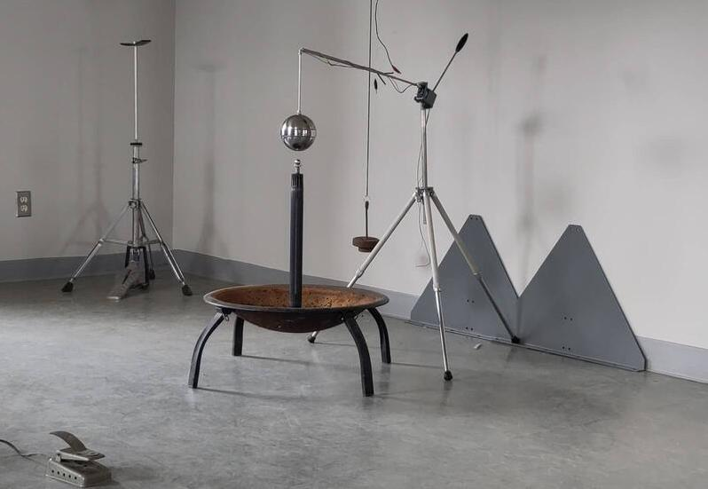
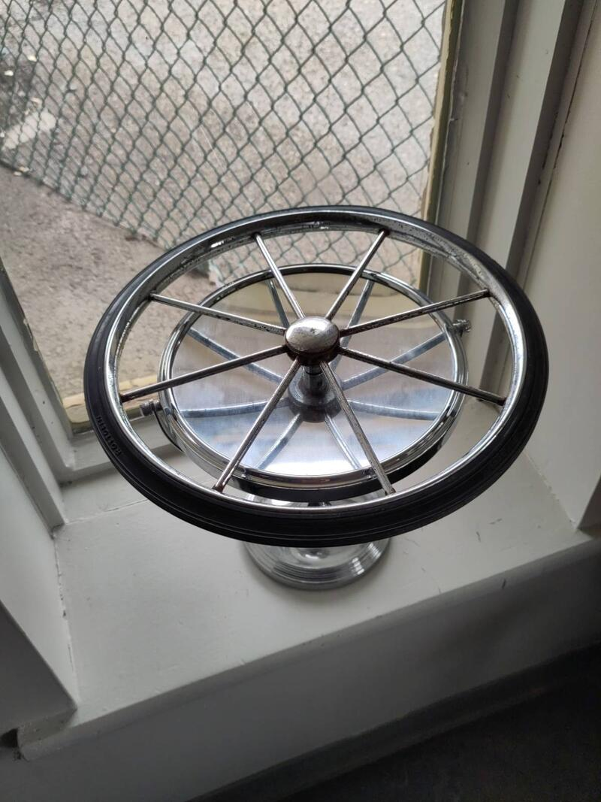
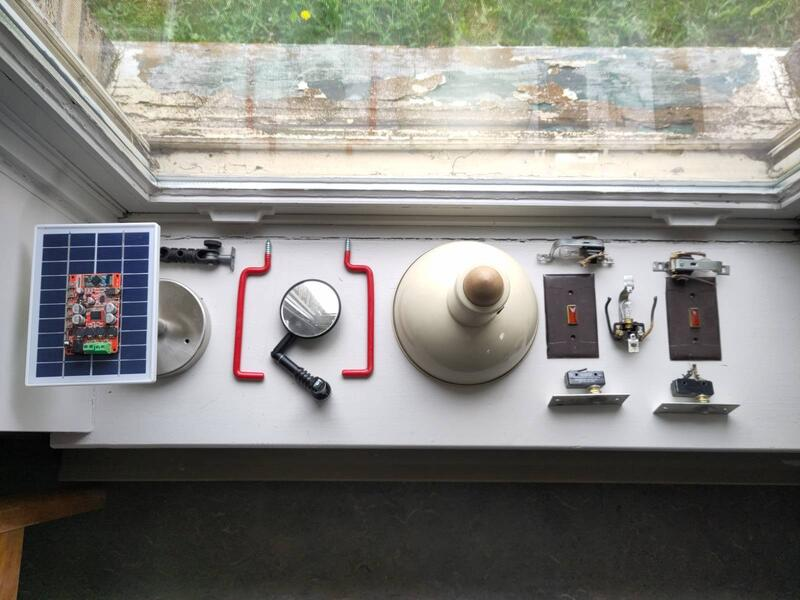
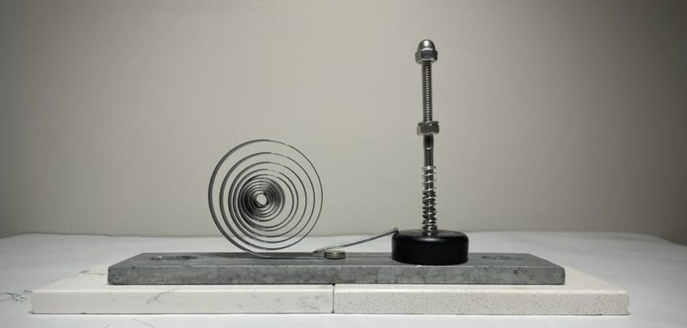

Le projet de recherche consiste à créer la maquette d'une sculpture cinétique fabriquée de matériaux recyclés et qui est énergétiquement autonome et l'idée originale suppose la création d'un seul élément monumental. Le processus d'exploration des différentes dimensions de la sculpture s'articule dans la forme d'une installation composée de plusieurs éléments complémentaires en interaction.

Partant des matériaux trouvés j'ai créé une série d'artefacts permettant d'explorer la capture et visualisation de sources d'énergie naturelles, principalement le vent. Dans une autre optique j'ai assemblé des éléments me permettant de simuler le vent afin d'obtenir plus d'autonomie dans le développement des applications formelles de visualisation.

J'ai fabriqué quelques "artefacts" qui interagissent avec l'énergie éolienne et place la matérialité technique et fonctionnelle au premier plan pour suggérer l'expérience de l'énergie et la rendre tangible.

  

Parallèlement et au fur et à mesure de mes trouvailles j'ai assemblé d'autres compositions non-fonctionnelles dans l'objectif de créer des relations symboliques en juxtaposant des objets issus du quotidien. J'en ai profité surtout pour continuer à visiter la thématique des formes, de leur sens et dialogue, et d'observer leur équilibre.

  

Le médium vidéo permet de mieux apprécier la nature cinétique des études effectuées utilisant l'énergie du train qui passe avec le vent qu'il crée et les vibrations qu'il produit. Puis j'ai expérimenté avec son transfert en courant électrique et d'activer des artefacts de visualisation.





