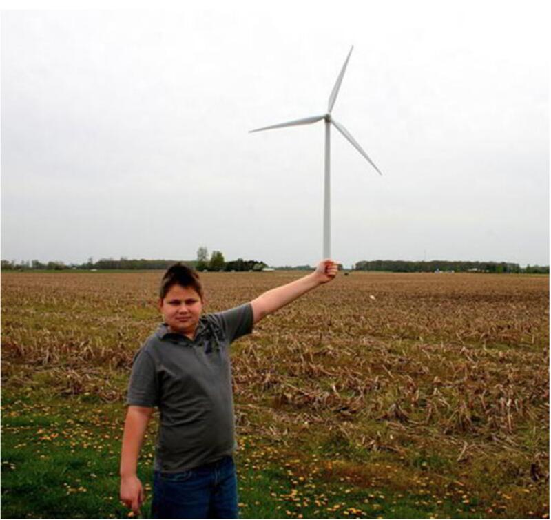
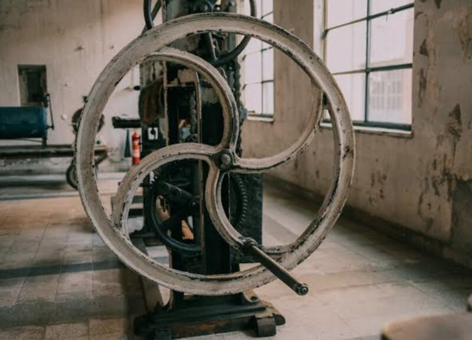
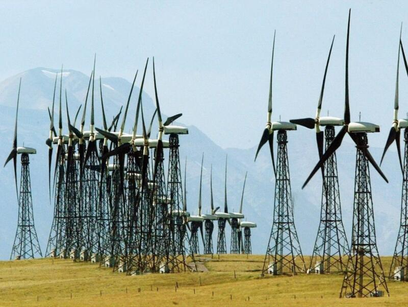

#### Je cultive l'émerveillement devant les phénomènes du monde par l'interaction directe avec la représentation visuelle de son énergie.  

Voici une compilation d'images qui évoquent les thèmes explorés par le projet et qui rejoint mes intérêts particuliers.

On parle d'illusion optique, de point de vue et de la rencontre de la matière avec l'énergie de la matière sous l'influence de la nature dans le temps et en relation avec l'humanité et son besoin d'en extraire toutes les ressources.

L'élément circulaire est prédominant en allusion à la sphère terrestre et pour la propension de la forme à suggérer et provoquer le mouvement et ses sensations. Il est aussi manifeste le poids des masses, les proportions et le jeu avec les échelles de grandeur et le point de vue du regard sur la matérialité. L'idée avant tout est de représenter la magie de l'ingénierie humaine et l'obsolescence de la quête pour se perpétuer dans le monde.

 

Les processus suscitant une possible application dans le projet nous ramènent à des approches technologiques variées mais qui partagent le dénominateur qui implique la recherche d'autonomie par le biais de la circularité d'interactions entre eux et avec l'environnement. Qu'il soit physique, intellectuel ou social, le lien qui se crée entre les différentes représentations de la réalité devient un geste intégral et utopique que seul l'art peut rendre possible lorsqu'il s'articule autour de contraintes réelles mais s'abstient de chercher à produire autre chose que des sensations qui soient ouvertes à tous les sens ainsi qu'à la notion de découverte de l'impossible. Ce projet comme le reste de mon travail fait implicitement référence à l'idée conceptuelle d'un mouvement perpétuel cherchant à transcender la notion de Dieu par la technique et la maîtrise de ses connaissances. 

. 

*Mouvement perpétuel. Gravure d'un « moulin à eau en circuit fermé », une machine à mouvement perpétuel conçue par le médecin anglais Robert Fludd au XVIIe siècle. L'énergie produite par la chute de l'eau d'un réservoir sur une roue de moulin était supposée à tort être suffisante pour actionner une vis d'Archimède et renvoyer l'eau au réservoir, maintenant ainsi la machine en mouvement perpétuel.*
